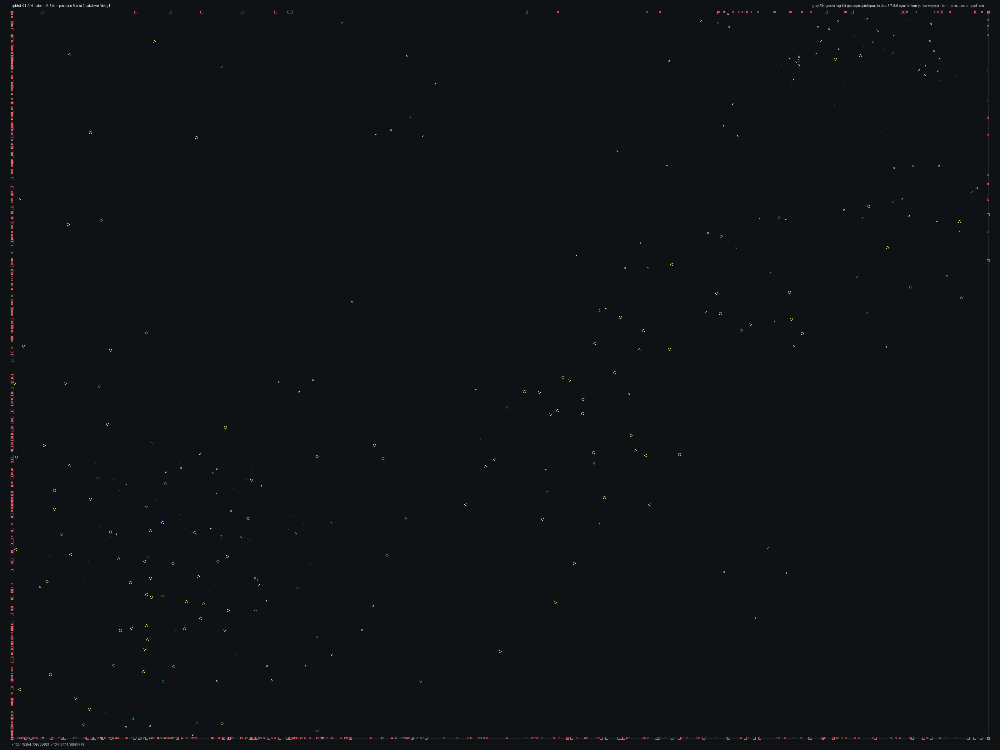

# SPBHD_01.bms - Marka Breakdown

Back to [AIN Mission Index](../AIN%20Mission%20Index.md)

[Open full-size overlay image](overlays/spbhd_01_xy.png)

## Overlay Legend

| Marker | Meaning |
| --- | --- |
| Gray dots | Normal AIN navigation nodes. |
| Green dots | AIN nodes with `NodeFlags & 0x1C`. |
| Gold dots | AIN `NodeClass 6`. |
| Cyan-blue dots | AIN `NodeClass 7`. |
| Pink dots | AIN `NodeClass 8`. |
| Purple dots | AIN `NodeClass 9`. |
| Cyan circles | MIS items with `ai_textfile`. |
| Yellow circles | MIS items with `waypoint_id`. |
| White circles | Other MIS items with positions. |
| Red squares on frame | MIS items outside the AIN graph bounds. |

## Mission File Info

- Terrain: `dvdg1`
- AIN nodes: `371`
- AIN areas: `256`
- MIS items/events/waypoint defs: `2036` / `163` / `64`
- MIS AI-positioned items: `85`
- MIS items with `waypoint_id`: `632`
- AINODEPATH events: `7`

## AIN Plot Maps

| Field | Description | XY | XZ | YZ |
| --- | --- | --- | --- | --- |
| Area ID | Node area/sector grouping. | [XY](plots/SPBHD_01_area_id_xy.png) | [XZ](plots/SPBHD_01_area_id_xz.png) | [YZ](plots/SPBHD_01_area_id_yz.png) |
| Node Class | `NodeClass` values, including special classes `6`-`9`. | [XY](plots/SPBHD_01_node_class_xy.png) | [XZ](plots/SPBHD_01_node_class_xz.png) | [YZ](plots/SPBHD_01_node_class_yz.png) |
| Node Flags | `NodeFlags` byte values and flag clusters. | [XY](plots/SPBHD_01_node_flags_xy.png) | [XZ](plots/SPBHD_01_node_flags_xz.png) | [YZ](plots/SPBHD_01_node_flags_yz.png) |
| Radius | Node `Radius` byte values. | [XY](plots/SPBHD_01_radius_xy.png) | [XZ](plots/SPBHD_01_radius_xz.png) | [YZ](plots/SPBHD_01_radius_yz.png) |
| Edge Flags | Combined outgoing `EdgeFlags`. | [XY](plots/SPBHD_01_edge_flags_xy.png) | [XZ](plots/SPBHD_01_edge_flags_xz.png) | [YZ](plots/SPBHD_01_edge_flags_yz.png) |

## AINODEPATH Events

### Event 2 - AINODEPATH_OFF

- Event block line: `781`
- AINODEPATH action line(s): `787`

**Trigger Items**

| Ref | Candidates |
| ---: | --- |
| `10` | item `10` / id `1365` / type `1239` Technical enemy vehicle with mounted 50cal (`101239`) / ai `G_Jeep` / team `2` / group `33`; node `144`, area `0`, dist `1209.3` item `213` / id `10` / type `1235` Placable Husk for Fjeep2 (`101235`); node `152`, area `0`, dist `472.8` |

**Referenced Items**

| Ref | Candidates |
| ---: | --- |
| `10` | item `10` / id `1365` / type `1239` Technical enemy vehicle with mounted 50cal (`101239`) / ai `G_Jeep` / team `2` / group `33`; node `144`, area `0`, dist `1209.3` item `213` / id `10` / type `1235` Placable Husk for Fjeep2 (`101235`); node `152`, area `0`, dist `472.8` |

**Trigger Waypoints**

| Ref | Candidates |
| ---: | --- |
| `10` | item `1133` / wp `10` / id `509` / type `6005` waypoint (`106005`) item `1145` / wp `10` / id `510` / type `6005` waypoint (`106005`) item `1202` / wp `10` / id `511` / type `6005` waypoint (`106005`) item `1250` / wp `10` / id `513` / type `6005` waypoint (`106005`) |

### Event 3 - AINODEPATH_OFF

- Event block line: `791`
- AINODEPATH action line(s): `800`

**Trigger Items**

| Ref | Candidates |
| ---: | --- |
| `10` | item `10` / id `1365` / type `1239` Technical enemy vehicle with mounted 50cal (`101239`) / ai `G_Jeep` / team `2` / group `33`; node `144`, area `0`, dist `1209.3` item `213` / id `10` / type `1235` Placable Husk for Fjeep2 (`101235`); node `152`, area `0`, dist `472.8` |

**Referenced Items**

| Ref | Candidates |
| ---: | --- |
| `2` | item `2` / id `647` / type `1239` Technical enemy vehicle with mounted 50cal (`101239`) / ai `G_Jeep` / team `2` / group `15`; node `251`, area `0`, dist `86.7` item `117` / id `2` / type `1101` Open Building on Pier Piece (`101101`); node `152`, area `0`, dist `482.9` |
| `4` | item `4` / id `2181` / type `1239` Technical enemy vehicle with mounted 50cal (`101239`) / ai `G_Jeep` / team `2` / group `40`; node `267`, area `0`, dist `869.5` item `32` / id `4` / type `1276` Hummer with NON-Armored 50cal (`101276`) / ai `g_jeep` / group `4`; node `152`, area `0`, dist `432.6` |
| `10` | item `10` / id `1365` / type `1239` Technical enemy vehicle with mounted 50cal (`101239`) / ai `G_Jeep` / team `2` / group `33`; node `144`, area `0`, dist `1209.3` item `213` / id `10` / type `1235` Placable Husk for Fjeep2 (`101235`); node `152`, area `0`, dist `472.8` |
| `15` | item `15` / id `1790` / type `1253` Friendly 5.5 ton with closed tarp (`101253`) / ai `g_jeep` / group `28`; node `46`, area `0`, dist `3.1` |
| `30` | item `30` / id `3` / type `1276` Hummer with NON-Armored 50cal (`101276`) / ai `G_Jeep` / group `6`; node `152`, area `0`, dist `441.9` |

**Trigger Waypoints**

| Ref | Candidates |
| ---: | --- |
| `10` | item `1133` / wp `10` / id `509` / type `6005` waypoint (`106005`) item `1145` / wp `10` / id `510` / type `6005` waypoint (`106005`) item `1202` / wp `10` / id `511` / type `6005` waypoint (`106005`) item `1250` / wp `10` / id `513` / type `6005` waypoint (`106005`) |

### Event 35 - AINODEPATH_ON

- Event block line: `1173`
- AINODEPATH action line(s): `1183`

**Trigger Items**

| Ref | Candidates |
| ---: | --- |
| `4` | item `4` / id `2181` / type `1239` Technical enemy vehicle with mounted 50cal (`101239`) / ai `G_Jeep` / team `2` / group `40`; node `267`, area `0`, dist `869.5` item `32` / id `4` / type `1276` Hummer with NON-Armored 50cal (`101276`) / ai `g_jeep` / group `4`; node `152`, area `0`, dist `432.6` |
| `6` | item `6` / id `574` / type `1239` Technical enemy vehicle with mounted 50cal (`101239`) / ai `G_Jeep` / team `2` / group `14`; node `291`, area `0`, dist `480.4` |
| `18` | item `18` / id `327` / type `1265` UN Truck with smoking engine used in Marka Breakdown (`101265`) / ai `g_jeep` / group `28`; node `26`, area `0`, dist `3.3` |

**Referenced Items**

| Ref | Candidates |
| ---: | --- |
| `2` | item `2` / id `647` / type `1239` Technical enemy vehicle with mounted 50cal (`101239`) / ai `G_Jeep` / team `2` / group `15`; node `251`, area `0`, dist `86.7` item `117` / id `2` / type `1101` Open Building on Pier Piece (`101101`); node `152`, area `0`, dist `482.9` |
| `4` | item `4` / id `2181` / type `1239` Technical enemy vehicle with mounted 50cal (`101239`) / ai `G_Jeep` / team `2` / group `40`; node `267`, area `0`, dist `869.5` item `32` / id `4` / type `1276` Hummer with NON-Armored 50cal (`101276`) / ai `g_jeep` / group `4`; node `152`, area `0`, dist `432.6` |
| `6` | item `6` / id `574` / type `1239` Technical enemy vehicle with mounted 50cal (`101239`) / ai `G_Jeep` / team `2` / group `14`; node `291`, area `0`, dist `480.4` |
| `10` | item `10` / id `1365` / type `1239` Technical enemy vehicle with mounted 50cal (`101239`) / ai `G_Jeep` / team `2` / group `33`; node `144`, area `0`, dist `1209.3` item `213` / id `10` / type `1235` Placable Husk for Fjeep2 (`101235`); node `152`, area `0`, dist `472.8` |
| `15` | item `15` / id `1790` / type `1253` Friendly 5.5 ton with closed tarp (`101253`) / ai `g_jeep` / group `28`; node `46`, area `0`, dist `3.1` |
| `18` | item `18` / id `327` / type `1265` UN Truck with smoking engine used in Marka Breakdown (`101265`) / ai `g_jeep` / group `28`; node `26`, area `0`, dist `3.3` |

**Trigger Waypoints**

| Ref | Candidates |
| ---: | --- |
| `4` | item `1122` / wp `4` / id `487` / type `6005` waypoint (`106005`) item `1171` / wp `4` / id `488` / type `6005` waypoint (`106005`) item `1188` / wp `4` / id `489` / type `6005` waypoint (`106005`) |
| `6` | item `1124` / wp `6` / id `493` / type `6005` waypoint (`106005`) item `1152` / wp `6` / id `494` / type `6005` waypoint (`106005`) item `1189` / wp `6` / id `495` / type `6005` waypoint (`106005`) |
| `18` | item `1097` / wp `18` / id `1323` / type `6005` waypoint (`106005`) item `1160` / wp `18` / id `1324` / type `6005` waypoint (`106005`) item `1224` / wp `18` / id `1325` / type `6005` waypoint (`106005`) item `1276` / wp `18` / id `1326` / type `6005` waypoint (`106005`) +4 more |

### Event 50 - AINODEPATH_ON

- Event block line: `1329`
- AINODEPATH action line(s): `1339`

**Trigger Items**

| Ref | Candidates |
| ---: | --- |
| `5` | item `5` / id `572` / type `1239` Technical enemy vehicle with mounted 50cal (`101239`) / ai `G_Jeep` / team `2` / group `13`; node `151`, area `0`, dist `359.8` item `33` / id `5` / type `1276` Hummer with NON-Armored 50cal (`101276`) / ai `G_Jeep` / team `1` / group `7`; node `152`, area `0`, dist `451.6` |
| `6` | item `6` / id `574` / type `1239` Technical enemy vehicle with mounted 50cal (`101239`) / ai `G_Jeep` / team `2` / group `14`; node `291`, area `0`, dist `480.4` |
| `27` | item `27` / id `2492` / type `1267` Technical 4 (`101267`) / ai `G_Jeep` / team `2`; node `144`, area `0`, dist `965.5` |

**Referenced Items**

| Ref | Candidates |
| ---: | --- |
| `5` | item `5` / id `572` / type `1239` Technical enemy vehicle with mounted 50cal (`101239`) / ai `G_Jeep` / team `2` / group `13`; node `151`, area `0`, dist `359.8` item `33` / id `5` / type `1276` Hummer with NON-Armored 50cal (`101276`) / ai `G_Jeep` / team `1` / group `7`; node `152`, area `0`, dist `451.6` |
| `6` | item `6` / id `574` / type `1239` Technical enemy vehicle with mounted 50cal (`101239`) / ai `G_Jeep` / team `2` / group `14`; node `291`, area `0`, dist `480.4` |
| `27` | item `27` / id `2492` / type `1267` Technical 4 (`101267`) / ai `G_Jeep` / team `2`; node `144`, area `0`, dist `965.5` |
| `33` | item `33` / id `5` / type `1276` Hummer with NON-Armored 50cal (`101276`) / ai `G_Jeep` / team `1` / group `7`; node `152`, area `0`, dist `451.6` |
| `43` | item `43` / id `981` / type `1093` Mogadishu Slum Hut Single Unit (`101093`); node `327`, area `0`, dist `1013.5` item `1050` / id `43` / type `4372` Single desert palm (`104372`); node `146`, area `0`, dist `444.3` |
| `44` | item `44` / id `982` / type `1093` Mogadishu Slum Hut Single Unit (`101093`); node `154`, area `0`, dist `991.7` item `1052` / id `44` / type `4372` Single desert palm (`104372`); node `146`, area `0`, dist `439.7` |

**Trigger Waypoints**

| Ref | Candidates |
| ---: | --- |
| `5` | item `1123` / wp `5` / id `490` / type `6005` waypoint (`106005`) item `1140` / wp `5` / id `491` / type `6005` waypoint (`106005`) item `1218` / wp `5` / id `492` / type `6005` waypoint (`106005`) |
| `6` | item `1124` / wp `6` / id `493` / type `6005` waypoint (`106005`) item `1152` / wp `6` / id `494` / type `6005` waypoint (`106005`) item `1189` / wp `6` / id `495` / type `6005` waypoint (`106005`) |
| `27` | item `1085` / wp `27` / id `691` / type `6005` waypoint (`106005`) item `1185` / wp `27` / id `692` / type `6005` waypoint (`106005`) item `1191` / wp `27` / id `693` / type `6005` waypoint (`106005`) item `1265` / wp `27` / id `694` / type `6005` waypoint (`106005`) |

### Event 55 - AINODEPATH_ON

- Event block line: `1390`
- AINODEPATH action line(s): `1397`

**Trigger Items**

| Ref | Candidates |
| ---: | --- |
| `7` | item `7` / id `1356` / type `1239` Technical enemy vehicle with mounted 50cal (`101239`) / ai `G_Jeep` / team `2` / group `34`; node `144`, area `0`, dist `1256.4` |
| `9` | item `0` / id `9` / type `1226` Friendly Hummer standard Version (`101226`) / ai `g_jeep` / team `1` / group `5`; node `152`, area `0`, dist `448.1` item `9` / id `1361` / type `1239` Technical enemy vehicle with mounted 50cal (`101239`) / ai `G_Jeep` / team `2` / group `39`; node `89`, area `0`, dist `1024.2` |
| `14` | item `14` / id `2163` / type `1245` Technical enemy vehicle #3 (`101245`) / ai `G_Jeep` / team `2` / group `33`; node `144`, area `0`, dist `1175.0` |
| `22` | item `22` / id `651` / type `1266` Enemy Cargo Truck #1 (`101266`) / ai `g_jeep` / team `2` / group `16`; node `251`, area `0`, dist `116.8` |

**Referenced Items**

| Ref | Candidates |
| ---: | --- |
| `7` | item `7` / id `1356` / type `1239` Technical enemy vehicle with mounted 50cal (`101239`) / ai `G_Jeep` / team `2` / group `34`; node `144`, area `0`, dist `1256.4` |
| `9` | item `0` / id `9` / type `1226` Friendly Hummer standard Version (`101226`) / ai `g_jeep` / team `1` / group `5`; node `152`, area `0`, dist `448.1` item `9` / id `1361` / type `1239` Technical enemy vehicle with mounted 50cal (`101239`) / ai `G_Jeep` / team `2` / group `39`; node `89`, area `0`, dist `1024.2` |
| `14` | item `14` / id `2163` / type `1245` Technical enemy vehicle #3 (`101245`) / ai `G_Jeep` / team `2` / group `33`; node `144`, area `0`, dist `1175.0` |
| `15` | item `15` / id `1790` / type `1253` Friendly 5.5 ton with closed tarp (`101253`) / ai `g_jeep` / group `28`; node `46`, area `0`, dist `3.1` |
| `20` | item `20` / id `703` / type `1266` Enemy Cargo Truck #1 (`101266`) / ai `g_jeep` / team `2`; node `144`, area `0`, dist `652.8` |
| `22` | item `22` / id `651` / type `1266` Enemy Cargo Truck #1 (`101266`) / ai `g_jeep` / team `2` / group `16`; node `251`, area `0`, dist `116.8` |

**Trigger Waypoints**

| Ref | Candidates |
| ---: | --- |
| `7` | item `1129` / wp `7` / id `496` / type `6005` waypoint (`106005`) item `1167` / wp `7` / id `497` / type `6005` waypoint (`106005`) item `1216` / wp `7` / id `498` / type `6005` waypoint (`106005`) |
| `9` | item `1132` / wp `9` / id `502` / type `6005` waypoint (`106005`) item `1136` / wp `9` / id `503` / type `6005` waypoint (`106005`) item `1192` / wp `9` / id `504` / type `6005` waypoint (`106005`) item `1252` / wp `9` / id `505` / type `6005` waypoint (`106005`) +2 more |
| `14` | item `1113` / wp `14` / id `4545` / type `6005` waypoint (`106005`) item `1164` / wp `14` / id `4521` / type `6005` waypoint (`106005`) item `1214` / wp `14` / id `4522` / type `6005` waypoint (`106005`) item `1254` / wp `14` / id `4523` / type `6005` waypoint (`106005`) +4 more |
| `22` | item `1076` / wp `22` / id `659` / type `6005` waypoint (`106005`) item `1173` / wp `22` / id `660` / type `6005` waypoint (`106005`) item `1223` / wp `22` / id `661` / type `6005` waypoint (`106005`) item `1271` / wp `22` / id `662` / type `6005` waypoint (`106005`) +4 more |

### Event 77 - AINODEPATH_OFF

- Event block line: `1666`
- AINODEPATH action line(s): `1674`

**Trigger Items**

| Ref | Candidates |
| ---: | --- |
| `2` | item `2` / id `647` / type `1239` Technical enemy vehicle with mounted 50cal (`101239`) / ai `G_Jeep` / team `2` / group `15`; node `251`, area `0`, dist `86.7` item `117` / id `2` / type `1101` Open Building on Pier Piece (`101101`); node `152`, area `0`, dist `482.9` |
| `7` | item `7` / id `1356` / type `1239` Technical enemy vehicle with mounted 50cal (`101239`) / ai `G_Jeep` / team `2` / group `34`; node `144`, area `0`, dist `1256.4` |
| `9` | item `0` / id `9` / type `1226` Friendly Hummer standard Version (`101226`) / ai `g_jeep` / team `1` / group `5`; node `152`, area `0`, dist `448.1` item `9` / id `1361` / type `1239` Technical enemy vehicle with mounted 50cal (`101239`) / ai `G_Jeep` / team `2` / group `39`; node `89`, area `0`, dist `1024.2` |
| `10` | item `10` / id `1365` / type `1239` Technical enemy vehicle with mounted 50cal (`101239`) / ai `G_Jeep` / team `2` / group `33`; node `144`, area `0`, dist `1209.3` item `213` / id `10` / type `1235` Placable Husk for Fjeep2 (`101235`); node `152`, area `0`, dist `472.8` |
| `14` | item `14` / id `2163` / type `1245` Technical enemy vehicle #3 (`101245`) / ai `G_Jeep` / team `2` / group `33`; node `144`, area `0`, dist `1175.0` |
| `24` | item `24` / id `1776` / type `1267` Technical 4 (`101267`) / ai `G_Jeep` / team `2`; node `146`, area `0`, dist `278.7` |

**Referenced Items**

| Ref | Candidates |
| ---: | --- |
| `2` | item `2` / id `647` / type `1239` Technical enemy vehicle with mounted 50cal (`101239`) / ai `G_Jeep` / team `2` / group `15`; node `251`, area `0`, dist `86.7` item `117` / id `2` / type `1101` Open Building on Pier Piece (`101101`); node `152`, area `0`, dist `482.9` |
| `7` | item `7` / id `1356` / type `1239` Technical enemy vehicle with mounted 50cal (`101239`) / ai `G_Jeep` / team `2` / group `34`; node `144`, area `0`, dist `1256.4` |
| `9` | item `0` / id `9` / type `1226` Friendly Hummer standard Version (`101226`) / ai `g_jeep` / team `1` / group `5`; node `152`, area `0`, dist `448.1` item `9` / id `1361` / type `1239` Technical enemy vehicle with mounted 50cal (`101239`) / ai `G_Jeep` / team `2` / group `39`; node `89`, area `0`, dist `1024.2` |
| `10` | item `10` / id `1365` / type `1239` Technical enemy vehicle with mounted 50cal (`101239`) / ai `G_Jeep` / team `2` / group `33`; node `144`, area `0`, dist `1209.3` item `213` / id `10` / type `1235` Placable Husk for Fjeep2 (`101235`); node `152`, area `0`, dist `472.8` |
| `14` | item `14` / id `2163` / type `1245` Technical enemy vehicle #3 (`101245`) / ai `G_Jeep` / team `2` / group `33`; node `144`, area `0`, dist `1175.0` |
| `24` | item `24` / id `1776` / type `1267` Technical 4 (`101267`) / ai `G_Jeep` / team `2`; node `146`, area `0`, dist `278.7` |

**Trigger Waypoints**

| Ref | Candidates |
| ---: | --- |
| `2` | item `1120` / wp `2` / id `437` / type `6005` waypoint (`106005`) item `1148` / wp `2` / id `438` / type `6005` waypoint (`106005`) item `1200` / wp `2` / id `439` / type `6005` waypoint (`106005`) item `1241` / wp `2` / id `440` / type `6005` waypoint (`106005`) +4 more |
| `7` | item `1129` / wp `7` / id `496` / type `6005` waypoint (`106005`) item `1167` / wp `7` / id `497` / type `6005` waypoint (`106005`) item `1216` / wp `7` / id `498` / type `6005` waypoint (`106005`) |
| `9` | item `1132` / wp `9` / id `502` / type `6005` waypoint (`106005`) item `1136` / wp `9` / id `503` / type `6005` waypoint (`106005`) item `1192` / wp `9` / id `504` / type `6005` waypoint (`106005`) item `1252` / wp `9` / id `505` / type `6005` waypoint (`106005`) +2 more |
| `10` | item `1133` / wp `10` / id `509` / type `6005` waypoint (`106005`) item `1145` / wp `10` / id `510` / type `6005` waypoint (`106005`) item `1202` / wp `10` / id `511` / type `6005` waypoint (`106005`) item `1250` / wp `10` / id `513` / type `6005` waypoint (`106005`) |
| `14` | item `1113` / wp `14` / id `4545` / type `6005` waypoint (`106005`) item `1164` / wp `14` / id `4521` / type `6005` waypoint (`106005`) item `1214` / wp `14` / id `4522` / type `6005` waypoint (`106005`) item `1254` / wp `14` / id `4523` / type `6005` waypoint (`106005`) +4 more |
| `24` | item `1077` / wp `24` / id `670` / type `6005` waypoint (`106005`) item `1176` / wp `24` / id `671` / type `6005` waypoint (`106005`) item `1228` / wp `24` / id `672` / type `6005` waypoint (`106005`) item `1237` / wp `24` / id `673` / type `6005` waypoint (`106005`) +4 more |

### Event 128 - AINODEPATH_OFF

- Event block line: `2242`
- AINODEPATH action line(s): `2248`

**Trigger Items**

| Ref | Candidates |
| ---: | --- |
| `4` | item `4` / id `2181` / type `1239` Technical enemy vehicle with mounted 50cal (`101239`) / ai `G_Jeep` / team `2` / group `40`; node `267`, area `0`, dist `869.5` item `32` / id `4` / type `1276` Hummer with NON-Armored 50cal (`101276`) / ai `g_jeep` / group `4`; node `152`, area `0`, dist `432.6` |
| `7` | item `7` / id `1356` / type `1239` Technical enemy vehicle with mounted 50cal (`101239`) / ai `G_Jeep` / team `2` / group `34`; node `144`, area `0`, dist `1256.4` |
| `100` | item `100` / id `1018` / type `1096` Mogadishu Slum Hut 4 connected Units (`101096`); node `327`, area `0`, dist `1061.9` |

**Referenced Items**

| Ref | Candidates |
| ---: | --- |
| `4` | item `4` / id `2181` / type `1239` Technical enemy vehicle with mounted 50cal (`101239`) / ai `G_Jeep` / team `2` / group `40`; node `267`, area `0`, dist `869.5` item `32` / id `4` / type `1276` Hummer with NON-Armored 50cal (`101276`) / ai `g_jeep` / group `4`; node `152`, area `0`, dist `432.6` |
| `7` | item `7` / id `1356` / type `1239` Technical enemy vehicle with mounted 50cal (`101239`) / ai `G_Jeep` / team `2` / group `34`; node `144`, area `0`, dist `1256.4` |
| `100` | item `100` / id `1018` / type `1096` Mogadishu Slum Hut 4 connected Units (`101096`); node `327`, area `0`, dist `1061.9` |

**Trigger Waypoints**

| Ref | Candidates |
| ---: | --- |
| `4` | item `1122` / wp `4` / id `487` / type `6005` waypoint (`106005`) item `1171` / wp `4` / id `488` / type `6005` waypoint (`106005`) item `1188` / wp `4` / id `489` / type `6005` waypoint (`106005`) |
| `7` | item `1129` / wp `7` / id `496` / type `6005` waypoint (`106005`) item `1167` / wp `7` / id `497` / type `6005` waypoint (`106005`) item `1216` / wp `7` / id `498` / type `6005` waypoint (`106005`) |
| `100` | item `1264` / wp `100` / id `4413` / type `6005` waypoint (`106005`) item `1299` / wp `100` / id `4414` / type `6005` waypoint (`106005`) item `1328` / wp `100` / id `4415` / type `6005` waypoint (`106005`) item `1355` / wp `100` / id `4416` / type `6005` waypoint (`106005`) |

## Spatial Notes

| Check | Result |
| --- | --- |
| AI item coverage | `15 / 85` AI-positioned items are inside the AIN XY bounds. |
| Positioned item coverage | `250 / 2036` positioned MIS items are inside the AIN XY bounds. |
| AI nearest-node distance | min `1.3`, median `454.8`, max `1367.6`. |
| Area coverage | `1` `AreaId` values used; dominant areas: `[(0, 371)]`. |
| Special node classes | `{}`. |
| Nonzero edge flags | `{'0x00': 1682}`. |

### Outside AIN Bounds

| Item |
| --- |
| item `0` / id `9` / type `1226` Friendly Hummer standard Version (`101226`) / ai `g_jeep` / team `1` / group `5` |
| item `1` / id `645` / type `1239` Technical enemy vehicle with mounted 50cal (`101239`) / ai `G_Jeep` / team `2` / group `12` |
| item `2` / id `647` / type `1239` Technical enemy vehicle with mounted 50cal (`101239`) / ai `G_Jeep` / team `2` / group `15` |
| item `3` / id `649` / type `1239` Technical enemy vehicle with mounted 50cal (`101239`) / ai `G_Jeep` / team `2` / group `17` |
| item `4` / id `2181` / type `1239` Technical enemy vehicle with mounted 50cal (`101239`) / ai `G_Jeep` / team `2` / group `40` |
| item `5` / id `572` / type `1239` Technical enemy vehicle with mounted 50cal (`101239`) / ai `G_Jeep` / team `2` / group `13` |
| item `6` / id `574` / type `1239` Technical enemy vehicle with mounted 50cal (`101239`) / ai `G_Jeep` / team `2` / group `14` |
| item `7` / id `1356` / type `1239` Technical enemy vehicle with mounted 50cal (`101239`) / ai `G_Jeep` / team `2` / group `34` |

### Farthest AI Items From AIN Nodes

| Item | Nearest Node | Area | Distance |
| --- | ---: | ---: | ---: |
| item `29` / id `245` / type `1272` Blackhawk, miniguns, both doors open (`101272`) / ai `h_bhawkf` / team `1` / group `9` | `152` | `0` | `1367.6` |
| item `7` / id `1356` / type `1239` Technical enemy vehicle with mounted 50cal (`101239`) / ai `G_Jeep` / team `2` / group `34` | `144` | `0` | `1256.4` |
| item `13` / id `1357` / type `1245` Technical enemy vehicle #3 (`101245`) / ai `G_Jeep` / team `2` / group `35` | `144` | `0` | `1255.7` |
| item `1074` / id `4446` / type `2043` Map Centerpoint, helps align commander map grid (`102043`) / ai `null` | `152` | `0` | `1227.5` |
| item `8` / id `1360` / type `1239` Technical enemy vehicle with mounted 50cal (`101239`) / ai `G_Jeep` / team `2` / group `38` | `154` | `0` | `1211.7` |

### Special Class Nodes

| Node | Class | Area | Flags | Nearest MIS Item | Distance |
| ---: | ---: | ---: | --- | --- | ---: |
| | | | | | |

### Nonzero Edge Flags

| Flag | Source | Target | Areas | Classes | Reverse | Distance |
| --- | ---: | ---: | --- | --- | --- | ---: |
| | | | | | | |
