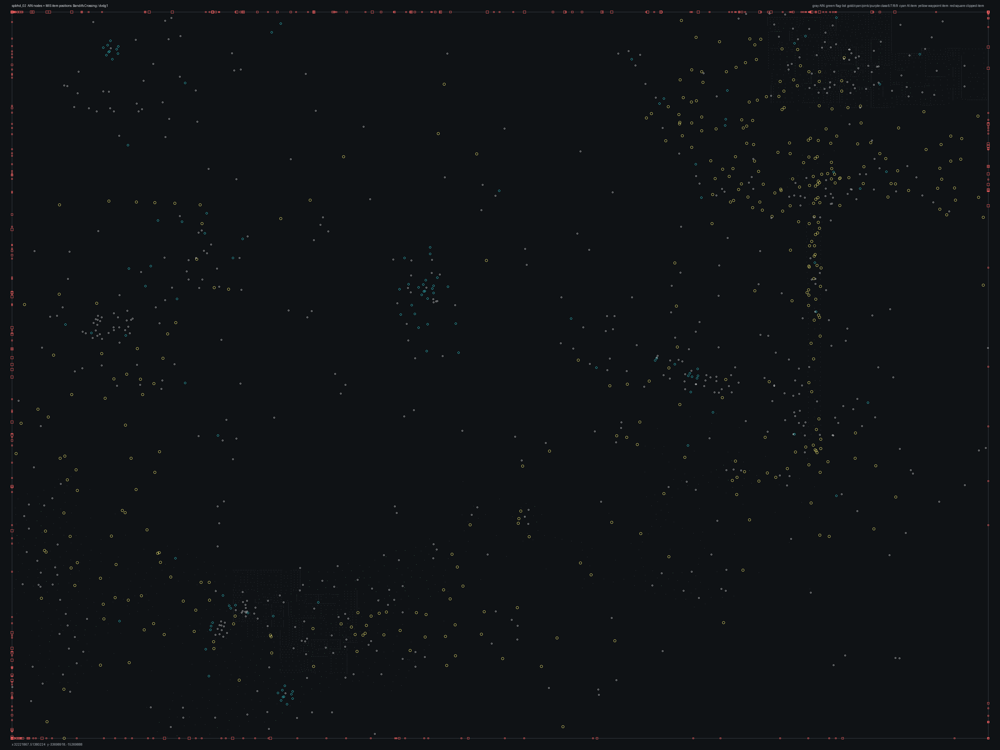

# SPBHD_02.bms - Bandit's Crossing

Back to [AIN Mission Index](../AIN%20Mission%20Index.md)

[Open full-size overlay image](overlays/spbhd_02_xy.png)

## Overlay Legend

| Marker | Meaning |
| --- | --- |
| Gray dots | Normal AIN navigation nodes. |
| Green dots | AIN nodes with `NodeFlags & 0x1C`. |
| Gold dots | AIN `NodeClass 6`. |
| Cyan-blue dots | AIN `NodeClass 7`. |
| Pink dots | AIN `NodeClass 8`. |
| Purple dots | AIN `NodeClass 9`. |
| Cyan circles | MIS items with `ai_textfile`. |
| Yellow circles | MIS items with `waypoint_id`. |
| White circles | Other MIS items with positions. |
| Red squares on frame | MIS items outside the AIN graph bounds. |

## Mission File Info

- Terrain: `dvdg1`
- AIN nodes: `3172`
- AIN areas: `256`
- MIS items/events/waypoint defs: `1557` / `177` / `77`
- MIS AI-positioned items: `219`
- MIS items with `waypoint_id`: `489`
- AINODEPATH events: `5`

## AIN Plot Maps

| Field | Description | XY | XZ | YZ |
| --- | --- | --- | --- | --- |
| Area ID | Node area/sector grouping. | [XY](plots/SPBHD_02_area_id_xy.png) | [XZ](plots/SPBHD_02_area_id_xz.png) | [YZ](plots/SPBHD_02_area_id_yz.png) |
| Node Class | `NodeClass` values, including special classes `6`-`9`. | [XY](plots/SPBHD_02_node_class_xy.png) | [XZ](plots/SPBHD_02_node_class_xz.png) | [YZ](plots/SPBHD_02_node_class_yz.png) |
| Node Flags | `NodeFlags` byte values and flag clusters. | [XY](plots/SPBHD_02_node_flags_xy.png) | [XZ](plots/SPBHD_02_node_flags_xz.png) | [YZ](plots/SPBHD_02_node_flags_yz.png) |
| Radius | Node `Radius` byte values. | [XY](plots/SPBHD_02_radius_xy.png) | [XZ](plots/SPBHD_02_radius_xz.png) | [YZ](plots/SPBHD_02_radius_yz.png) |
| Edge Flags | Combined outgoing `EdgeFlags`. | [XY](plots/SPBHD_02_edge_flags_xy.png) | [XZ](plots/SPBHD_02_edge_flags_xz.png) | [YZ](plots/SPBHD_02_edge_flags_yz.png) |

## AINODEPATH Events

### Event 0 - AINODEPATH_OFF

- Event block line: `983`
- AINODEPATH action line(s): `995`

**Trigger Items**

_None found._

**Referenced Items**

| Ref | Candidates |
| ---: | --- |
| `2` | item `2` / id `268` / type `1239` Technical enemy vehicle with mounted 50cal (`101239`) / ai `G_Jeep` / team `2` / group `7`; node `184`, area `0`, dist `412.8` |
| `3` | item `3` / id `267` / type `1239` Technical enemy vehicle with mounted 50cal (`101239`) / ai `G_Jeep` / team `2` / group `6`; node `184`, area `0`, dist `420.5` |
| `4` | item `4` / id `1275` / type `1239` Technical enemy vehicle with mounted 50cal (`101239`) / ai `G_Jeep` / team `2` / group `37`; node `335`, area `0`, dist `219.8` |
| `5` | item `5` / id `1269` / type `1239` Technical enemy vehicle with mounted 50cal (`101239`) / ai `G_Jeep` / team `2` / group `34`; node `184`, area `0`, dist `331.4` |
| `6` | item `6` / id `1271` / type `1239` Technical enemy vehicle with mounted 50cal (`101239`) / ai `G_Jeep` / team `2` / group `35`; node `184`, area `0`, dist `370.1` |
| `7` | item `7` / id `1279` / type `1245` Technical enemy vehicle #3 (`101245`) / ai `G_Jeep` / team `2` / group `39`; node `184`, area `0`, dist `225.4` |

**Trigger Waypoints**

_None found._

### Event 24 - AINODEPATH_ON

- Event block line: `1273`
- AINODEPATH action line(s): `1279`

**Trigger Items**

| Ref | Candidates |
| ---: | --- |
| `2` | item `2` / id `268` / type `1239` Technical enemy vehicle with mounted 50cal (`101239`) / ai `G_Jeep` / team `2` / group `7`; node `184`, area `0`, dist `412.8` |
| `5` | item `5` / id `1269` / type `1239` Technical enemy vehicle with mounted 50cal (`101239`) / ai `G_Jeep` / team `2` / group `34`; node `184`, area `0`, dist `331.4` |
| `7` | item `7` / id `1279` / type `1245` Technical enemy vehicle #3 (`101245`) / ai `G_Jeep` / team `2` / group `39`; node `184`, area `0`, dist `225.4` |
| `10` | item `10` / id `1273` / type `1245` Technical enemy vehicle #3 (`101245`) / ai `G_Jeep` / team `2` / group `36`; node `184`, area `0`, dist `357.8` |

**Referenced Items**

| Ref | Candidates |
| ---: | --- |
| `2` | item `2` / id `268` / type `1239` Technical enemy vehicle with mounted 50cal (`101239`) / ai `G_Jeep` / team `2` / group `7`; node `184`, area `0`, dist `412.8` |
| `5` | item `5` / id `1269` / type `1239` Technical enemy vehicle with mounted 50cal (`101239`) / ai `G_Jeep` / team `2` / group `34`; node `184`, area `0`, dist `331.4` |
| `7` | item `7` / id `1279` / type `1245` Technical enemy vehicle #3 (`101245`) / ai `G_Jeep` / team `2` / group `39`; node `184`, area `0`, dist `225.4` |
| `10` | item `10` / id `1273` / type `1245` Technical enemy vehicle #3 (`101245`) / ai `G_Jeep` / team `2` / group `36`; node `184`, area `0`, dist `357.8` |

**Trigger Waypoints**

| Ref | Candidates |
| ---: | --- |
| `2` | item `717` / wp `2` / id `764` / type `6005` waypoint (`106005`) item `828` / wp `2` / id `765` / type `6005` waypoint (`106005`) item `865` / wp `2` / id `766` / type `6005` waypoint (`106005`) item `955` / wp `2` / id `767` / type `6005` waypoint (`106005`) +3 more |
| `5` | item `742` / wp `5` / id `184` / type `6005` waypoint (`106005`) item `805` / wp `5` / id `185` / type `6005` waypoint (`106005`) item `1065` / wp `5` / id `190` / type `6005` waypoint (`106005`) item `1074` / wp `5` / id `191` / type `6005` waypoint (`106005`) +4 more |
| `7` | item `706` / wp `7` / id `204` / type `6005` waypoint (`106005`) item `799` / wp `7` / id `205` / type `6005` waypoint (`106005`) item `857` / wp `7` / id `206` / type `6005` waypoint (`106005`) item `910` / wp `7` / id `207` / type `6005` waypoint (`106005`) +4 more |
| `10` | item `774` / wp `10` / id `255` / type `6005` waypoint (`106005`) / ai `null` item `834` / wp `10` / id `256` / type `6005` waypoint (`106005`) item `879` / wp `10` / id `257` / type `6005` waypoint (`106005`) item `921` / wp `10` / id `258` / type `6005` waypoint (`106005`) +4 more |

### Event 31 - AINODEPATH_ON

- Event block line: `1354`
- AINODEPATH action line(s): `1363`

**Trigger Items**

| Ref | Candidates |
| ---: | --- |
| `3` | item `3` / id `267` / type `1239` Technical enemy vehicle with mounted 50cal (`101239`) / ai `G_Jeep` / team `2` / group `6`; node `184`, area `0`, dist `420.5` |
| `6` | item `6` / id `1271` / type `1239` Technical enemy vehicle with mounted 50cal (`101239`) / ai `G_Jeep` / team `2` / group `35`; node `184`, area `0`, dist `370.1` |
| `7` | item `7` / id `1279` / type `1245` Technical enemy vehicle #3 (`101245`) / ai `G_Jeep` / team `2` / group `39`; node `184`, area `0`, dist `225.4` |
| `10` | item `10` / id `1273` / type `1245` Technical enemy vehicle #3 (`101245`) / ai `G_Jeep` / team `2` / group `36`; node `184`, area `0`, dist `357.8` |
| `20` | item `20` / id `1137` / type `1266` Enemy Cargo Truck #1 (`101266`) / ai `g_jeep` / group `26`; node `2883`, area `1`, dist `235.0` |
| `26` | item `26` / id `51` / type `1493` Small fishing boat type #2 (`101493`) / ai `wu`; node `1585`, area `0`, dist `50.0` |

**Referenced Items**

| Ref | Candidates |
| ---: | --- |
| `3` | item `3` / id `267` / type `1239` Technical enemy vehicle with mounted 50cal (`101239`) / ai `G_Jeep` / team `2` / group `6`; node `184`, area `0`, dist `420.5` |
| `4` | item `4` / id `1275` / type `1239` Technical enemy vehicle with mounted 50cal (`101239`) / ai `G_Jeep` / team `2` / group `37`; node `335`, area `0`, dist `219.8` |
| `5` | item `5` / id `1269` / type `1239` Technical enemy vehicle with mounted 50cal (`101239`) / ai `G_Jeep` / team `2` / group `34`; node `184`, area `0`, dist `331.4` |
| `6` | item `6` / id `1271` / type `1239` Technical enemy vehicle with mounted 50cal (`101239`) / ai `G_Jeep` / team `2` / group `35`; node `184`, area `0`, dist `370.1` |
| `7` | item `7` / id `1279` / type `1245` Technical enemy vehicle #3 (`101245`) / ai `G_Jeep` / team `2` / group `39`; node `184`, area `0`, dist `225.4` |
| `10` | item `10` / id `1273` / type `1245` Technical enemy vehicle #3 (`101245`) / ai `G_Jeep` / team `2` / group `36`; node `184`, area `0`, dist `357.8` |

**Trigger Waypoints**

| Ref | Candidates |
| ---: | --- |
| `3` | item `724` / wp `3` / id `776` / type `6005` waypoint (`106005`) item `807` / wp `3` / id `785` / type `6005` waypoint (`106005`) item `850` / wp `3` / id `777` / type `6005` waypoint (`106005`) item `909` / wp `3` / id `778` / type `6005` waypoint (`106005`) +1 more |
| `6` | item `739` / wp `6` / id `194` / type `6005` waypoint (`106005`) / ai `null` item `839` / wp `6` / id `195` / type `6005` waypoint (`106005`) item `861` / wp `6` / id `196` / type `6005` waypoint (`106005`) / ai `null` item `943` / wp `6` / id `197` / type `6005` waypoint (`106005`) +1 more |
| `7` | item `706` / wp `7` / id `204` / type `6005` waypoint (`106005`) item `799` / wp `7` / id `205` / type `6005` waypoint (`106005`) item `857` / wp `7` / id `206` / type `6005` waypoint (`106005`) item `910` / wp `7` / id `207` / type `6005` waypoint (`106005`) +4 more |
| `10` | item `774` / wp `10` / id `255` / type `6005` waypoint (`106005`) / ai `null` item `834` / wp `10` / id `256` / type `6005` waypoint (`106005`) item `879` / wp `10` / id `257` / type `6005` waypoint (`106005`) item `921` / wp `10` / id `258` / type `6005` waypoint (`106005`) +4 more |
| `20` | item `719` / wp `20` / id `935` / type `6005` waypoint (`106005`) item `810` / wp `20` / id `936` / type `6005` waypoint (`106005`) item `873` / wp `20` / id `937` / type `6005` waypoint (`106005`) item `926` / wp `20` / id `938` / type `6005` waypoint (`106005`) +4 more |
| `26` | item `737` / wp `26` / id `1146` / type `6005` waypoint (`106005`) item `837` / wp `26` / id `1147` / type `6005` waypoint (`106005`) item `881` / wp `26` / id `1148` / type `6005` waypoint (`106005`) item `951` / wp `26` / id `1149` / type `6005` waypoint (`106005`) +3 more |

### Event 33 - AINODEPATH_ON

- Event block line: `1374`
- AINODEPATH action line(s): `1384`

**Trigger Items**

| Ref | Candidates |
| ---: | --- |
| `5` | item `5` / id `1269` / type `1239` Technical enemy vehicle with mounted 50cal (`101239`) / ai `G_Jeep` / team `2` / group `34`; node `184`, area `0`, dist `331.4` |
| `6` | item `6` / id `1271` / type `1239` Technical enemy vehicle with mounted 50cal (`101239`) / ai `G_Jeep` / team `2` / group `35`; node `184`, area `0`, dist `370.1` |
| `22` | item `22` / id `104` / type `1267` Technical 4 (`101267`) / ai `G_Jeep` / team `2` / group `30`; node `2755`, area `1`, dist `7.6` |
| `23` | item `23` / id `886` / type `1269` Indestructible Blackhawk with two miniguns (`101269`) / ai `h_bhawkf` / group `15`; node `2850`, area `1`, dist `713.4` |

**Referenced Items**

| Ref | Candidates |
| ---: | --- |
| `4` | item `4` / id `1275` / type `1239` Technical enemy vehicle with mounted 50cal (`101239`) / ai `G_Jeep` / team `2` / group `37`; node `335`, area `0`, dist `219.8` |
| `5` | item `5` / id `1269` / type `1239` Technical enemy vehicle with mounted 50cal (`101239`) / ai `G_Jeep` / team `2` / group `34`; node `184`, area `0`, dist `331.4` |
| `6` | item `6` / id `1271` / type `1239` Technical enemy vehicle with mounted 50cal (`101239`) / ai `G_Jeep` / team `2` / group `35`; node `184`, area `0`, dist `370.1` |
| `22` | item `22` / id `104` / type `1267` Technical 4 (`101267`) / ai `G_Jeep` / team `2` / group `30`; node `2755`, area `1`, dist `7.6` |
| `23` | item `23` / id `886` / type `1269` Indestructible Blackhawk with two miniguns (`101269`) / ai `h_bhawkf` / group `15`; node `2850`, area `1`, dist `713.4` |
| `63` | item `39` / id `63` / type `1038` Desert Adobe hut 3 (`101038`) / ai `null`; node `1898`, area `1`, dist `2.3` item `63` / id `341` / type `1111` Mogadishu Slum, Small Wooden structure (`101111`); node `2699`, area `1`, dist `0.6` |

**Trigger Waypoints**

| Ref | Candidates |
| ---: | --- |
| `5` | item `742` / wp `5` / id `184` / type `6005` waypoint (`106005`) item `805` / wp `5` / id `185` / type `6005` waypoint (`106005`) item `1065` / wp `5` / id `190` / type `6005` waypoint (`106005`) item `1074` / wp `5` / id `191` / type `6005` waypoint (`106005`) +4 more |
| `6` | item `739` / wp `6` / id `194` / type `6005` waypoint (`106005`) / ai `null` item `839` / wp `6` / id `195` / type `6005` waypoint (`106005`) item `861` / wp `6` / id `196` / type `6005` waypoint (`106005`) / ai `null` item `943` / wp `6` / id `197` / type `6005` waypoint (`106005`) +1 more |
| `22` | item `734` / wp `22` / id `1001` / type `6005` waypoint (`106005`) item `827` / wp `22` / id `1002` / type `6005` waypoint (`106005`) item `847` / wp `22` / id `1003` / type `6005` waypoint (`106005`) item `957` / wp `22` / id `1004` / type `6005` waypoint (`106005`) +4 more |
| `23` | item `735` / wp `23` / id `1016` / type `6005` waypoint (`106005`) item `831` / wp `23` / id `1017` / type `6005` waypoint (`106005`) item `851` / wp `23` / id `1018` / type `6005` waypoint (`106005`) item `913` / wp `23` / id `1019` / type `6005` waypoint (`106005`) +4 more |

### Event 69 - AINODEPATH_ON

- Event block line: `1831`
- AINODEPATH action line(s): `1839`

**Trigger Items**

| Ref | Candidates |
| ---: | --- |
| `4` | item `4` / id `1275` / type `1239` Technical enemy vehicle with mounted 50cal (`101239`) / ai `G_Jeep` / team `2` / group `37`; node `335`, area `0`, dist `219.8` |
| `7` | item `7` / id `1279` / type `1245` Technical enemy vehicle #3 (`101245`) / ai `G_Jeep` / team `2` / group `39`; node `184`, area `0`, dist `225.4` |

**Referenced Items**

| Ref | Candidates |
| ---: | --- |
| `4` | item `4` / id `1275` / type `1239` Technical enemy vehicle with mounted 50cal (`101239`) / ai `G_Jeep` / team `2` / group `37`; node `335`, area `0`, dist `219.8` |
| `5` | item `5` / id `1269` / type `1239` Technical enemy vehicle with mounted 50cal (`101239`) / ai `G_Jeep` / team `2` / group `34`; node `184`, area `0`, dist `331.4` |
| `7` | item `7` / id `1279` / type `1245` Technical enemy vehicle #3 (`101245`) / ai `G_Jeep` / team `2` / group `39`; node `184`, area `0`, dist `225.4` |
| `8` | item `8` / id `1265` / type `1245` Technical enemy vehicle #3 (`101245`) / ai `G_Jeep` / team `2` / group `32`; node `184`, area `0`, dist `354.7` |
| `13` | item `13` / id `1353` / type `1253` Friendly 5.5 ton with closed tarp (`101253`) / ai `sitgrnd1` / group `62`; node `3094`, area `1`, dist `49.8` |
| `19` | item `19` / id `1241` / type `1266` Enemy Cargo Truck #1 (`101266`) / ai `g_jeep` / group `51`; node `335`, area `0`, dist `258.0` |

**Trigger Waypoints**

| Ref | Candidates |
| ---: | --- |
| `4` | item `743` / wp `4` / id `887` / type `6005` waypoint (`106005`) item `809` / wp `4` / id `888` / type `6005` waypoint (`106005`) item `853` / wp `4` / id `889` / type `6005` waypoint (`106005`) item `940` / wp `4` / id `891` / type `6005` waypoint (`106005`) +4 more |
| `7` | item `706` / wp `7` / id `204` / type `6005` waypoint (`106005`) item `799` / wp `7` / id `205` / type `6005` waypoint (`106005`) item `857` / wp `7` / id `206` / type `6005` waypoint (`106005`) item `910` / wp `7` / id `207` / type `6005` waypoint (`106005`) +4 more |

## Spatial Notes

| Check | Result |
| --- | --- |
| AI item coverage | `130 / 219` AI-positioned items are inside the AIN XY bounds. |
| Positioned item coverage | `1081 / 1557` positioned MIS items are inside the AIN XY bounds. |
| AI nearest-node distance | min `0.7`, median `72.3`, max `713.4`. |
| Area coverage | `2` `AreaId` values used; dominant areas: `[(0, 1759), (1, 1413)]`. |
| Special node classes | `{}`. |
| Nonzero edge flags | `{'0x00': 13322}`. |

### Outside AIN Bounds

| Item |
| --- |
| item `2` / id `268` / type `1239` Technical enemy vehicle with mounted 50cal (`101239`) / ai `G_Jeep` / team `2` / group `7` |
| item `3` / id `267` / type `1239` Technical enemy vehicle with mounted 50cal (`101239`) / ai `G_Jeep` / team `2` / group `6` |
| item `4` / id `1275` / type `1239` Technical enemy vehicle with mounted 50cal (`101239`) / ai `G_Jeep` / team `2` / group `37` |
| item `5` / id `1269` / type `1239` Technical enemy vehicle with mounted 50cal (`101239`) / ai `G_Jeep` / team `2` / group `34` |
| item `6` / id `1271` / type `1239` Technical enemy vehicle with mounted 50cal (`101239`) / ai `G_Jeep` / team `2` / group `35` |
| item `7` / id `1279` / type `1245` Technical enemy vehicle #3 (`101245`) / ai `G_Jeep` / team `2` / group `39` |
| item `8` / id `1265` / type `1245` Technical enemy vehicle #3 (`101245`) / ai `G_Jeep` / team `2` / group `32` |
| item `9` / id `1267` / type `1245` Technical enemy vehicle #3 (`101245`) / ai `G_Jeep` / team `2` / group `33` |

### Farthest AI Items From AIN Nodes

| Item | Nearest Node | Area | Distance |
| --- | ---: | ---: | ---: |
| item `23` / id `886` / type `1269` Indestructible Blackhawk with two miniguns (`101269`) / ai `h_bhawkf` / group `15` | `2850` | `1` | `713.4` |
| item `538` / id `622` / type `2092` Large Green Bush used in desert Climate (`102092`) / ai `null` | `3060` | `1` | `456.4` |
| item `3` / id `267` / type `1239` Technical enemy vehicle with mounted 50cal (`101239`) / ai `G_Jeep` / team `2` / group `6` | `184` | `0` | `420.5` |
| item `2` / id `268` / type `1239` Technical enemy vehicle with mounted 50cal (`101239`) / ai `G_Jeep` / team `2` / group `7` | `184` | `0` | `412.8` |
| item `534` / id `619` / type `2092` Large Green Bush used in desert Climate (`102092`) / ai `null` | `3060` | `1` | `402.3` |

### Special Class Nodes

| Node | Class | Area | Flags | Nearest MIS Item | Distance |
| ---: | ---: | ---: | --- | --- | ---: |
| | | | | | |

### Nonzero Edge Flags

| Flag | Source | Target | Areas | Classes | Reverse | Distance |
| --- | ---: | ---: | --- | --- | --- | ---: |
| | | | | | | |
