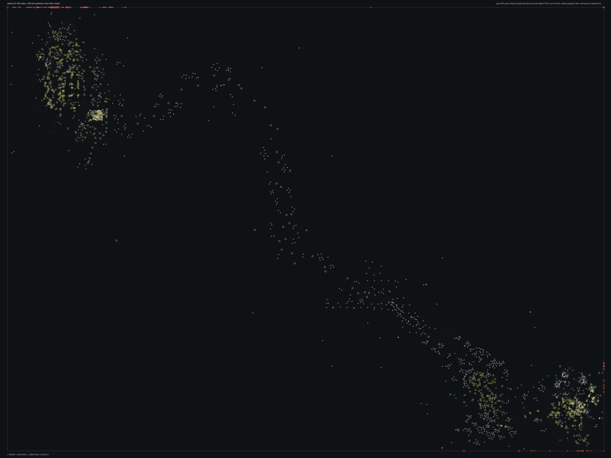

# SPBHD_03.bms - River Raid

Back to [AIN Mission Index](../AIN%20Mission%20Index.md)

[Open full-size overlay image](overlays/spbhd_03_xy.png)

## Overlay Legend

| Marker | Meaning |
| --- | --- |
| Gray dots | Normal AIN navigation nodes. |
| Green dots | AIN nodes with `NodeFlags & 0x1C`. |
| Gold dots | AIN `NodeClass 6`. |
| Cyan-blue dots | AIN `NodeClass 7`. |
| Pink dots | AIN `NodeClass 8`. |
| Purple dots | AIN `NodeClass 9`. |
| Cyan circles | MIS items with `ai_textfile`. |
| Yellow circles | MIS items with `waypoint_id`. |
| White circles | Other MIS items with positions. |
| Red squares on frame | MIS items outside the AIN graph bounds. |

## Mission File Info

- Terrain: `dvdg1`
- AIN nodes: `7263`
- AIN areas: `256`
- MIS items/events/waypoint defs: `2161` / `158` / `89`
- MIS AI-positioned items: `35`
- MIS items with `waypoint_id`: `638`
- AINODEPATH events: `5`

## AIN Plot Maps

| Field | Description | XY | XZ | YZ |
| --- | --- | --- | --- | --- |
| Area ID | Node area/sector grouping. | [XY](plots/SPBHD_03_area_id_xy.png) | [XZ](plots/SPBHD_03_area_id_xz.png) | [YZ](plots/SPBHD_03_area_id_yz.png) |
| Node Class | `NodeClass` values, including special classes `6`-`9`. | [XY](plots/SPBHD_03_node_class_xy.png) | [XZ](plots/SPBHD_03_node_class_xz.png) | [YZ](plots/SPBHD_03_node_class_yz.png) |
| Node Flags | `NodeFlags` byte values and flag clusters. | [XY](plots/SPBHD_03_node_flags_xy.png) | [XZ](plots/SPBHD_03_node_flags_xz.png) | [YZ](plots/SPBHD_03_node_flags_yz.png) |
| Radius | Node `Radius` byte values. | [XY](plots/SPBHD_03_radius_xy.png) | [XZ](plots/SPBHD_03_radius_xz.png) | [YZ](plots/SPBHD_03_radius_yz.png) |
| Edge Flags | Combined outgoing `EdgeFlags`. | [XY](plots/SPBHD_03_edge_flags_xy.png) | [XZ](plots/SPBHD_03_edge_flags_xz.png) | [YZ](plots/SPBHD_03_edge_flags_yz.png) |

## AINODEPATH Events

### Event 0 - AINODEPATH_OFF

- Event block line: `1101`
- AINODEPATH action line(s): `1121`

**Trigger Items**

_None found._

**Referenced Items**

| Ref | Candidates |
| ---: | --- |
| `2` | item `2` / id `159` / type `1245` Technical enemy vehicle #3 (`101245`) / ai `G_Jeep` / team `2` / group `63`; node `4390`, area `0`, dist `242.9` |
| `3` | item `3` / id `160` / type `1256` Enemy Motorized River Boat (`101256`) / ai `wu_f` / group `54`; node `4093`, area `0`, dist `3.3` |
| `4` | item `4` / id `86` / type `1269` Indestructible Blackhawk with two miniguns (`101269`) / ai `h_bhawkn` / group `31`; node `4738`, area `0`, dist `274.9` |
| `5` | item `5` / id `87` / type `1272` Blackhawk, miniguns, both doors open (`101272`) / ai `h_bhawkn` / wp `40` / group `53`; node `7259`, area `0`, dist `650.8` item `1929` / id `5` / type `1550` Large African Crocodile (`101550`) / team `2` / group `42`; node `837`, area `0`, dist `31.1` |
| `6` | item `6` / id `85` / type `1286` / ai `gu` / group `3`; node `463`, area `0`, dist `41.0` item `1930` / id `6` / type `1550` Large African Crocodile (`101550`) / team `2` / group `42`; node `944`, area `0`, dist `44.6` |
| `7` | item `7` / id `166` / type `1492` Small fishing boat type #1 (`101492`) / ai `sitboat` / group `49`; node `4024`, area `0`, dist `4.3` item `1931` / id `7` / type `1550` Large African Crocodile (`101550`) / team `2` / group `57`; node `725`, area `0`, dist `80.7` |

**Trigger Waypoints**

_None found._

### Event 7 - AINODEPATH_ON

- Event block line: `1206`
- AINODEPATH action line(s): `1219`

**Trigger Items**

| Ref | Candidates |
| ---: | --- |
| `6` | item `6` / id `85` / type `1286` / ai `gu` / group `3`; node `463`, area `0`, dist `41.0` item `1930` / id `6` / type `1550` Large African Crocodile (`101550`) / team `2` / group `42`; node `944`, area `0`, dist `44.6` |

**Referenced Items**

| Ref | Candidates |
| ---: | --- |
| `4` | item `4` / id `86` / type `1269` Indestructible Blackhawk with two miniguns (`101269`) / ai `h_bhawkn` / group `31`; node `4738`, area `0`, dist `274.9` |
| `6` | item `6` / id `85` / type `1286` / ai `gu` / group `3`; node `463`, area `0`, dist `41.0` item `1930` / id `6` / type `1550` Large African Crocodile (`101550`) / team `2` / group `42`; node `944`, area `0`, dist `44.6` |
| `17` | item `17` / id `172` / type `2041` Power Up Med Pack (`102041`) / group `56`; node `268`, area `20`, dist `0.7` item `2034` / id `17` / type `1766` Civilian Man Somalian #6 (`101766`) / group `20`; node `5387`, area `3`, dist `2.0` |
| `21` | item `21` / id `175` / type `2042` Power Up Ammo Pack (`102042`) / group `56`; node `268`, area `20`, dist `1.4` item `2032` / id `21` / type `1766` Civilian Man Somalian #6 (`101766`) / group `20`; node `233`, area `19`, dist `1.3` |
| `71` | item `71` / id `225` / type `1093` Mogadishu Slum Hut Single Unit (`101093`) / group `9`; node `5779`, area `9`, dist `3.0` item `2038` / id `71` / type `4514` 10th Mountain Teammate 1 (`104514`) / team `1` / group `1`; node `7259`, area `0`, dist `651.8` |
| `75` | item `75` / id `229` / type `1094` Mogadishu Slum Hut double unit (`101094`); node `1222`, area `0`, dist `3.3` item `2011` / id `75` / type `1752` 10th Mountain Teammate 2 (`101752`) / team `1` / group `1`; node `7259`, area `0`, dist `651.7` |

**Trigger Waypoints**

| Ref | Candidates |
| ---: | --- |
| `6` | item `1218` / wp `6` / id `2493` / type `6005` waypoint (`106005`) item `1302` / wp `6` / id `2521` / type `6005` waypoint (`106005`) item `1383` / wp `6` / id `2632` / type `6005` waypoint (`106005`) item `1420` / wp `6` / id `2677` / type `6005` waypoint (`106005`) +4 more |

### Event 56 - AINODEPATH_OFF

- Event block line: `1848`
- AINODEPATH action line(s): `1864`

**Trigger Items**

| Ref | Candidates |
| ---: | --- |
| `2` | item `2` / id `159` / type `1245` Technical enemy vehicle #3 (`101245`) / ai `G_Jeep` / team `2` / group `63`; node `4390`, area `0`, dist `242.9` |
| `55` | item `55` / id `209` / type `1093` Mogadishu Slum Hut Single Unit (`101093`) / group `9`; node `5143`, area `0`, dist `3.1` item `1981` / id `55` / type `1702` Enemy Somalian Malitia Member7 (`101702`) / team `2` / group `41`; node `3866`, area `0`, dist `0.8` |
| `101` | item `101` / id `255` / type `1095` Mogadishu Slum Hut Triple Unit (`101095`) / group `9`; node `7262`, area `0`, dist `354.9` item `1969` / id `101` / type `1701` Enemy Somalian Malitia Member6 (`101701`) / wp `16` / team `2` / group `36`; node `5349`, area `0`, dist `1.4` |

**Referenced Items**

| Ref | Candidates |
| ---: | --- |
| `2` | item `2` / id `159` / type `1245` Technical enemy vehicle #3 (`101245`) / ai `G_Jeep` / team `2` / group `63`; node `4390`, area `0`, dist `242.9` |
| `3` | item `3` / id `160` / type `1256` Enemy Motorized River Boat (`101256`) / ai `wu_f` / group `54`; node `4093`, area `0`, dist `3.3` |
| `6` | item `6` / id `85` / type `1286` / ai `gu` / group `3`; node `463`, area `0`, dist `41.0` item `1930` / id `6` / type `1550` Large African Crocodile (`101550`) / team `2` / group `42`; node `944`, area `0`, dist `44.6` |
| `29` | item `29` / id `183` / type `1093` Mogadishu Slum Hut Single Unit (`101093`) / group `9`; node `368`, area `0`, dist `3.1` item `1942` / id `29` / type `1661` Civilian Woman Somalian #2 (`101661`) / group `20`; node `5796`, area `0`, dist `1.6` |
| `30` | item `30` / id `184` / type `1093` Mogadishu Slum Hut Single Unit (`101093`) / group `9`; node `7160`, area `0`, dist `4.2` item `1945` / id `30` / type `1696` Enemy Somalian Soldier with AK47 (`101696`) / team `2` / group `21`; node `1564`, area `0`, dist `1.4` |
| `34` | item `34` / id `188` / type `1093` Mogadishu Slum Hut Single Unit (`101093`); node `4526`, area `0`, dist `3.3` item `1946` / id `34` / type `1697` Enemy Somalian Soldier with AK47 (`101697`) / wp `59` / team `2` / group `4`; node `261`, area `20`, dist `0.7` |

**Trigger Waypoints**

| Ref | Candidates |
| ---: | --- |
| `55` | item `1228` / wp `55` / id `2503` / type `6005` waypoint (`106005`) item `1316` / wp `55` / id `2536` / type `6005` waypoint (`106005`) item `1393` / wp `55` / id `2579` / type `6005` waypoint (`106005`) item `1415` / wp `55` / id `2669` / type `6005` waypoint (`106005`) +4 more |
| `101` | item `1309` / wp `101` / id `3477` / type `6005` waypoint (`106005`) |

### Event 69 - AINODEPATH_ON

- Event block line: `2000`
- AINODEPATH action line(s): `2006`

**Trigger Items**

| Ref | Candidates |
| ---: | --- |
| `3` | item `3` / id `160` / type `1256` Enemy Motorized River Boat (`101256`) / ai `wu_f` / group `54`; node `4093`, area `0`, dist `3.3` |
| `70` | item `70` / id `224` / type `1093` Mogadishu Slum Hut Single Unit (`101093`) / group `9`; node `5780`, area `9`, dist `3.2` item `2009` / id `70` / type `1752` 10th Mountain Teammate 2 (`101752`) / wp `126` / group `33`; node `4020`, area `0`, dist `2429.2` |

**Referenced Items**

| Ref | Candidates |
| ---: | --- |
| `3` | item `3` / id `160` / type `1256` Enemy Motorized River Boat (`101256`) / ai `wu_f` / group `54`; node `4093`, area `0`, dist `3.3` |
| `70` | item `70` / id `224` / type `1093` Mogadishu Slum Hut Single Unit (`101093`) / group `9`; node `5780`, area `9`, dist `3.2` item `2009` / id `70` / type `1752` 10th Mountain Teammate 2 (`101752`) / wp `126` / group `33`; node `4020`, area `0`, dist `2429.2` |

**Trigger Waypoints**

| Ref | Candidates |
| ---: | --- |
| `70` | item `1254` / wp `70` / id `3596` / type `6005` waypoint (`106005`) item `1328` / wp `70` / id `3597` / type `6005` waypoint (`106005`) item `1392` / wp `70` / id `3598` / type `6005` waypoint (`106005`) item `1457` / wp `70` / id `3599` / type `6005` waypoint (`106005`) |

### Event 70 - AINODEPATH_ON

- Event block line: `2010`
- AINODEPATH action line(s): `2027`

**Trigger Items**

| Ref | Candidates |
| ---: | --- |
| `3` | item `3` / id `160` / type `1256` Enemy Motorized River Boat (`101256`) / ai `wu_f` / group `54`; node `4093`, area `0`, dist `3.3` |
| `10` | item `10` / id `3617` / type `1492` Small fishing boat type #1 (`101492`) / ai `sitboat` / group `17`; node `837`, area `0`, dist `62.6` |
| `51` | item `51` / id `205` / type `1093` Mogadishu Slum Hut Single Unit (`101093`); node `1495`, area `0`, dist `2.9` |
| `67` | item `67` / id `221` / type `1093` Mogadishu Slum Hut Single Unit (`101093`) / group `9`; node `7262`, area `0`, dist `304.8` item `2004` / id `67` / type `1704` Enemy Somalian Malitia Member9 (`101704`) / wp `63` / team `2` / group `4`; node `1956`, area `20`, dist `1.1` |
| `70` | item `70` / id `224` / type `1093` Mogadishu Slum Hut Single Unit (`101093`) / group `9`; node `5780`, area `9`, dist `3.2` item `2009` / id `70` / type `1752` 10th Mountain Teammate 2 (`101752`) / wp `126` / group `33`; node `4020`, area `0`, dist `2429.2` |

**Referenced Items**

| Ref | Candidates |
| ---: | --- |
| `3` | item `3` / id `160` / type `1256` Enemy Motorized River Boat (`101256`) / ai `wu_f` / group `54`; node `4093`, area `0`, dist `3.3` |
| `9` | item `9` / id `163` / type `1492` Small fishing boat type #1 (`101492`) / ai `sitboat` / group `49`; node `4099`, area `0`, dist `5.8` item `1934` / id `9` / type `1658` Civilian Man Somalian #1 (`101658`) / group `20`; node `5145`, area `10`, dist `1.3` |
| `10` | item `10` / id `3617` / type `1492` Small fishing boat type #1 (`101492`) / ai `sitboat` / group `17`; node `837`, area `0`, dist `62.6` |
| `12` | item `12` / id `168` / type `1493` Small fishing boat type #2 (`101493`) / ai `sitboat` / group `49`; node `4146`, area `0`, dist `4.0` item `2030` / id `12` / type `1765` Civilian Man Somalian #5 (`101765`) / group `20`; node `7011`, area `0`, dist `1.6` |
| `15` | item `15` / id `170` / type `1494` Small fishing boat type #3 (`101494`) / ai `sitboat` / group `49`; node `4048`, area `0`, dist `4.2` item `1938` / id `15` / type `1659` Civilian Man Somalian #2 (`101659`) / group `20`; node `5743`, area `0`, dist `1.5` |
| `49` | item `49` / id `203` / type `1093` Mogadishu Slum Hut Single Unit (`101093`) / group `9`; node `5357`, area `0`, dist `3.0` item `1970` / id `49` / type `1701` Enemy Somalian Malitia Member6 (`101701`) / team `2` / group `23`; node `3520`, area `0`, dist `2.1` |

**Trigger Waypoints**

| Ref | Candidates |
| ---: | --- |
| `10` | item `1201` / wp `10` / id `2476` / type `6005` waypoint (`106005`) item `1323` / wp `10` / id `2541` / type `6005` waypoint (`106005`) item `1363` / wp `10` / id `2611` / type `6005` waypoint (`106005`) item `1412` / wp `10` / id `2666` / type `6005` waypoint (`106005`) +4 more |
| `51` | item `1223` / wp `51` / id `2498` / type `6005` waypoint (`106005`) / ai `null` item `1300` / wp `51` / id `2526` / type `6005` waypoint (`106005`) |
| `67` | item `1234` / wp `67` / id `2509` / type `6005` waypoint (`106005`) item `1282` / wp `67` / id `2572` / type `6005` waypoint (`106005`) item `1385` / wp `67` / id `2634` / type `6005` waypoint (`106005`) item `1427` / wp `67` / id `2693` / type `6005` waypoint (`106005`) +4 more |
| `70` | item `1254` / wp `70` / id `3596` / type `6005` waypoint (`106005`) item `1328` / wp `70` / id `3597` / type `6005` waypoint (`106005`) item `1392` / wp `70` / id `3598` / type `6005` waypoint (`106005`) item `1457` / wp `70` / id `3599` / type `6005` waypoint (`106005`) |

## Spatial Notes

| Check | Result |
| --- | --- |
| AI item coverage | `33 / 35` AI-positioned items are inside the AIN XY bounds. |
| Positioned item coverage | `2009 / 2161` positioned MIS items are inside the AIN XY bounds. |
| AI nearest-node distance | min `1.1`, median `41.0`, max `650.8`. |
| Area coverage | `18` `AreaId` values used; dominant areas: `[(0, 6193), (20, 354), (19, 178), (9, 66), (11, 59), (8, 52)]`. |
| Special node classes | `{'6': 71, '7': 5}`. |
| Nonzero edge flags | `{'0x00': 39601, '0x01': 2}`. |

### Outside AIN Bounds

| Item |
| --- |
| item `4` / id `86` / type `1269` Indestructible Blackhawk with two miniguns (`101269`) / ai `h_bhawkn` / group `31` |
| item `5` / id `87` / type `1272` Blackhawk, miniguns, both doors open (`101272`) / ai `h_bhawkn` / wp `40` / group `53` |
| item `65` / id `219` / type `1093` Mogadishu Slum Hut Single Unit (`101093`) / group `9` |
| item `66` / id `220` / type `1093` Mogadishu Slum Hut Single Unit (`101093`) / group `9` |
| item `67` / id `221` / type `1093` Mogadishu Slum Hut Single Unit (`101093`) / group `9` |
| item `68` / id `222` / type `1093` Mogadishu Slum Hut Single Unit (`101093`) / group `9` |
| item `76` / id `230` / type `1094` Mogadishu Slum Hut double unit (`101094`) / group `9` |
| item `99` / id `253` / type `1095` Mogadishu Slum Hut Triple Unit (`101095`) / group `9` |

### Farthest AI Items From AIN Nodes

| Item | Nearest Node | Area | Distance |
| --- | ---: | ---: | ---: |
| item `5` / id `87` / type `1272` Blackhawk, miniguns, both doors open (`101272`) / ai `h_bhawkn` / wp `40` / group `53` | `7259` | `0` | `650.8` |
| item `1840` / id `3367` / type `6102` snd: desert wind-gusts, with lp3 (`106102`) / ai `null` | `827` | `0` | `307.2` |
| item `1` / id `158` / type `1239` Technical enemy vehicle with mounted 50cal (`101239`) / ai `G_Jeep` / team `2` / group `62` | `827` | `0` | `276.3` |
| item `4` / id `86` / type `1269` Indestructible Blackhawk with two miniguns (`101269`) / ai `h_bhawkn` / group `31` | `4738` | `0` | `274.9` |
| item `2` / id `159` / type `1245` Technical enemy vehicle #3 (`101245`) / ai `G_Jeep` / team `2` / group `63` | `4390` | `0` | `242.9` |

### Special Class Nodes

| Node | Class | Area | Flags | Nearest MIS Item | Distance |
| ---: | ---: | ---: | --- | --- | ---: |
| `24` | `6` | `19` | `0x80` | item `1102` / id `2314` / type `4300` Single metal barrel (`104300`) / group `56` | `3.9` |
| `43` | `6` | `19` | `0x80` | item `1345` / id `2590` / type `6005` waypoint (`106005`) / wp `22` | `1.7` |
| `48` | `6` | `19` | `0x81` | item `237` / id `1462` / type `1496` Small Trash pile to be placed along walls (`101496`) / group `9` | `2.5` |
| `58` | `6` | `19` | `0x84` | item `1040` / id `2298` / type `2119` Technical, parked4 (`102119`) / group `9` | `5.0` |
| `272` | `6` | `20` | `0x85` | item `1973` / id `125` / type `1701` Enemy Somalian Malitia Member6 (`101701`) / team `2` / group `19` | `0.3` |
| `281` | `6` | `20` | `0x81` | item `1273` / id `2563` / type `6005` waypoint (`106005`) / wp `59` | `1.3` |
| `299` | `6` | `20` | `0x01` | item `1962` / id `112` / type `1700` Enemy Somalian Malitia Member5 (`101700`) / wp `62` / team `2` / group `4` | `2.7` |
| `302` | `6` | `20` | `0x81` | item `1463` / id `2654` / type `6005` waypoint (`106005`) / wp `59` | `1.5` |
| `319` | `6` | `19` | `0x81` | item `1943` / id `31` / type `1696` Enemy Somalian Soldier with AK47 (`101696`) / team `2` / group `36` | `14.1` |
| `2113` | `6` | `20` | `0x01` | item `1447` / id `2643` / type `6005` waypoint (`106005`) / wp `63` | `1.2` |
| `2115` | `6` | `20` | `0x01` | item `1355` / id `2602` / type `6005` waypoint (`106005`) / wp `63` | `1.0` |
| `2118` | `6` | `20` | `0x01` | item `1990` / id `141` / type `1703` Enemy Somalian Malitia Member8 (`101703`) / wp `61` / team `2` / group `4` | `1.1` |

### Nonzero Edge Flags

| Flag | Source | Target | Areas | Classes | Reverse | Distance |
| --- | ---: | ---: | --- | --- | --- | ---: |
| `0x01` | `4197` | `4100` | `0` -> `0` | `0` -> `0` | `0x00` | `5.0` |
| `0x01` | `4199` | `4197` | `0` -> `0` | `0` -> `0` | `0x00` | `2.5` |
