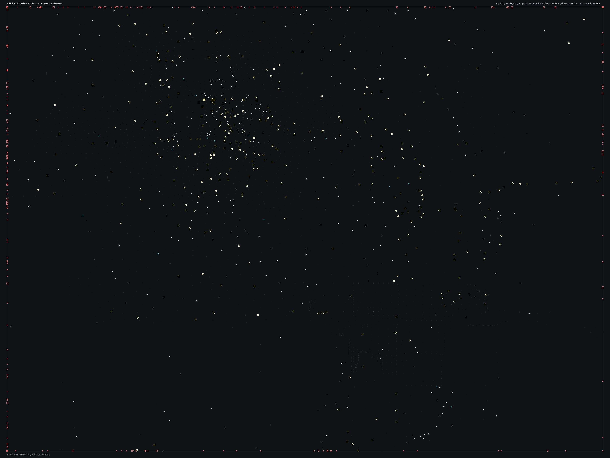

# SPBHD_04.bms - Gasoline Alley

Back to [AIN Mission Index](../AIN%20Mission%20Index.md)

[Open full-size overlay image](overlays/spbhd_04_xy.png)

## Overlay Legend

| Marker | Meaning |
| --- | --- |
| Gray dots | Normal AIN navigation nodes. |
| Green dots | AIN nodes with `NodeFlags & 0x1C`. |
| Gold dots | AIN `NodeClass 6`. |
| Cyan-blue dots | AIN `NodeClass 7`. |
| Pink dots | AIN `NodeClass 8`. |
| Purple dots | AIN `NodeClass 9`. |
| Cyan circles | MIS items with `ai_textfile`. |
| Yellow circles | MIS items with `waypoint_id`. |
| White circles | Other MIS items with positions. |
| Red squares on frame | MIS items outside the AIN graph bounds. |

## Mission File Info

- Terrain: `mis6`
- AIN nodes: `2018`
- AIN areas: `256`
- MIS items/events/waypoint defs: `1680` / `149` / `65`
- MIS AI-positioned items: `64`
- MIS items with `waypoint_id`: `574`
- AINODEPATH events: `2`

## AIN Plot Maps

| Field | Description | XY | XZ | YZ |
| --- | --- | --- | --- | --- |
| Area ID | Node area/sector grouping. | [XY](plots/SPBHD_04_area_id_xy.png) | [XZ](plots/SPBHD_04_area_id_xz.png) | [YZ](plots/SPBHD_04_area_id_yz.png) |
| Node Class | `NodeClass` values, including special classes `6`-`9`. | [XY](plots/SPBHD_04_node_class_xy.png) | [XZ](plots/SPBHD_04_node_class_xz.png) | [YZ](plots/SPBHD_04_node_class_yz.png) |
| Node Flags | `NodeFlags` byte values and flag clusters. | [XY](plots/SPBHD_04_node_flags_xy.png) | [XZ](plots/SPBHD_04_node_flags_xz.png) | [YZ](plots/SPBHD_04_node_flags_yz.png) |
| Radius | Node `Radius` byte values. | [XY](plots/SPBHD_04_radius_xy.png) | [XZ](plots/SPBHD_04_radius_xz.png) | [YZ](plots/SPBHD_04_radius_yz.png) |
| Edge Flags | Combined outgoing `EdgeFlags`. | [XY](plots/SPBHD_04_edge_flags_xy.png) | [XZ](plots/SPBHD_04_edge_flags_xz.png) | [YZ](plots/SPBHD_04_edge_flags_yz.png) |

## AINODEPATH Events

### Event 4 - AINODEPATH_OFF

- Event block line: `995`
- AINODEPATH action line(s): `1001`

**Trigger Items**

| Ref | Candidates |
| ---: | --- |
| `10` | item `10` / id `2406` / type `1266` Enemy Cargo Truck #1 (`101266`) / ai `g_jeep` / group `47`; node `727`, area `0`, dist `46.6` item `36` / id `10` / type `1088` Mogadishu City Block4 Moderately Generic 64x64 (`101088`); node `558`, area `0`, dist `25.8` |

**Referenced Items**

| Ref | Candidates |
| ---: | --- |
| `10` | item `10` / id `2406` / type `1266` Enemy Cargo Truck #1 (`101266`) / ai `g_jeep` / group `47`; node `727`, area `0`, dist `46.6` item `36` / id `10` / type `1088` Mogadishu City Block4 Moderately Generic 64x64 (`101088`); node `558`, area `0`, dist `25.8` |

**Trigger Waypoints**

| Ref | Candidates |
| ---: | --- |
| `10` | item `665` / wp `10` / id `1155` / type `6005` waypoint (`106005`) / ai `null` item `743` / wp `10` / id `1156` / type `6005` waypoint (`106005`) item `803` / wp `10` / id `1157` / type `6005` waypoint (`106005`) item `859` / wp `10` / id `1158` / type `6005` waypoint (`106005`) +4 more |

### Event 33 - AINODEPATH_ON

- Event block line: `1338`
- AINODEPATH action line(s): `1347`

**Trigger Items**

| Ref | Candidates |
| ---: | --- |
| `2` | item `2` / id `623` / type `1232` Friendly No Die Smoking LITTLE BIRD (`101232`) / ai `h_ah6z` / group `6`; node `557`, area `0`, dist `2467.1` |
| `4` | item `4` / id `2402` / type `1239` Technical enemy vehicle with mounted 50cal (`101239`) / ai `g_jeep` / group `46`; node `727`, area `0`, dist `49.5` item `59` / id `4` / type `1093` Mogadishu Slum Hut Single Unit (`101093`); node `1028`, area `0`, dist `10.2` |
| `7` | item `7` / id `257` / type `1253` Friendly 5.5 ton with closed tarp (`101253`) / ai `g_jeep` / team `1` / group `3`; node `868`, area `0`, dist `610.5` |
| `23` | item `23` / id `840` / type `1085` Mogadishu City Block1 Moderately Generic 64x64 (`101085`); node `868`, area `0`, dist `364.7` item `204` / id `23` / type `1455` Intersection (`101455`); node `1015`, area `0`, dist `7.2` |

**Referenced Items**

| Ref | Candidates |
| ---: | --- |
| `2` | item `2` / id `623` / type `1232` Friendly No Die Smoking LITTLE BIRD (`101232`) / ai `h_ah6z` / group `6`; node `557`, area `0`, dist `2467.1` |
| `4` | item `4` / id `2402` / type `1239` Technical enemy vehicle with mounted 50cal (`101239`) / ai `g_jeep` / group `46`; node `727`, area `0`, dist `49.5` item `59` / id `4` / type `1093` Mogadishu Slum Hut Single Unit (`101093`); node `1028`, area `0`, dist `10.2` |
| `7` | item `7` / id `257` / type `1253` Friendly 5.5 ton with closed tarp (`101253`) / ai `g_jeep` / team `1` / group `3`; node `868`, area `0`, dist `610.5` |
| `23` | item `23` / id `840` / type `1085` Mogadishu City Block1 Moderately Generic 64x64 (`101085`); node `868`, area `0`, dist `364.7` item `204` / id `23` / type `1455` Intersection (`101455`); node `1015`, area `0`, dist `7.2` |
| `79` | item `79` / id `263` / type `1094` Mogadishu Slum Hut double unit (`101094`); node `868`, area `0`, dist `632.0` |

**Trigger Waypoints**

| Ref | Candidates |
| ---: | --- |
| `2` | item `666` / wp `2` / id `329` / type `6005` waypoint (`106005`) item `742` / wp `2` / id `330` / type `6005` waypoint (`106005`) item `820` / wp `2` / id `331` / type `6005` waypoint (`106005`) item `900` / wp `2` / id `332` / type `6005` waypoint (`106005`) +4 more |
| `4` | item `663` / wp `4` / id `624` / type `6005` waypoint (`106005`) item `710` / wp `4` / id `625` / type `6005` waypoint (`106005`) item `776` / wp `4` / id `626` / type `6005` waypoint (`106005`) item `849` / wp `4` / id `627` / type `6005` waypoint (`106005`) +4 more |
| `7` | item `695` / wp `7` / id `1081` / type `6005` waypoint (`106005`) item `748` / wp `7` / id `1082` / type `6005` waypoint (`106005`) item `774` / wp `7` / id `1083` / type `6005` waypoint (`106005`) item `813` / wp `7` / id `1084` / type `6005` waypoint (`106005`) +4 more |
| `23` | item `674` / wp `23` / id `2279` / type `6005` waypoint (`106005`) item `717` / wp `23` / id `2280` / type `6005` waypoint (`106005`) item `780` / wp `23` / id `2281` / type `6005` waypoint (`106005`) item `856` / wp `23` / id `2282` / type `6005` waypoint (`106005`) +4 more |

## Spatial Notes

| Check | Result |
| --- | --- |
| AI item coverage | `26 / 64` AI-positioned items are inside the AIN XY bounds. |
| Positioned item coverage | `886 / 1680` positioned MIS items are inside the AIN XY bounds. |
| AI nearest-node distance | min `1.3`, median `69.5`, max `2467.1`. |
| Area coverage | `2` `AreaId` values used; dominant areas: `[(0, 2004), (64, 14)]`. |
| Special node classes | `{}`. |
| Nonzero edge flags | `{'0x00': 8759}`. |

### Outside AIN Bounds

| Item |
| --- |
| item `1` / id `4061` / type `1226` Friendly Hummer standard Version (`101226`) / ai `sitgrnd1` / team `1` |
| item `2` / id `623` / type `1232` Friendly No Die Smoking LITTLE BIRD (`101232`) / ai `h_ah6z` / group `6` |
| item `3` / id `2399` / type `1239` Technical enemy vehicle with mounted 50cal (`101239`) / ai `g_jeep` / group `45` |
| item `4` / id `2402` / type `1239` Technical enemy vehicle with mounted 50cal (`101239`) / ai `g_jeep` / group `46` |
| item `6` / id `247` / type `1253` Friendly 5.5 ton with closed tarp (`101253`) / ai `g_jeep` / team `1` / group `54` |
| item `7` / id `257` / type `1253` Friendly 5.5 ton with closed tarp (`101253`) / ai `g_jeep` / team `1` / group `3` |
| item `8` / id `258` / type `1253` Friendly 5.5 ton with closed tarp (`101253`) / ai `g_jeep` / team `1` / group `27` |
| item `9` / id `2215` / type `1253` Friendly 5.5 ton with closed tarp (`101253`) / ai `g_jeep` / team `1` / group `55` |

### Farthest AI Items From AIN Nodes

| Item | Nearest Node | Area | Distance |
| --- | ---: | ---: | ---: |
| item `2` / id `623` / type `1232` Friendly No Die Smoking LITTLE BIRD (`101232`) / ai `h_ah6z` / group `6` | `557` | `0` | `2467.1` |
| item `1333` / id `3995` / type `6131` snd: desert wind-gusts2, with lp4 (`106131`) / ai `null` | `868` | `0` | `695.3` |
| item `9` / id `2215` / type `1253` Friendly 5.5 ton with closed tarp (`101253`) / ai `g_jeep` / team `1` / group `55` | `868` | `0` | `665.9` |
| item `14` / id `259` / type `1276` Hummer with NON-Armored 50cal (`101276`) / ai `G_Jeep` / team `1` / group `3` | `868` | `0` | `655.8` |
| item `13` / id `240` / type `1276` Hummer with NON-Armored 50cal (`101276`) / ai `G_Jeep` / team `1` / group `3` | `868` | `0` | `644.7` |

### Special Class Nodes

| Node | Class | Area | Flags | Nearest MIS Item | Distance |
| ---: | ---: | ---: | --- | --- | ---: |
| | | | | | |

### Nonzero Edge Flags

| Flag | Source | Target | Areas | Classes | Reverse | Distance |
| --- | ---: | ---: | --- | --- | --- | ---: |
| | | | | | | |
