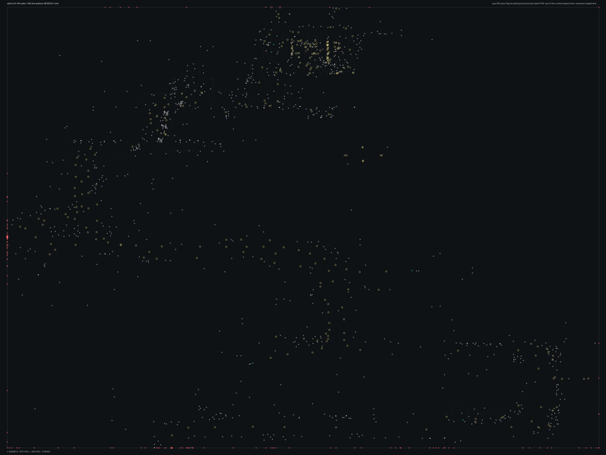

# SPBHD_06.bms - BESIEGED

Back to [AIN Mission Index](../AIN%20Mission%20Index.md)

[Open full-size overlay image](overlays/spbhd_06_xy.png)

## Overlay Legend

| Marker | Meaning |
| --- | --- |
| Gray dots | Normal AIN navigation nodes. |
| Green dots | AIN nodes with `NodeFlags & 0x1C`. |
| Gold dots | AIN `NodeClass 6`. |
| Cyan-blue dots | AIN `NodeClass 7`. |
| Pink dots | AIN `NodeClass 8`. |
| Purple dots | AIN `NodeClass 9`. |
| Cyan circles | MIS items with `ai_textfile`. |
| Yellow circles | MIS items with `waypoint_id`. |
| White circles | Other MIS items with positions. |
| Red squares on frame | MIS items outside the AIN graph bounds. |

## Mission File Info

- Terrain: `mis4`
- AIN nodes: `2391`
- AIN areas: `256`
- MIS items/events/waypoint defs: `1493` / `125` / `61`
- MIS AI-positioned items: `13`
- MIS items with `waypoint_id`: `294`
- AINODEPATH events: `2`

## AIN Plot Maps

| Field | Description | XY | XZ | YZ |
| --- | --- | --- | --- | --- |
| Area ID | Node area/sector grouping. | [XY](plots/SPBHD_06_area_id_xy.png) | [XZ](plots/SPBHD_06_area_id_xz.png) | [YZ](plots/SPBHD_06_area_id_yz.png) |
| Node Class | `NodeClass` values, including special classes `6`-`9`. | [XY](plots/SPBHD_06_node_class_xy.png) | [XZ](plots/SPBHD_06_node_class_xz.png) | [YZ](plots/SPBHD_06_node_class_yz.png) |
| Node Flags | `NodeFlags` byte values and flag clusters. | [XY](plots/SPBHD_06_node_flags_xy.png) | [XZ](plots/SPBHD_06_node_flags_xz.png) | [YZ](plots/SPBHD_06_node_flags_yz.png) |
| Radius | Node `Radius` byte values. | [XY](plots/SPBHD_06_radius_xy.png) | [XZ](plots/SPBHD_06_radius_xz.png) | [YZ](plots/SPBHD_06_radius_yz.png) |
| Edge Flags | Combined outgoing `EdgeFlags`. | [XY](plots/SPBHD_06_edge_flags_xy.png) | [XZ](plots/SPBHD_06_edge_flags_xz.png) | [YZ](plots/SPBHD_06_edge_flags_yz.png) |

## AINODEPATH Events

### Event 0 - AINODEPATH_OFF

- Event block line: `804`
- AINODEPATH action line(s): `824`

**Trigger Items**

_None found._

**Referenced Items**

| Ref | Candidates |
| ---: | --- |
| `2` | item `2` / id `143` / type `1226` Friendly Hummer standard Version (`101226`) / ai `G_Jeep` / group `62`; node `1085`, area `0`, dist `2.5` item `1290` / id `2` / type `1654` Pakistani soldier #2 (`101654`) / group `12`; node `195`, area `2`, dist `1.4` |
| `3` | item `3` / id `144` / type `1226` Friendly Hummer standard Version (`101226`) / ai `G_Jeep` / group `62`; node `1070`, area `0`, dist `2.6` item `1293` / id `3` / type `1654` Pakistani soldier #2 (`101654`) / group `21`; node `1070`, area `0`, dist `1.4` |
| `4` | item `4` / id `145` / type `1237` Technical enemy vehicle with mounted Cannon (`101237`) / ai `G_Jeep` / team `2` / group `6`; node `1553`, area `0`, dist `41.2` item `1294` / id `4` / type `1654` Pakistani soldier #2 (`101654`) / group `11`; node `1229`, area `1`, dist `1.3` |
| `5` | item `5` / id `146` / type `1239` Technical enemy vehicle with mounted 50cal (`101239`) / ai `G_Jeep` / team `2`; node `1518`, area `0`, dist `83.6` item `1295` / id `5` / type `1654` Pakistani soldier #2 (`101654`) / wp `34` / group `11`; node `202`, area `2`, dist `1.4` |
| `6` | item `6` / id `147` / type `1245` Technical enemy vehicle #3 (`101245`) / ai `G_Jeep` / team `2` / group `6`; node `2267`, area `0`, dist `33.6` item `1296` / id `6` / type `1654` Pakistani soldier #2 (`101654`) / group `12`; node `1648`, area `4`, dist `1.5` |
| `7` | item `7` / id `148` / type `1245` Technical enemy vehicle #3 (`101245`) / ai `G_Jeep` / team `2` / group `5`; node `2303`, area `0`, dist `19.5` item `1297` / id `7` / type `1654` Pakistani soldier #2 (`101654`) / group `21`; node `2062`, area `0`, dist `1.4` |

**Trigger Waypoints**

_None found._

### Event 38 - AINODEPATH_ON

- Event block line: `1285`
- AINODEPATH action line(s): `1298`

**Trigger Items**

| Ref | Candidates |
| ---: | --- |
| `3` | item `3` / id `144` / type `1226` Friendly Hummer standard Version (`101226`) / ai `G_Jeep` / group `62`; node `1070`, area `0`, dist `2.6` item `1293` / id `3` / type `1654` Pakistani soldier #2 (`101654`) / group `21`; node `1070`, area `0`, dist `1.4` |
| `5` | item `5` / id `146` / type `1239` Technical enemy vehicle with mounted 50cal (`101239`) / ai `G_Jeep` / team `2`; node `1518`, area `0`, dist `83.6` item `1295` / id `5` / type `1654` Pakistani soldier #2 (`101654`) / wp `34` / group `11`; node `202`, area `2`, dist `1.4` |
| `7` | item `7` / id `148` / type `1245` Technical enemy vehicle #3 (`101245`) / ai `G_Jeep` / team `2` / group `5`; node `2303`, area `0`, dist `19.5` item `1297` / id `7` / type `1654` Pakistani soldier #2 (`101654`) / group `21`; node `2062`, area `0`, dist `1.4` |
| `10` | item `10` / id `151` / type `1276` Hummer with NON-Armored 50cal (`101276`) / ai `G_Jeep` / wp `16` / group `3`; node `1350`, area `0`, dist `120.7` item `1300` / id `10` / type `1659` Civilian Man Somalian #2 (`101659`) / wp `10` / group `29`; node `1421`, area `0`, dist `1.3` |
| `17` | item `17` / id `158` / type `1086` Mogadishu City Block2 Moderately Generic 64x64 (`101086`); node `425`, area `0`, dist `33.6` item `1325` / id `17` / type `1697` Enemy Somalian Soldier with AK47 (`101697`) / team `2` / group `23`; node `1737`, area `0`, dist `1.4` |
| `29` | item `29` / id `168` / type `1088` Mogadishu City Block4 Moderately Generic 64x64 (`101088`); node `1441`, area `1`, dist `9.7` item `1330` / id `29` / type `1698` Enemy Somalian Soldier with RPG (`101698`) / team `2` / group `36`; node `2267`, area `0`, dist `35.3` |

**Referenced Items**

| Ref | Candidates |
| ---: | --- |
| `3` | item `3` / id `144` / type `1226` Friendly Hummer standard Version (`101226`) / ai `G_Jeep` / group `62`; node `1070`, area `0`, dist `2.6` item `1293` / id `3` / type `1654` Pakistani soldier #2 (`101654`) / group `21`; node `1070`, area `0`, dist `1.4` |
| `4` | item `4` / id `145` / type `1237` Technical enemy vehicle with mounted Cannon (`101237`) / ai `G_Jeep` / team `2` / group `6`; node `1553`, area `0`, dist `41.2` item `1294` / id `4` / type `1654` Pakistani soldier #2 (`101654`) / group `11`; node `1229`, area `1`, dist `1.3` |
| `5` | item `5` / id `146` / type `1239` Technical enemy vehicle with mounted 50cal (`101239`) / ai `G_Jeep` / team `2`; node `1518`, area `0`, dist `83.6` item `1295` / id `5` / type `1654` Pakistani soldier #2 (`101654`) / wp `34` / group `11`; node `202`, area `2`, dist `1.4` |
| `6` | item `6` / id `147` / type `1245` Technical enemy vehicle #3 (`101245`) / ai `G_Jeep` / team `2` / group `6`; node `2267`, area `0`, dist `33.6` item `1296` / id `6` / type `1654` Pakistani soldier #2 (`101654`) / group `12`; node `1648`, area `4`, dist `1.5` |
| `7` | item `7` / id `148` / type `1245` Technical enemy vehicle #3 (`101245`) / ai `G_Jeep` / team `2` / group `5`; node `2303`, area `0`, dist `19.5` item `1297` / id `7` / type `1654` Pakistani soldier #2 (`101654`) / group `21`; node `2062`, area `0`, dist `1.4` |
| `8` | item `8` / id `149` / type `1258` Bus with crop top (`101258`) / ai `G_Jeep` / team `2` / group `7`; node `1518`, area `0`, dist `36.2` item `1286` / id `8` / type `1654` Pakistani soldier #2 (`101654`) / group `21`; node `1071`, area `0`, dist `1.3` |

**Trigger Waypoints**

| Ref | Candidates |
| ---: | --- |
| `3` | item `939` / wp `3` / id `1687` / type `6005` waypoint (`106005`) item `1027` / wp `3` / id `1713` / type `6005` waypoint (`106005`) item `1071` / wp `3` / id `1749` / type `6005` waypoint (`106005`) item `1072` / wp `3` / id `1774` / type `6005` waypoint (`106005`) +4 more |
| `5` | item `965` / wp `5` / id `1695` / type `6005` waypoint (`106005`) item `1030` / wp `5` / id `1716` / type `6005` waypoint (`106005`) item `1048` / wp `5` / id `1740` / type `6005` waypoint (`106005`) item `1060` / wp `5` / id `1755` / type `6005` waypoint (`106005`) +4 more |
| `7` | item `942` / wp `7` / id `1689` / type `6005` waypoint (`106005`) |
| `10` | item `964` / wp `10` / id `1693` / type `6005` waypoint (`106005`) item `1026` / wp `10` / id `1712` / type `6005` waypoint (`106005`) item `1045` / wp `10` / id `2126` / type `6005` waypoint (`106005`) item `1298` / wp `10` / id `9` / type `1658` Civilian Man Somalian #1 (`101658`) +1 more |
| `17` | item `979` / wp `17` / id `1703` / type `6005` waypoint (`106005`) item `1025` / wp `17` / id `1711` / type `6005` waypoint (`106005`) |
| `29` | item `946` / wp `29` / id `2201` / type `6005` waypoint (`106005`) |

## Spatial Notes

| Check | Result |
| --- | --- |
| AI item coverage | `9 / 13` AI-positioned items are inside the AIN XY bounds. |
| Positioned item coverage | `1298 / 1493` positioned MIS items are inside the AIN XY bounds. |
| AI nearest-node distance | min `1.6`, median `25.3`, max `120.7`. |
| Area coverage | `10` `AreaId` values used; dominant areas: `[(0, 1713), (11, 118), (10, 98), (1, 92), (3, 88), (5, 88)]`. |
| Special node classes | `{'6': 39, '7': 20}`. |
| Nonzero edge flags | `{'0x00': 13714, '0x01': 5, '0x10': 7, '0x20': 1, '0x30': 12}`. |

### Outside AIN Bounds

| Item |
| --- |
| item `0` / id `141` / type `1220` Neutral Compact Pickup Truck (`101220`) / ai `g_jeep` / team `2` / group `7` |
| item `5` / id `146` / type `1239` Technical enemy vehicle with mounted 50cal (`101239`) / ai `G_Jeep` / team `2` |
| item `8` / id `149` / type `1258` Bus with crop top (`101258`) / ai `G_Jeep` / team `2` / group `7` |
| item `10` / id `151` / type `1276` Hummer with NON-Armored 50cal (`101276`) / ai `G_Jeep` / wp `16` / group `3` |
| item `18` / id `159` / type `1086` Mogadishu City Block2 Moderately Generic 64x64 (`101086`) |
| item `19` / id `160` / type `1086` Mogadishu City Block2 Moderately Generic 64x64 (`101086`) |
| item `20` / id `161` / type `1086` Mogadishu City Block2 Moderately Generic 64x64 (`101086`) |
| item `22` / id `157` / type `1086` Mogadishu City Block2 Moderately Generic 64x64 (`101086`) |

### Farthest AI Items From AIN Nodes

| Item | Nearest Node | Area | Distance |
| --- | ---: | ---: | ---: |
| item `10` / id `151` / type `1276` Hummer with NON-Armored 50cal (`101276`) / ai `G_Jeep` / wp `16` / group `3` | `1350` | `0` | `120.7` |
| item `5` / id `146` / type `1239` Technical enemy vehicle with mounted 50cal (`101239`) / ai `G_Jeep` / team `2` | `1518` | `0` | `83.6` |
| item `0` / id `141` / type `1220` Neutral Compact Pickup Truck (`101220`) / ai `g_jeep` / team `2` / group `7` | `1518` | `0` | `51.8` |
| item `4` / id `145` / type `1237` Technical enemy vehicle with mounted Cannon (`101237`) / ai `G_Jeep` / team `2` / group `6` | `1553` | `0` | `41.2` |
| item `8` / id `149` / type `1258` Bus with crop top (`101258`) / ai `G_Jeep` / team `2` / group `7` | `1518` | `0` | `36.2` |

### Special Class Nodes

| Node | Class | Area | Flags | Nearest MIS Item | Distance |
| ---: | ---: | ---: | --- | --- | ---: |
| `120` | `6` | `3` | `0x0D` | item `962` / id `2220` / type `6005` waypoint (`106005`) / wp `44` | `1.4` |
| `121` | `6` | `3` | `0x0D` | item `961` / id `2219` / type `6005` waypoint (`106005`) / wp `42` | `2.2` |
| `122` | `6` | `3` | `0x0D` | item `954` / id `2212` / type `6005` waypoint (`106005`) / wp `36` | `1.8` |
| `123` | `6` | `3` | `0x8D` | item `681` / id `1402` / type `1593` U.N. Single of Supply Bundle (`101593`) | `2.6` |
| `125` | `6` | `3` | `0x85` | item `956` / id `2214` / type `6005` waypoint (`106005`) / wp `37` | `1.3` |
| `126` | `6` | `2` | `0x85` | item `365` / id `1105` / type `1476` Scattered papers and waste (`101476`) | `1.5` |
| `127` | `6` | `2` | `0x85` | item `1292` / id `98` / type `1654` Pakistani soldier #2 (`101654`) / group `12` | `1.8` |
| `139` | `6` | `4` | `0x81` | item `179` / id `919` / type `1476` Scattered papers and waste (`101476`) | `1.7` |
| `142` | `6` | `4` | `0x8D` | item `179` / id `919` / type `1476` Scattered papers and waste (`101476`) | `3.7` |
| `190` | `6` | `2` | `0x05` | item `330` / id `1070` / type `1476` Scattered papers and waste (`101476`) | `1.5` |
| `191` | `6` | `2` | `0x01` | item `947` / id `2202` / type `6005` waypoint (`106005`) / wp `30` | `1.5` |
| `192` | `6` | `2` | `0x05` | item `1414` / id `94` / type `3800` Pakistani soldier #3 (`103800`) / group `11` | `2.2` |

### Nonzero Edge Flags

| Flag | Source | Target | Areas | Classes | Reverse | Distance |
| --- | ---: | ---: | --- | --- | --- | ---: |
| `0x01` | `648` | `2164` | `11` -> `11` | `0` -> `0` | `0x00` | `1.5` |
| `0x01` | `912` | `916` | `11` -> `11` | `0` -> `0` | `0x00` | `2.2` |
| `0x01` | `1116` | `1011` | `6` -> `6` | `0` -> `7` | `0x00` | `3.7` |
| `0x01` | `1426` | `1012` | `6` -> `6` | `0` -> `0` | `0x00` | `1.6` |
| `0x01` | `1427` | `1012` | `6` -> `6` | `0` -> `0` | `0x00` | `2.0` |
| `0x10` | `212` | `209` | `0` -> `0` | `0` -> `0` | `0x00` | `1.2` |
| `0x10` | `212` | `210` | `0` -> `0` | `0` -> `0` | `0x00` | `1.2` |
| `0x10` | `217` | `223` | `0` -> `0` | `0` -> `7` | `0x00` | `1.5` |
| `0x10` | `217` | `224` | `0` -> `0` | `0` -> `0` | `0x00` | `1.7` |
| `0x10` | `218` | `223` | `0` -> `0` | `0` -> `7` | `0x00` | `2.2` |
| `0x10` | `218` | `224` | `0` -> `0` | `0` -> `0` | `0x00` | `1.8` |
| `0x10` | `1013` | `1014` | `6` -> `0` | `0` -> `0` | `0x00` | `2.4` |
