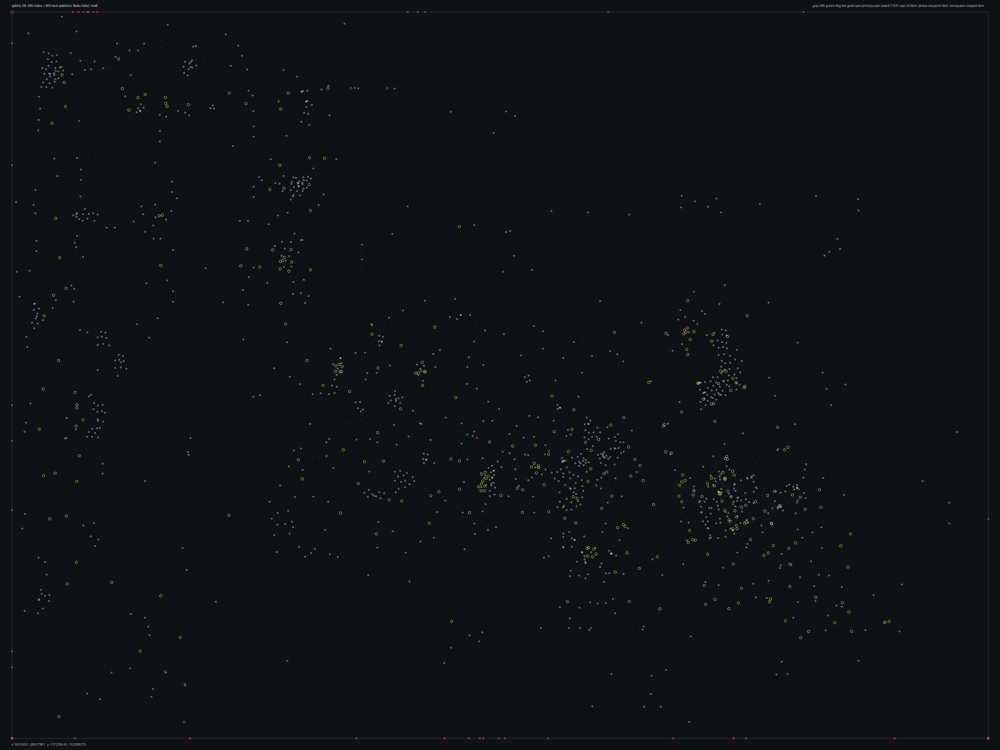

# SPBHD_08.bms - Radio Aidid

Back to [AIN Mission Index](../AIN%20Mission%20Index.md)

[Open full-size overlay image](overlays/spbhd_08_xy.png)

## Overlay Legend

| Marker | Meaning |
| --- | --- |
| Gray dots | Normal AIN navigation nodes. |
| Green dots | AIN nodes with `NodeFlags & 0x1C`. |
| Gold dots | AIN `NodeClass 6`. |
| Cyan-blue dots | AIN `NodeClass 7`. |
| Pink dots | AIN `NodeClass 8`. |
| Purple dots | AIN `NodeClass 9`. |
| Cyan circles | MIS items with `ai_textfile`. |
| Yellow circles | MIS items with `waypoint_id`. |
| White circles | Other MIS items with positions. |
| Red squares on frame | MIS items outside the AIN graph bounds. |

## Mission File Info

- Terrain: `mis8`
- AIN nodes: `2980`
- AIN areas: `256`
- MIS items/events/waypoint defs: `1465` / `184` / `59`
- MIS AI-positioned items: `9`
- MIS items with `waypoint_id`: `309`
- AINODEPATH events: `0`

## AIN Plot Maps

| Field | Description | XY | XZ | YZ |
| --- | --- | --- | --- | --- |
| Area ID | Node area/sector grouping. | [XY](plots/SPBHD_08_area_id_xy.png) | [XZ](plots/SPBHD_08_area_id_xz.png) | [YZ](plots/SPBHD_08_area_id_yz.png) |
| Node Class | `NodeClass` values, including special classes `6`-`9`. | [XY](plots/SPBHD_08_node_class_xy.png) | [XZ](plots/SPBHD_08_node_class_xz.png) | [YZ](plots/SPBHD_08_node_class_yz.png) |
| Node Flags | `NodeFlags` byte values and flag clusters. | [XY](plots/SPBHD_08_node_flags_xy.png) | [XZ](plots/SPBHD_08_node_flags_xz.png) | [YZ](plots/SPBHD_08_node_flags_yz.png) |
| Radius | Node `Radius` byte values. | [XY](plots/SPBHD_08_radius_xy.png) | [XZ](plots/SPBHD_08_radius_xz.png) | [YZ](plots/SPBHD_08_radius_yz.png) |
| Edge Flags | Combined outgoing `EdgeFlags`. | [XY](plots/SPBHD_08_edge_flags_xy.png) | [XZ](plots/SPBHD_08_edge_flags_xz.png) | [YZ](plots/SPBHD_08_edge_flags_yz.png) |

## AINODEPATH Events

No `AINODEPATH` actions were found in this mission.

## Spatial Notes

| Check | Result |
| --- | --- |
| AI item coverage | `7 / 9` AI-positioned items are inside the AIN XY bounds. |
| Positioned item coverage | `1424 / 1465` positioned MIS items are inside the AIN XY bounds. |
| AI nearest-node distance | min `1.4`, median `2.5`, max `1941.7`. |
| Area coverage | `26` `AreaId` values used; dominant areas: `[(0, 2134), (8, 134), (11, 73), (14, 55), (15, 45), (6, 42)]`. |
| Special node classes | `{'6': 109, '7': 4, '8': 10, '9': 2}`. |
| Nonzero edge flags | `{'0x00': 17100}`. |

### Outside AIN Bounds

| Item |
| --- |
| item `1` / id `3159` / type `1232` Friendly No Die Smoking LITTLE BIRD (`101232`) / ai `h_ah6b_z` |
| item `5` / id `1271` / type `1269` Indestructible Blackhawk with two miniguns (`101269`) / ai `h_bhawkf` / group `45` |
| item `13` / id `4` / type `1085` Mogadishu City Block1 Moderately Generic 64x64 (`101085`) |
| item `16` / id `2` / type `1085` Mogadishu City Block1 Moderately Generic 64x64 (`101085`) |
| item `17` / id `3` / type `1085` Mogadishu City Block1 Moderately Generic 64x64 (`101085`) |
| item `19` / id `10` / type `1086` Mogadishu City Block2 Moderately Generic 64x64 (`101086`) |
| item `21` / id `8` / type `1086` Mogadishu City Block2 Moderately Generic 64x64 (`101086`) |
| item `24` / id `11` / type `1088` Mogadishu City Block4 Moderately Generic 64x64 (`101088`) |

### Farthest AI Items From AIN Nodes

| Item | Nearest Node | Area | Distance |
| --- | ---: | ---: | ---: |
| item `1` / id `3159` / type `1232` Friendly No Die Smoking LITTLE BIRD (`101232`) / ai `h_ah6b_z` | `2431` | `0` | `1941.7` |
| item `5` / id `1271` / type `1269` Indestructible Blackhawk with two miniguns (`101269`) / ai `h_bhawkf` / group `45` | `1097` | `0` | `271.4` |
| item `2` / id `1236` / type `1239` Technical enemy vehicle with mounted 50cal (`101239`) / ai `G_Jeep` / team `2` / group `34` | `1793` | `0` | `25.3` |
| item `3` / id `1237` / type `1245` Technical enemy vehicle #3 (`101245`) / ai `G_Jeep` / team `2` / group `34` | `1793` | `0` | `12.3` |
| item `1225` / id `3155` / type `6147` snd: NghtBug1 (1-shots) (`106147`) / ai `null` | `2426` | `0` | `2.5` |

### Special Class Nodes

| Node | Class | Area | Flags | Nearest MIS Item | Distance |
| ---: | ---: | ---: | --- | --- | ---: |
| `294` | `6` | `26` | `0x04` | item `1273` / id `836` / type `1699` Enemy Somalian Malitia Member4 (`101699`) / team `2` / group `9` | `1.3` |
| `298` | `6` | `26` | `0x04` | item `1265` / id `835` / type `1697` Enemy Somalian Soldier with AK47 (`101697`) / team `2` / group `9` | `3.9` |
| `300` | `6` | `26` | `0x04` | item `1058` / id `1026` / type `6005` waypoint (`106005`) / wp `56` | `1.6` |
| `304` | `6` | `27` | `0x04` | item `56` / id `52` / type `1095` Mogadishu Slum Hut Triple Unit (`101095`) | `4.3` |
| `309` | `6` | `27` | `0x04` | item `1279` / id `869` / type `1700` Enemy Somalian Malitia Member5 (`101700`) / team `2` / group `8` | `7.8` |
| `311` | `6` | `27` | `0x00` | item `74` / id `57` / type `1096` Mogadishu Slum Hut 4 connected Units (`101096`) | `7.9` |
| `312` | `6` | `24` | `0x00` | item `1279` / id `869` / type `1700` Enemy Somalian Malitia Member5 (`101700`) / team `2` / group `8` | `9.8` |
| `313` | `6` | `24` | `0x06` | item `1312` / id `887` / type `1702` Enemy Somalian Malitia Member7 (`101702`) / team `2` | `9.0` |
| `315` | `6` | `26` | `0x00` | item `1016` / id `1024` / type `6005` waypoint (`106005`) / wp `56` | `1.5` |
| `317` | `6` | `25` | `0x06` | item `1359` / id `3236` / type `6013` Area Trigger (`106013`) | `1.9` |
| `323` | `6` | `25` | `0x00` | item `37` / id `32` / type `1093` Mogadishu Slum Hut Single Unit (`101093`) | `4.6` |
| `337` | `6` | `0` | `0x84` | item `51` / id `42` / type `1094` Mogadishu Slum Hut double unit (`101094`) | `4.3` |

### Nonzero Edge Flags

| Flag | Source | Target | Areas | Classes | Reverse | Distance |
| --- | ---: | ---: | --- | --- | --- | ---: |
| | | | | | | |
