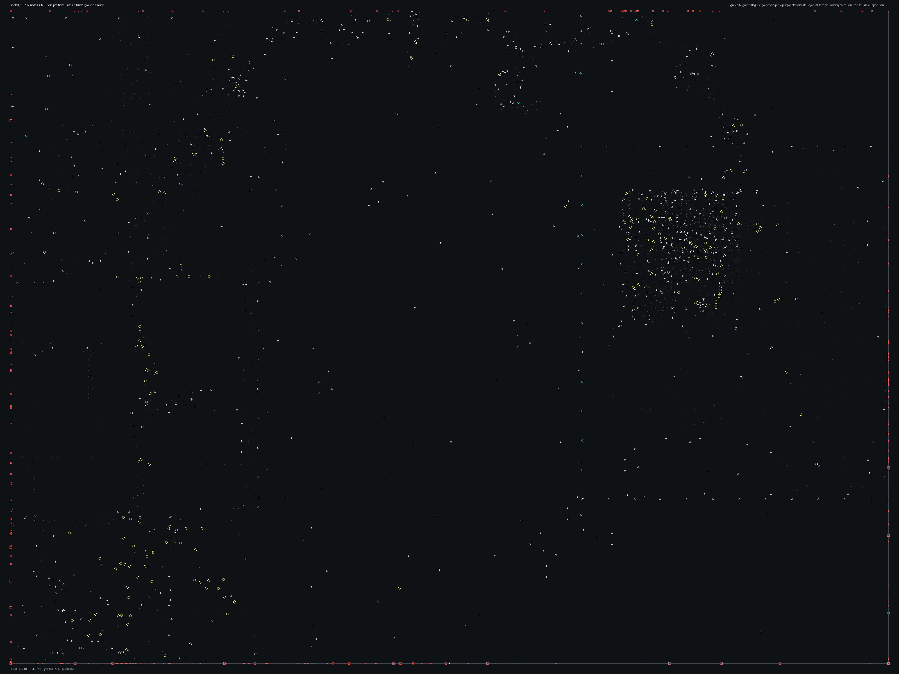

# SPBHD_10.bms - Russian Underground

Back to [AIN Mission Index](../AIN%20Mission%20Index.md)

[Open full-size overlay image](overlays/spbhd_10_xy.png)

## Overlay Legend

| Marker | Meaning |
| --- | --- |
| Gray dots | Normal AIN navigation nodes. |
| Green dots | AIN nodes with `NodeFlags & 0x1C`. |
| Gold dots | AIN `NodeClass 6`. |
| Cyan-blue dots | AIN `NodeClass 7`. |
| Pink dots | AIN `NodeClass 8`. |
| Purple dots | AIN `NodeClass 9`. |
| Cyan circles | MIS items with `ai_textfile`. |
| Yellow circles | MIS items with `waypoint_id`. |
| White circles | Other MIS items with positions. |
| Red squares on frame | MIS items outside the AIN graph bounds. |

## Mission File Info

- Terrain: `mis10`
- AIN nodes: `3200`
- AIN areas: `256`
- MIS items/events/waypoint defs: `1539` / `147` / `72`
- MIS AI-positioned items: `24`
- MIS items with `waypoint_id`: `287`
- AINODEPATH events: `2`

## AIN Plot Maps

| Field | Description | XY | XZ | YZ |
| --- | --- | --- | --- | --- |
| Area ID | Node area/sector grouping. | [XY](plots/SPBHD_10_area_id_xy.png) | [XZ](plots/SPBHD_10_area_id_xz.png) | [YZ](plots/SPBHD_10_area_id_yz.png) |
| Node Class | `NodeClass` values, including special classes `6`-`9`. | [XY](plots/SPBHD_10_node_class_xy.png) | [XZ](plots/SPBHD_10_node_class_xz.png) | [YZ](plots/SPBHD_10_node_class_yz.png) |
| Node Flags | `NodeFlags` byte values and flag clusters. | [XY](plots/SPBHD_10_node_flags_xy.png) | [XZ](plots/SPBHD_10_node_flags_xz.png) | [YZ](plots/SPBHD_10_node_flags_yz.png) |
| Radius | Node `Radius` byte values. | [XY](plots/SPBHD_10_radius_xy.png) | [XZ](plots/SPBHD_10_radius_xz.png) | [YZ](plots/SPBHD_10_radius_yz.png) |
| Edge Flags | Combined outgoing `EdgeFlags`. | [XY](plots/SPBHD_10_edge_flags_xy.png) | [XZ](plots/SPBHD_10_edge_flags_xz.png) | [YZ](plots/SPBHD_10_edge_flags_yz.png) |

## AINODEPATH Events

### Event 0 - AINODEPATH_OFF

- Event block line: `959`
- AINODEPATH action line(s): `972`

**Trigger Items**

_None found._

**Referenced Items**

| Ref | Candidates |
| ---: | --- |
| `2` | item `2` / id `3490` / type `1269` Indestructible Blackhawk with two miniguns (`101269`) / ai `h_bhawkf` / team `1` / group `18`; node `3049`, area `0`, dist `377.9` item `1402` / id `2` / type `1745` Delta Force Teammate 3 (`101745`) / team `1` / group `1`; node `1906`, area `0`, dist `254.3` |
| `3` | item `3` / id `3308` / type `1900` Target Object (`101900`) / team `2`; node `2845`, area `66`, dist `1.7` item `1404` / id `3` / type `1747` Delta Force Teammate 4 (`101747`) / team `1` / group `1`; node `1906`, area `0`, dist `253.2` |
| `4` | item `4` / id `3554` / type `1900` Target Object (`101900`); node `1151`, area `28`, dist `0.7` item `1321` / id `4` / type `1696` Enemy Somalian Soldier with AK47 (`101696`) / team `2` / group `4`; node `239`, area `8`, dist `2.3` |
| `5` | item `5` / id `3903` / type `1900` Target Object (`101900`) / team `2`; node `1568`, area `0`, dist `172.0` item `1330` / id `5` / type `1697` Enemy Somalian Soldier with AK47 (`101697`) / team `2` / group `4`; node `463`, area `19`, dist `0.5` |
| `6` | item `6` / id `3904` / type `1900` Target Object (`101900`) / team `2`; node `1897`, area `0`, dist `77.5` |
| `7` | item `7` / id `3912` / type `1900` Target Object (`101900`) / team `2`; node `1568`, area `0`, dist `120.4` item `1339` / id `7` / type `1699` Enemy Somalian Malitia Member4 (`101699`) / team `2` / group `4`; node `456`, area `18`, dist `1.2` |

**Trigger Waypoints**

_None found._

### Event 24 - AINODEPATH_ON

- Event block line: `1252`
- AINODEPATH action line(s): `1271`

**Trigger Items**

| Ref | Candidates |
| ---: | --- |
| `4` | item `4` / id `3554` / type `1900` Target Object (`101900`); node `1151`, area `28`, dist `0.7` item `1321` / id `4` / type `1696` Enemy Somalian Soldier with AK47 (`101696`) / team `2` / group `4`; node `239`, area `8`, dist `2.3` |
| `7` | item `7` / id `3912` / type `1900` Target Object (`101900`) / team `2`; node `1568`, area `0`, dist `120.4` item `1339` / id `7` / type `1699` Enemy Somalian Malitia Member4 (`101699`) / team `2` / group `4`; node `456`, area `18`, dist `1.2` |
| `8` | item `8` / id `3913` / type `1900` Target Object (`101900`) / team `2`; node `2991`, area `0`, dist `272.3` item `1353` / id `8` / type `1700` Enemy Somalian Malitia Member5 (`101700`) / team `2` / group `4`; node `266`, area `10`, dist `1.3` |
| `10` | item `10` / id `3312` / type `1902` 50cal on 180 tripod (`101902`); node `2899`, area `29`, dist `1.5` item `1340` / id `10` / type `1699` Enemy Somalian Malitia Member4 (`101699`) / team `2` / group `4`; node `336`, area `11`, dist `1.3` |
| `11` | item `11` / id `3698` / type `2041` Power Up Med Pack (`102041`); node `2943`, area `131`, dist `4.7` item `1379` / id `11` / type `1703` Enemy Somalian Malitia Member8 (`101703`) / team `2` / group `4`; node `339`, area `11`, dist `1.3` |
| `19` | item `19` / id `63` / type `1088` Mogadishu City Block4 Moderately Generic 64x64 (`101088`) / group `20`; node `912`, area `0`, dist `105.1` item `1369` / id `19` / type `1702` Enemy Somalian Malitia Member7 (`101702`) / team `2`; node `156`, area `3`, dist `1.4` |

**Referenced Items**

| Ref | Candidates |
| ---: | --- |
| `2` | item `2` / id `3490` / type `1269` Indestructible Blackhawk with two miniguns (`101269`) / ai `h_bhawkf` / team `1` / group `18`; node `3049`, area `0`, dist `377.9` item `1402` / id `2` / type `1745` Delta Force Teammate 3 (`101745`) / team `1` / group `1`; node `1906`, area `0`, dist `254.3` |
| `4` | item `4` / id `3554` / type `1900` Target Object (`101900`); node `1151`, area `28`, dist `0.7` item `1321` / id `4` / type `1696` Enemy Somalian Soldier with AK47 (`101696`) / team `2` / group `4`; node `239`, area `8`, dist `2.3` |
| `7` | item `7` / id `3912` / type `1900` Target Object (`101900`) / team `2`; node `1568`, area `0`, dist `120.4` item `1339` / id `7` / type `1699` Enemy Somalian Malitia Member4 (`101699`) / team `2` / group `4`; node `456`, area `18`, dist `1.2` |
| `8` | item `8` / id `3913` / type `1900` Target Object (`101900`) / team `2`; node `2991`, area `0`, dist `272.3` item `1353` / id `8` / type `1700` Enemy Somalian Malitia Member5 (`101700`) / team `2` / group `4`; node `266`, area `10`, dist `1.3` |
| `10` | item `10` / id `3312` / type `1902` 50cal on 180 tripod (`101902`); node `2899`, area `29`, dist `1.5` item `1340` / id `10` / type `1699` Enemy Somalian Malitia Member4 (`101699`) / team `2` / group `4`; node `336`, area `11`, dist `1.3` |
| `11` | item `11` / id `3698` / type `2041` Power Up Med Pack (`102041`); node `2943`, area `131`, dist `4.7` item `1379` / id `11` / type `1703` Enemy Somalian Malitia Member8 (`101703`) / team `2` / group `4`; node `339`, area `11`, dist `1.3` |

**Trigger Waypoints**

| Ref | Candidates |
| ---: | --- |
| `4` | item `981` / wp `4` / id `1246` / type `6005` waypoint (`106005`) item `1011` / wp `4` / id `1248` / type `6005` waypoint (`106005`) item `1036` / wp `4` / id `1250` / type `6005` waypoint (`106005`) item `1089` / wp `4` / id `1252` / type `6005` waypoint (`106005`) +1 more |
| `7` | item `928` / wp `7` / id `1267` / type `6005` waypoint (`106005`) item `1008` / wp `7` / id `1268` / type `6005` waypoint (`106005`) item `1038` / wp `7` / id `1266` / type `6005` waypoint (`106005`) item `1101` / wp `7` / id `1274` / type `6005` waypoint (`106005`) |
| `8` | item `1` / wp `8` / id `3051` / type `1269` Indestructible Blackhawk with two miniguns (`101269`) / ai `h_bhawkf` item `951` / wp `8` / id `3052` / type `6005` waypoint (`106005`) item `1009` / wp `8` / id `3053` / type `6005` waypoint (`106005`) item `1069` / wp `8` / id `3141` / type `6005` waypoint (`106005`) +4 more |
| `10` | item `952` / wp `10` / id `2998` / type `6005` waypoint (`106005`) item `1012` / wp `10` / id `2999` / type `6005` waypoint (`106005`) item `1055` / wp `10` / id `3000` / type `6005` waypoint (`106005`) item `1085` / wp `10` / id `3001` / type `6005` waypoint (`106005`) +1 more |
| `11` | item `991` / wp `11` / id `3003` / type `6005` waypoint (`106005`) item `1072` / wp `11` / id `3005` / type `6005` waypoint (`106005`) item `1104` / wp `11` / id `3004` / type `6005` waypoint (`106005`) |
| `19` | item `979` / wp `19` / id `3110` / type `6005` waypoint (`106005`) item `1024` / wp `19` / id `3111` / type `6005` waypoint (`106005`) item `1068` / wp `19` / id `3112` / type `6005` waypoint (`106005`) item `1102` / wp `19` / id `3113` / type `6005` waypoint (`106005`) |

## Spatial Notes

| Check | Result |
| --- | --- |
| AI item coverage | `17 / 24` AI-positioned items are inside the AIN XY bounds. |
| Positioned item coverage | `1123 / 1539` positioned MIS items are inside the AIN XY bounds. |
| AI nearest-node distance | min `0.6`, median `12.8`, max `2163.1`. |
| Area coverage | `40` `AreaId` values used; dominant areas: `[(0, 1247), (64, 540), (65, 289), (11, 83), (131, 68), (66, 59)]`. |
| Special node classes | `{'6': 113, '8': 6, '9': 10}`. |
| Nonzero edge flags | `{'0x00': 14897, '0x08': 1, '0x10': 1}`. |

### Outside AIN Bounds

| Item |
| --- |
| item `0` / id `50` / type `1269` Indestructible Blackhawk with two miniguns (`101269`) / ai `h_bhawkf` / wp `3` / team `1` / group `3` |
| item `1` / id `3051` / type `1269` Indestructible Blackhawk with two miniguns (`101269`) / ai `h_bhawkf` / wp `8` / team `1` / group `6` |
| item `2` / id `3490` / type `1269` Indestructible Blackhawk with two miniguns (`101269`) / ai `h_bhawkf` / team `1` / group `18` |
| item `5` / id `3903` / type `1900` Target Object (`101900`) / team `2` |
| item `6` / id `3904` / type `1900` Target Object (`101900`) / team `2` |
| item `7` / id `3912` / type `1900` Target Object (`101900`) / team `2` |
| item `8` / id `3913` / type `1900` Target Object (`101900`) / team `2` |
| item `17` / id `53` / type `1085` Mogadishu City Block1 Moderately Generic 64x64 (`101085`) / group `20` |

### Farthest AI Items From AIN Nodes

| Item | Nearest Node | Area | Distance |
| --- | ---: | ---: | ---: |
| item `1206` / id `3105` / type `6088` teleport target (`106088`) / ai `null` | `908` | `0` | `2163.1` |
| item `2` / id `3490` / type `1269` Indestructible Blackhawk with two miniguns (`101269`) / ai `h_bhawkf` / team `1` / group `18` | `3049` | `0` | `377.9` |
| item `0` / id `50` / type `1269` Indestructible Blackhawk with two miniguns (`101269`) / ai `h_bhawkf` / wp `3` / team `1` / group `3` | `1906` | `0` | `255.4` |
| item `1` / id `3051` / type `1269` Indestructible Blackhawk with two miniguns (`101269`) / ai `h_bhawkf` / wp `8` / team `1` / group `6` | `3101` | `0` | `149.2` |
| item `590` / id `1221` / type `2092` Large Green Bush used in desert Climate (`102092`) / ai `null` | `3048` | `0` | `104.7` |

### Special Class Nodes

| Node | Class | Area | Flags | Nearest MIS Item | Distance |
| ---: | ---: | ---: | --- | --- | ---: |
| `3` | `6` | `25` | `0x00` | item `783` / id `3531` / type `2139` Scattered papers and waste #2 (`102139`) | `1.4` |
| `8` | `6` | `25` | `0x00` | item `237` / id `346` / type `1537` Broken Coffee Table (`101537`) | `2.2` |
| `9` | `6` | `25` | `0x80` | item `782` / id `3434` / type `2139` Scattered papers and waste #2 (`102139`) | `2.7` |
| `11` | `6` | `25` | `0x80` | item `784` / id `3435` / type `2139` Scattered papers and waste #2 (`102139`) | `1.4` |
| `58` | `6` | `24` | `0x80` | item `786` / id `3519` / type `2139` Scattered papers and waste #2 (`102139`) | `2.2` |
| `79` | `6` | `1` | `0x80` | item `1454` / id `3972` / type `6013` Area Trigger (`106013`) | `4.6` |
| `80` | `6` | `1` | `0x80` | item `249` / id `350` / type `1539` Broken Office Chair (`101539`) | `6.0` |
| `81` | `6` | `1` | `0x80` | item `758` / id `3225` / type `2125` Special Sky light for Russian Embassy (`102125`) | `3.3` |
| `82` | `6` | `1` | `0x80` | item `758` / id `3225` / type `2125` Special Sky light for Russian Embassy (`102125`) | `3.5` |
| `108` | `6` | `2` | `0x00` | item `759` / id `3226` / type `2125` Special Sky light for Russian Embassy (`102125`) | `5.3` |
| `109` | `6` | `2` | `0x00` | item `759` / id `3226` / type `2125` Special Sky light for Russian Embassy (`102125`) | `3.2` |
| `110` | `6` | `2` | `0x00` | item `759` / id `3226` / type `2125` Special Sky light for Russian Embassy (`102125`) | `3.4` |

### Nonzero Edge Flags

| Flag | Source | Target | Areas | Classes | Reverse | Distance |
| --- | ---: | ---: | --- | --- | --- | ---: |
| `0x08` | `2923` | `2922` | `131` -> `0` | `0` -> `0` | `0x00` | `6.4` |
| `0x10` | `345` | `336` | `11` -> `11` | `0` -> `0` | `0x00` | `1.5` |
