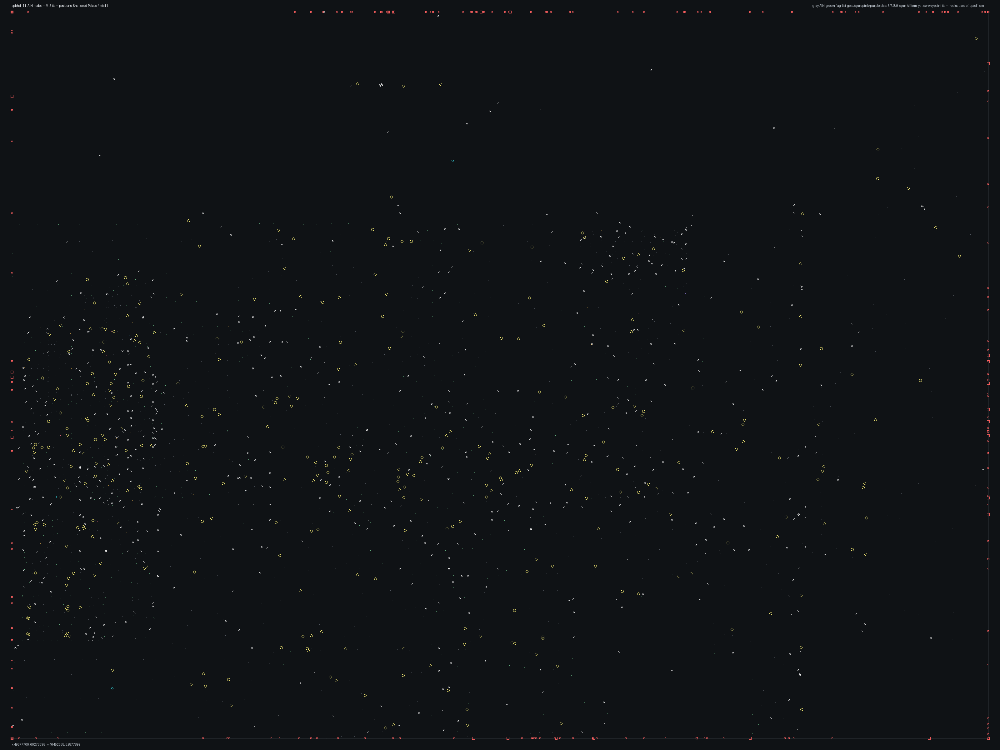

# SPBHD_11.bms - Shattered Palace

Back to [AIN Mission Index](../AIN%20Mission%20Index.md)

[Open full-size overlay image](overlays/spbhd_11_xy.png)

## Overlay Legend

| Marker | Meaning |
| --- | --- |
| Gray dots | Normal AIN navigation nodes. |
| Green dots | AIN nodes with `NodeFlags & 0x1C`. |
| Gold dots | AIN `NodeClass 6`. |
| Cyan-blue dots | AIN `NodeClass 7`. |
| Pink dots | AIN `NodeClass 8`. |
| Purple dots | AIN `NodeClass 9`. |
| Cyan circles | MIS items with `ai_textfile`. |
| Yellow circles | MIS items with `waypoint_id`. |
| White circles | Other MIS items with positions. |
| Red squares on frame | MIS items outside the AIN graph bounds. |

## Mission File Info

- Terrain: `mis11`
- AIN nodes: `2571`
- AIN areas: `256`
- MIS items/events/waypoint defs: `1618` / `141` / `62`
- MIS AI-positioned items: `12`
- MIS items with `waypoint_id`: `363`
- AINODEPATH events: `3`

## AIN Plot Maps

| Field | Description | XY | XZ | YZ |
| --- | --- | --- | --- | --- |
| Area ID | Node area/sector grouping. | [XY](plots/SPBHD_11_area_id_xy.png) | [XZ](plots/SPBHD_11_area_id_xz.png) | [YZ](plots/SPBHD_11_area_id_yz.png) |
| Node Class | `NodeClass` values, including special classes `6`-`9`. | [XY](plots/SPBHD_11_node_class_xy.png) | [XZ](plots/SPBHD_11_node_class_xz.png) | [YZ](plots/SPBHD_11_node_class_yz.png) |
| Node Flags | `NodeFlags` byte values and flag clusters. | [XY](plots/SPBHD_11_node_flags_xy.png) | [XZ](plots/SPBHD_11_node_flags_xz.png) | [YZ](plots/SPBHD_11_node_flags_yz.png) |
| Radius | Node `Radius` byte values. | [XY](plots/SPBHD_11_radius_xy.png) | [XZ](plots/SPBHD_11_radius_xz.png) | [YZ](plots/SPBHD_11_radius_yz.png) |
| Edge Flags | Combined outgoing `EdgeFlags`. | [XY](plots/SPBHD_11_edge_flags_xy.png) | [XZ](plots/SPBHD_11_edge_flags_xz.png) | [YZ](plots/SPBHD_11_edge_flags_yz.png) |

## AINODEPATH Events

### Event 0 - AINODEPATH_OFF

- Event block line: `714`
- AINODEPATH action line(s): `734`

**Trigger Items**

_None found._

**Referenced Items**

| Ref | Candidates |
| ---: | --- |
| `2` | item `2` / id `157` / type `1236` Friendly Light Helicopter LITTLE BIRD with benches (`101236`) / ai `h_ah6b_z` / team `1` / group `3`; node `2552`, area `0`, dist `878.8` item `1433` / id `2` / type `1659` Civilian Man Somalian #2 (`101659`) / group `6`; node `586`, area `0`, dist `34.8` |
| `3` | item `3` / id `89` / type `1236` Friendly Light Helicopter LITTLE BIRD with benches (`101236`) / ai `h_ah6b_z`; node `414`, area `0`, dist `320.5` item `1494` / id `3` / type `1702` Enemy Somalian Malitia Member7 (`101702`) / team `2` / group `17`; node `1796`, area `8`, dist `1.2` |
| `4` | item `4` / id `90` / type `1243` Blackhawk used for fast roping (`101243`) / ai `h_bhawkf` / group `9`; node `2552`, area `0`, dist `815.7` |
| `5` | item `5` / id `159` / type `1290` Friendly 5.5 ton with sit points (`101290`) / ai `G_Jeep` / team `1` / group `14`; node `2535`, area `0`, dist `202.9` item `1441` / id `5` / type `1696` Enemy Somalian Soldier with AK47 (`101696`) / team `2` / group `18`; node `1326`, area `0`, dist `1.5` |
| `6` | item `6` / id `158` / type `1290` Friendly 5.5 ton with sit points (`101290`) / ai `G_Jeep` / team `1` / group `14`; node `2535`, area `0`, dist `212.9` |
| `7` | item `7` / id `163` / type `1880` 50cal on Tripod with bunker (`101880`); node `2204`, area `0`, dist `3.9` item `1442` / id `7` / type `1696` Enemy Somalian Soldier with AK47 (`101696`) / team `2` / group `12`; node `1820`, area `3`, dist `0.7` |

**Trigger Waypoints**

_None found._

### Event 38 - AINODEPATH_ON

- Event block line: `1187`
- AINODEPATH action line(s): `1206`

**Trigger Items**

| Ref | Candidates |
| ---: | --- |
| `2` | item `2` / id `157` / type `1236` Friendly Light Helicopter LITTLE BIRD with benches (`101236`) / ai `h_ah6b_z` / team `1` / group `3`; node `2552`, area `0`, dist `878.8` item `1433` / id `2` / type `1659` Civilian Man Somalian #2 (`101659`) / group `6`; node `586`, area `0`, dist `34.8` |
| `3` | item `3` / id `89` / type `1236` Friendly Light Helicopter LITTLE BIRD with benches (`101236`) / ai `h_ah6b_z`; node `414`, area `0`, dist `320.5` item `1494` / id `3` / type `1702` Enemy Somalian Malitia Member7 (`101702`) / team `2` / group `17`; node `1796`, area `8`, dist `1.2` |
| `7` | item `7` / id `163` / type `1880` 50cal on Tripod with bunker (`101880`); node `2204`, area `0`, dist `3.9` item `1442` / id `7` / type `1696` Enemy Somalian Soldier with AK47 (`101696`) / team `2` / group `12`; node `1820`, area `3`, dist `0.7` |
| `8` | item `8` / id `162` / type `1880` 50cal on Tripod with bunker (`101880`); node `742`, area `0`, dist `3.6` item `1443` / id `8` / type `1696` Enemy Somalian Soldier with AK47 (`101696`) / team `2` / group `22`; node `1942`, area `0`, dist `1.3` |
| `32` | item `32` / id `168` / type `1086` Mogadishu City Block2 Moderately Generic 64x64 (`101086`); node `2552`, area `0`, dist `238.9` item `1502` / id `32` / type `1702` Enemy Somalian Malitia Member7 (`101702`) / team `2` / group `24`; node `1265`, area `5`, dist `0.9` |

**Referenced Items**

| Ref | Candidates |
| ---: | --- |
| `2` | item `2` / id `157` / type `1236` Friendly Light Helicopter LITTLE BIRD with benches (`101236`) / ai `h_ah6b_z` / team `1` / group `3`; node `2552`, area `0`, dist `878.8` item `1433` / id `2` / type `1659` Civilian Man Somalian #2 (`101659`) / group `6`; node `586`, area `0`, dist `34.8` |
| `3` | item `3` / id `89` / type `1236` Friendly Light Helicopter LITTLE BIRD with benches (`101236`) / ai `h_ah6b_z`; node `414`, area `0`, dist `320.5` item `1494` / id `3` / type `1702` Enemy Somalian Malitia Member7 (`101702`) / team `2` / group `17`; node `1796`, area `8`, dist `1.2` |
| `4` | item `4` / id `90` / type `1243` Blackhawk used for fast roping (`101243`) / ai `h_bhawkf` / group `9`; node `2552`, area `0`, dist `815.7` |
| `5` | item `5` / id `159` / type `1290` Friendly 5.5 ton with sit points (`101290`) / ai `G_Jeep` / team `1` / group `14`; node `2535`, area `0`, dist `202.9` item `1441` / id `5` / type `1696` Enemy Somalian Soldier with AK47 (`101696`) / team `2` / group `18`; node `1326`, area `0`, dist `1.5` |
| `7` | item `7` / id `163` / type `1880` 50cal on Tripod with bunker (`101880`); node `2204`, area `0`, dist `3.9` item `1442` / id `7` / type `1696` Enemy Somalian Soldier with AK47 (`101696`) / team `2` / group `12`; node `1820`, area `3`, dist `0.7` |
| `8` | item `8` / id `162` / type `1880` 50cal on Tripod with bunker (`101880`); node `742`, area `0`, dist `3.6` item `1443` / id `8` / type `1696` Enemy Somalian Soldier with AK47 (`101696`) / team `2` / group `22`; node `1942`, area `0`, dist `1.3` |

**Trigger Waypoints**

| Ref | Candidates |
| ---: | --- |
| `2` | item `1046` / wp `2` / id `1214` / type `6005` waypoint (`106005`) item `1065` / wp `2` / id `1266` / type `6005` waypoint (`106005`) item `1110` / wp `2` / id `1279` / type `6005` waypoint (`106005`) item `1151` / wp `2` / id `1310` / type `6005` waypoint (`106005`) +4 more |
| `3` | item `1463` / wp `3` / id `16` / type `1699` Enemy Somalian Malitia Member4 (`101699`) item `1505` / wp `3` / id `33` / type `1702` Enemy Somalian Malitia Member7 (`101702`) item `1539` / wp `3` / id `149` / type `1704` Enemy Somalian Malitia Member9 (`101704`) |
| `7` | item `1049` / wp `7` / id `1499` / type `6005` waypoint (`106005`) item `1082` / wp `7` / id `1500` / type `6005` waypoint (`106005`) item `1115` / wp `7` / id `1501` / type `6005` waypoint (`106005`) item `1148` / wp `7` / id `1502` / type `6005` waypoint (`106005`) +4 more |
| `32` | item `1022` / wp `32` / id `1227` / type `6005` waypoint (`106005`) item `1097` / wp `32` / id `1261` / type `6005` waypoint (`106005`) |

### Event 113 - AINODEPATH_OFF

- Event block line: `2251`
- AINODEPATH action line(s): `2262`

**Trigger Items**

| Ref | Candidates |
| ---: | --- |
| `12` | item `12` / id `2706` / type `2042` Power Up Ammo Pack (`102042`); node `2443`, area `4`, dist `1.2` item `1439` / id `12` / type `1696` Enemy Somalian Soldier with AK47 (`101696`) / team `2` / group `16`; node `100`, area `12`, dist `0.9` |

**Referenced Items**

| Ref | Candidates |
| ---: | --- |
| `5` | item `5` / id `159` / type `1290` Friendly 5.5 ton with sit points (`101290`) / ai `G_Jeep` / team `1` / group `14`; node `2535`, area `0`, dist `202.9` item `1441` / id `5` / type `1696` Enemy Somalian Soldier with AK47 (`101696`) / team `2` / group `18`; node `1326`, area `0`, dist `1.5` |
| `7` | item `7` / id `163` / type `1880` 50cal on Tripod with bunker (`101880`); node `2204`, area `0`, dist `3.9` item `1442` / id `7` / type `1696` Enemy Somalian Soldier with AK47 (`101696`) / team `2` / group `12`; node `1820`, area `3`, dist `0.7` |
| `12` | item `12` / id `2706` / type `2042` Power Up Ammo Pack (`102042`); node `2443`, area `4`, dist `1.2` item `1439` / id `12` / type `1696` Enemy Somalian Soldier with AK47 (`101696`) / team `2` / group `16`; node `100`, area `12`, dist `0.9` |
| `28` | item `28` / id `171` / type `1086` Mogadishu City Block2 Moderately Generic 64x64 (`101086`); node `2552`, area `0`, dist `494.0` |
| `29` | item `29` / id `172` / type `1086` Mogadishu City Block2 Moderately Generic 64x64 (`101086`); node `2564`, area `0`, dist `270.9` |
| `30` | item `30` / id `173` / type `1086` Mogadishu City Block2 Moderately Generic 64x64 (`101086`); node `1719`, area `0`, dist `75.2` item `1491` / id `30` / type `1702` Enemy Somalian Malitia Member7 (`101702`) / team `2` / group `23`; node `154`, area `0`, dist `1.0` |

**Trigger Waypoints**

_None found._

## Spatial Notes

| Check | Result |
| --- | --- |
| AI item coverage | `3 / 12` AI-positioned items are inside the AIN XY bounds. |
| Positioned item coverage | `1036 / 1618` positioned MIS items are inside the AIN XY bounds. |
| AI nearest-node distance | min `2.4`, median `212.9`, max `878.8`. |
| Area coverage | `16` `AreaId` values used; dominant areas: `[(0, 1566), (15, 208), (4, 146), (12, 139), (5, 80), (3, 67)]`. |
| Special node classes | `{'6': 63, '7': 10, '8': 10, '9': 5}`. |
| Nonzero edge flags | `{'0x00': 16123, '0x01': 13}`. |

### Outside AIN Bounds

| Item |
| --- |
| item `0` / id `155` / type `1226` Friendly Hummer standard Version (`101226`) / ai `G_Jeep` / team `1` / group `14` |
| item `1` / id `156` / type `1226` Friendly Hummer standard Version (`101226`) / ai `G_Jeep` / team `1` / group `14` |
| item `2` / id `157` / type `1236` Friendly Light Helicopter LITTLE BIRD with benches (`101236`) / ai `h_ah6b_z` / team `1` / group `3` |
| item `3` / id `89` / type `1236` Friendly Light Helicopter LITTLE BIRD with benches (`101236`) / ai `h_ah6b_z` |
| item `4` / id `90` / type `1243` Blackhawk used for fast roping (`101243`) / ai `h_bhawkf` / group `9` |
| item `5` / id `159` / type `1290` Friendly 5.5 ton with sit points (`101290`) / ai `G_Jeep` / team `1` / group `14` |
| item `6` / id `158` / type `1290` Friendly 5.5 ton with sit points (`101290`) / ai `G_Jeep` / team `1` / group `14` |
| item `13` / id `1834` / type `1086` Mogadishu City Block2 Moderately Generic 64x64 (`101086`) |

### Farthest AI Items From AIN Nodes

| Item | Nearest Node | Area | Distance |
| --- | ---: | ---: | ---: |
| item `2` / id `157` / type `1236` Friendly Light Helicopter LITTLE BIRD with benches (`101236`) / ai `h_ah6b_z` / team `1` / group `3` | `2552` | `0` | `878.8` |
| item `4` / id `90` / type `1243` Blackhawk used for fast roping (`101243`) / ai `h_bhawkf` / group `9` | `2552` | `0` | `815.7` |
| item `151` / id `3115` / type `1096` Mogadishu Slum Hut 4 connected Units (`101096`) / ai `null` | `2552` | `0` | `610.0` |
| item `3` / id `89` / type `1236` Friendly Light Helicopter LITTLE BIRD with benches (`101236`) / ai `h_ah6b_z` | `414` | `0` | `320.5` |
| item `1` / id `156` / type `1226` Friendly Hummer standard Version (`101226`) / ai `G_Jeep` / team `1` / group `14` | `2535` | `0` | `222.2` |

### Special Class Nodes

| Node | Class | Area | Flags | Nearest MIS Item | Distance |
| ---: | ---: | ---: | --- | --- | ---: |
| `49` | `6` | `0` | `0x04` | item `524` / id `869` / type `1630` Closed Wooden Trunk (`101630`) | `5.0` |
| `59` | `6` | `0` | `0x04` | item `1485` / id `124` / type `1701` Enemy Somalian Malitia Member6 (`101701`) / team `2` / group `27` | `3.8` |
| `60` | `6` | `0` | `0x04` | item `482` / id `844` / type `1596` Scattered Pile of weapons crates, with 2 open crates (`101596`) | `4.7` |
| `61` | `6` | `12` | `0x04` | item `524` / id `869` / type `1630` Closed Wooden Trunk (`101630`) | `2.2` |
| `81` | `6` | `12` | `0x84` | item `1104` / id `1278` / type `6005` waypoint (`106005`) / wp `37` | `1.3` |
| `105` | `6` | `12` | `0x05` | item `468` / id `827` / type `1592` U.N. Group of Supply Canisters (`101592`) | `1.6` |
| `106` | `6` | `12` | `0x84` | item `1439` / id `12` / type `1696` Enemy Somalian Soldier with AK47 (`101696`) / team `2` / group `16` | `2.2` |
| `134` | `6` | `12` | `0x85` | item `1034` / id `1236` / type `6005` waypoint (`106005`) / wp `37` | `2.1` |
| `135` | `6` | `12` | `0x05` | item `1472` / id `20` / type `1700` Enemy Somalian Malitia Member5 (`101700`) / team `2` / group `16` | `1.4` |
| `196` | `6` | `14` | `0x05` | item `413` / id `781` / type `1556` Wall Trash, Large Pile (`101556`) | `2.0` |
| `200` | `6` | `14` | `0x85` | item `459` / id `822` / type `1587` End Table, interior decoration only (`101587`) | `2.1` |
| `202` | `6` | `14` | `0x84` | item `456` / id `821` / type `1587` End Table, interior decoration only (`101587`) | `2.3` |

### Nonzero Edge Flags

| Flag | Source | Target | Areas | Classes | Reverse | Distance |
| --- | ---: | ---: | --- | --- | --- | ---: |
| `0x01` | `916` | `915` | `0` -> `0` | `0` -> `0` | `missing` | `2.5` |
| `0x01` | `916` | `948` | `0` -> `0` | `0` -> `0` | `missing` | `2.5` |
| `0x01` | `917` | `950` | `0` -> `0` | `0` -> `0` | `missing` | `2.1` |
| `0x01` | `918` | `953` | `0` -> `0` | `0` -> `0` | `missing` | `2.3` |
| `0x01` | `919` | `956` | `0` -> `0` | `0` -> `0` | `missing` | `2.7` |
| `0x01` | `919` | `970` | `0` -> `0` | `0` -> `0` | `missing` | `3.6` |
| `0x01` | `922` | `921` | `0` -> `0` | `0` -> `0` | `missing` | `2.8` |
| `0x01` | `922` | `967` | `0` -> `0` | `0` -> `0` | `missing` | `3.8` |
| `0x01` | `923` | `954` | `0` -> `0` | `0` -> `0` | `missing` | `2.1` |
| `0x01` | `923` | `955` | `0` -> `0` | `0` -> `0` | `missing` | `2.2` |
| `0x01` | `924` | `915` | `0` -> `0` | `0` -> `0` | `missing` | `2.2` |
| `0x01` | `924` | `949` | `0` -> `0` | `0` -> `0` | `missing` | `2.4` |
