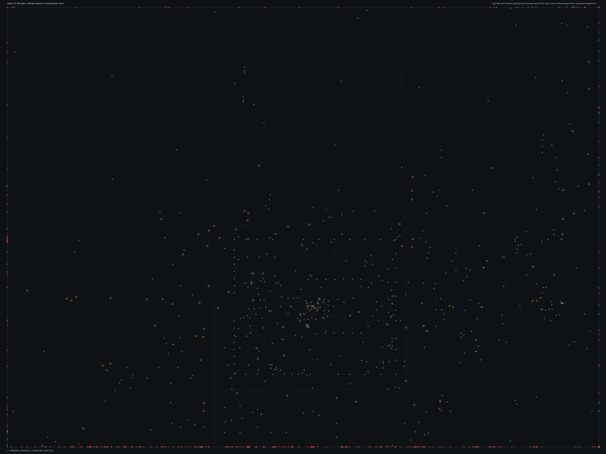

# SPBHD_13.bms - United Knights

Back to [AIN Mission Index](../AIN%20Mission%20Index.md)

[Open full-size overlay image](overlays/spbhd_13_xy.png)

## Overlay Legend

| Marker | Meaning |
| --- | --- |
| Gray dots | Normal AIN navigation nodes. |
| Green dots | AIN nodes with `NodeFlags & 0x1C`. |
| Gold dots | AIN `NodeClass 6`. |
| Cyan-blue dots | AIN `NodeClass 7`. |
| Pink dots | AIN `NodeClass 8`. |
| Purple dots | AIN `NodeClass 9`. |
| Cyan circles | MIS items with `ai_textfile`. |
| Yellow circles | MIS items with `waypoint_id`. |
| White circles | Other MIS items with positions. |
| Red squares on frame | MIS items outside the AIN graph bounds. |

## Mission File Info

- Terrain: `mis13`
- AIN nodes: `8272`
- AIN areas: `256`
- MIS items/events/waypoint defs: `1099` / `102` / `59`
- MIS AI-positioned items: `54`
- MIS items with `waypoint_id`: `107`
- AINODEPATH events: `0`

## AIN Plot Maps

| Field | Description | XY | XZ | YZ |
| --- | --- | --- | --- | --- |
| Area ID | Node area/sector grouping. | [XY](plots/SPBHD_13_area_id_xy.png) | [XZ](plots/SPBHD_13_area_id_xz.png) | [YZ](plots/SPBHD_13_area_id_yz.png) |
| Node Class | `NodeClass` values, including special classes `6`-`9`. | [XY](plots/SPBHD_13_node_class_xy.png) | [XZ](plots/SPBHD_13_node_class_xz.png) | [YZ](plots/SPBHD_13_node_class_yz.png) |
| Node Flags | `NodeFlags` byte values and flag clusters. | [XY](plots/SPBHD_13_node_flags_xy.png) | [XZ](plots/SPBHD_13_node_flags_xz.png) | [YZ](plots/SPBHD_13_node_flags_yz.png) |
| Radius | Node `Radius` byte values. | [XY](plots/SPBHD_13_radius_xy.png) | [XZ](plots/SPBHD_13_radius_xz.png) | [YZ](plots/SPBHD_13_radius_yz.png) |
| Edge Flags | Combined outgoing `EdgeFlags`. | [XY](plots/SPBHD_13_edge_flags_xy.png) | [XZ](plots/SPBHD_13_edge_flags_xz.png) | [YZ](plots/SPBHD_13_edge_flags_yz.png) |

## AINODEPATH Events

No `AINODEPATH` actions were found in this mission.

## Spatial Notes

| Check | Result |
| --- | --- |
| AI item coverage | `33 / 54` AI-positioned items are inside the AIN XY bounds. |
| Positioned item coverage | `613 / 1099` positioned MIS items are inside the AIN XY bounds. |
| AI nearest-node distance | min `0.3`, median `12.1`, max `2385.6`. |
| Area coverage | `19` `AreaId` values used; dominant areas: `[(0, 1664), (15, 1407), (1, 1355), (51, 885), (16, 834), (24, 528)]`. |
| Special node classes | `{'6': 20, '8': 11, '9': 4}`. |
| Nonzero edge flags | `{'0x00': 36181, '0x08': 7, '0x10': 1, '0x20': 1}`. |

### Outside AIN Bounds

| Item |
| --- |
| item `0` / id `2337` / type `1236` Friendly Light Helicopter LITTLE BIRD with benches (`101236`) / ai `h_bhawkn` / team `1` / group `4` |
| item `1` / id `761` / type `1236` Friendly Light Helicopter LITTLE BIRD with benches (`101236`) / ai `h_bhawkn` / team `1` / group `3` |
| item `4` / id `6231` / type `1239` Technical enemy vehicle with mounted 50cal (`101239`) / ai `G_Jeep` / group `59` |
| item `5` / id `6061` / type `1239` Technical enemy vehicle with mounted 50cal (`101239`) / ai `G_Jeep` / group `57` |
| item `7` / id `6220` / type `1239` Technical enemy vehicle with mounted 50cal (`101239`) / ai `G_Jeep` / group `56` |
| item `9` / id `5529` / type `1274` Technical with Emplaced Cannon #5 (`101274`) / ai `G_Jeep` / group `59` |
| item `19` / id `1968` / type `1086` Mogadishu City Block2 Moderately Generic 64x64 (`101086`) |
| item `20` / id `1973` / type `1086` Mogadishu City Block2 Moderately Generic 64x64 (`101086`) |

### Farthest AI Items From AIN Nodes

| Item | Nearest Node | Area | Distance |
| --- | ---: | ---: | ---: |
| item `1012` / id `6108` / type `1703` Enemy Somalian Malitia Member8 (`101703`) / ai `null` / team `2` / group `55` | `2845` | `16` | `2385.6` |
| item `1015` / id `1281` / type `1703` Enemy Somalian Malitia Member8 (`101703`) / ai `null` / team `2` / group `52` | `2845` | `16` | `2370.7` |
| item `962` / id `6254` / type `1698` Enemy Somalian Soldier with RPG (`101698`) / ai `null` / team `2` / group `51` | `2845` | `16` | `2309.5` |
| item `1` / id `761` / type `1236` Friendly Light Helicopter LITTLE BIRD with benches (`101236`) / ai `h_bhawkn` / team `1` / group `3` | `2845` | `16` | `716.2` |
| item `689` / id `75` / type `6001` start, player (`106001`) / ai `null` / team `2` | `2845` | `16` | `714.5` |

### Special Class Nodes

| Node | Class | Area | Flags | Nearest MIS Item | Distance |
| ---: | ---: | ---: | --- | --- | ---: |
| `665` | `6` | `20` | `0x04` | item `1018` / id `5616` / type `1703` Enemy Somalian Malitia Member8 (`101703`) / team `2` / group `15` | `2.2` |
| `666` | `6` | `20` | `0x04` | item `1000` / id `5614` / type `1701` Enemy Somalian Malitia Member6 (`101701`) / team `2` / group `15` | `1.8` |
| `668` | `6` | `20` | `0x04` | item `1082` / id `6604` / type `6013` Area Trigger (`106013`) | `1.8` |
| `669` | `6` | `20` | `0x04` | item `986` / id `5613` / type `1700` Enemy Somalian Malitia Member5 (`101700`) / team `2` / group `15` | `0.9` |
| `671` | `6` | `20` | `0x04` | item `1082` / id `6604` / type `6013` Area Trigger (`106013`) | `4.4` |
| `673` | `6` | `20` | `0x04` | item `977` / id `5621` / type `1699` Enemy Somalian Malitia Member4 (`101699`) / team `2` / group `15` | `2.1` |
| `4338` | `6` | `7` | `0x84` | item `806` / id `6262` / type `6088` teleport target (`106088`) / ai `null` | `1.3` |
| `4339` | `6` | `7` | `0x80` | item `807` / id `6261` / type `6088` teleport target (`106088`) | `1.3` |
| `4340` | `6` | `7` | `0x04` | item `804` / id `6218` / type `6088` teleport target (`106088`) | `0.9` |
| `4341` | `6` | `7` | `0x00` | item `805` / id `6260` / type `6088` teleport target (`106088`) | `1.1` |
| `4366` | `6` | `6` | `0x84` | item `1010` / id `5608` / type `1702` Enemy Somalian Malitia Member7 (`101702`) / team `2` / group `14` | `1.7` |
| `4367` | `6` | `6` | `0x84` | item `1010` / id `5608` / type `1702` Enemy Somalian Malitia Member7 (`101702`) / team `2` / group `14` | `3.2` |

### Nonzero Edge Flags

| Flag | Source | Target | Areas | Classes | Reverse | Distance |
| --- | ---: | ---: | --- | --- | --- | ---: |
| `0x08` | `604` | `590` | `22` -> `23` | `0` -> `0` | `0x00` | `3.6` |
| `0x08` | `605` | `590` | `22` -> `23` | `0` -> `0` | `0x00` | `3.6` |
| `0x08` | `620` | `590` | `22` -> `23` | `0` -> `0` | `0x00` | `3.9` |
| `0x08` | `675` | `597` | `20` -> `22` | `0` -> `0` | `missing` | `4.2` |
| `0x08` | `675` | `599` | `20` -> `22` | `0` -> `0` | `0x00` | `4.1` |
| `0x08` | `678` | `597` | `20` -> `22` | `0` -> `0` | `0x00` | `4.1` |
| `0x08` | `678` | `599` | `20` -> `22` | `0` -> `0` | `missing` | `4.2` |
| `0x10` | `4436` | `4443` | `5` -> `3` | `9` -> `2` | `0x00` | `0.8` |
| `0x20` | `821` | `847` | `21` -> `21` | `2` -> `2` | `0x00` | `0.8` |
