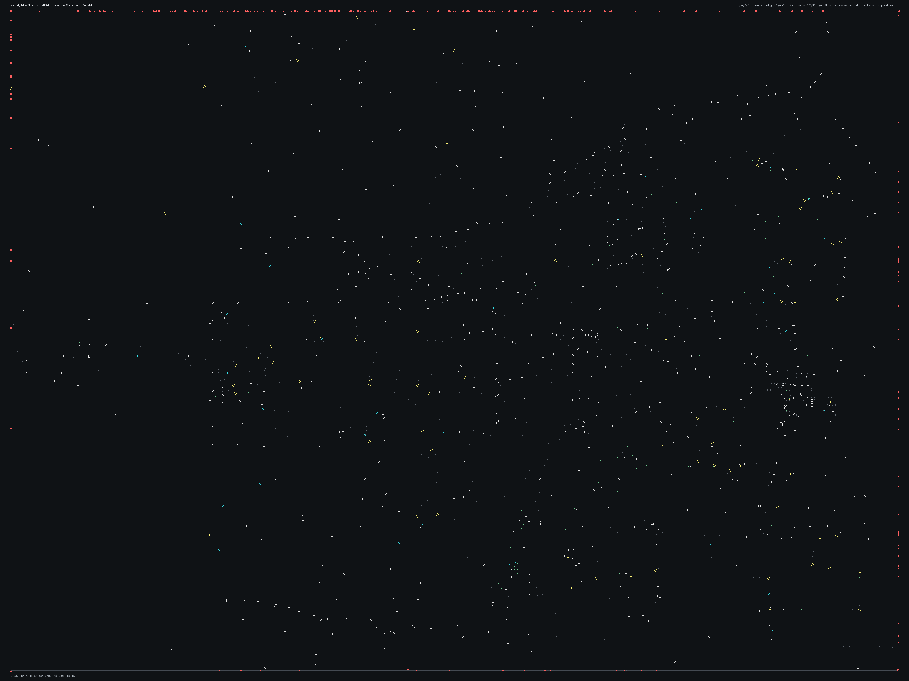

# SPBHD_14.bms - Shore Patrol

Back to [AIN Mission Index](../AIN%20Mission%20Index.md)

[Open full-size overlay image](overlays/spbhd_14_xy.png)

## Overlay Legend

| Marker | Meaning |
| --- | --- |
| Gray dots | Normal AIN navigation nodes. |
| Green dots | AIN nodes with `NodeFlags & 0x1C`. |
| Gold dots | AIN `NodeClass 6`. |
| Cyan-blue dots | AIN `NodeClass 7`. |
| Pink dots | AIN `NodeClass 8`. |
| Purple dots | AIN `NodeClass 9`. |
| Cyan circles | MIS items with `ai_textfile`. |
| Yellow circles | MIS items with `waypoint_id`. |
| White circles | Other MIS items with positions. |
| Red squares on frame | MIS items outside the AIN graph bounds. |

## Mission File Info

- Terrain: `mis14`
- AIN nodes: `4392`
- AIN areas: `256`
- MIS items/events/waypoint defs: `1519` / `182` / `24`
- MIS AI-positioned items: `54`
- MIS items with `waypoint_id`: `111`
- AINODEPATH events: `5`

## AIN Plot Maps

| Field | Description | XY | XZ | YZ |
| --- | --- | --- | --- | --- |
| Area ID | Node area/sector grouping. | [XY](plots/SPBHD_14_area_id_xy.png) | [XZ](plots/SPBHD_14_area_id_xz.png) | [YZ](plots/SPBHD_14_area_id_yz.png) |
| Node Class | `NodeClass` values, including special classes `6`-`9`. | [XY](plots/SPBHD_14_node_class_xy.png) | [XZ](plots/SPBHD_14_node_class_xz.png) | [YZ](plots/SPBHD_14_node_class_yz.png) |
| Node Flags | `NodeFlags` byte values and flag clusters. | [XY](plots/SPBHD_14_node_flags_xy.png) | [XZ](plots/SPBHD_14_node_flags_xz.png) | [YZ](plots/SPBHD_14_node_flags_yz.png) |
| Radius | Node `Radius` byte values. | [XY](plots/SPBHD_14_radius_xy.png) | [XZ](plots/SPBHD_14_radius_xz.png) | [YZ](plots/SPBHD_14_radius_yz.png) |
| Edge Flags | Combined outgoing `EdgeFlags`. | [XY](plots/SPBHD_14_edge_flags_xy.png) | [XZ](plots/SPBHD_14_edge_flags_xz.png) | [YZ](plots/SPBHD_14_edge_flags_yz.png) |

## AINODEPATH Events

### Event 1 - AINODEPATH_OFF

- Event block line: `516`
- AINODEPATH action line(s): `528`

**Trigger Items**

_None found._

**Referenced Items**

| Ref | Candidates |
| ---: | --- |
| `4` | item `4` / id `89` / type `1243` Blackhawk used for fast roping (`101243`) / ai `h_bhawkz` / group `4`; node `1674`, area `0`, dist `1274.7` item `1321` / id `4` / type `1667` Combat Friendly Soldier Ranger01 (`101667`) / team `1` / group `4`; node `1674`, area `0`, dist `1210.5` |
| `5` | item `5` / id `90` / type `1243` Blackhawk used for fast roping (`101243`) / ai `h_bhawkz` / group `4`; node `1674`, area `0`, dist `1210.9` item `1322` / id `5` / type `1667` Combat Friendly Soldier Ranger01 (`101667`) / team `1` / group `4`; node `1674`, area `0`, dist `1275.7` |
| `6` | item `6` / id `91` / type `1256` Enemy Motorized River Boat (`101256`) / ai `wu_f` / wp `2`; node `4071`, area `0`, dist `209.0` item `1319` / id `6` / type `1667` Combat Friendly Soldier Ranger01 (`101667`) / team `1` / group `4`; node `1674`, area `0`, dist `1211.9` |
| `7` | item `7` / id `153` / type `1266` Enemy Cargo Truck #1 (`101266`) / ai `gu` / group `18`; node `3120`, area `0`, dist `15.2` item `1320` / id `7` / type `1667` Combat Friendly Soldier Ranger01 (`101667`) / team `1` / group `4`; node `1674`, area `0`, dist `1272.6` |
| `8` | item `8` / id `156` / type `1492` Small fishing boat type #1 (`101492`) / ai `wu`; node `2755`, area `0`, dist `15.6` item `1338` / id `8` / type `1696` Enemy Somalian Soldier with AK47 (`101696`) / ai `null` / team `2` / group `13`; node `2662`, area `0`, dist `1.3` |

**Trigger Waypoints**

_None found._

### Event 9 - AINODEPATH_ON

- Event block line: `602`
- AINODEPATH action line(s): `608`

**Trigger Items**

| Ref | Candidates |
| ---: | --- |
| `7` | item `7` / id `153` / type `1266` Enemy Cargo Truck #1 (`101266`) / ai `gu` / group `18`; node `3120`, area `0`, dist `15.2` item `1320` / id `7` / type `1667` Combat Friendly Soldier Ranger01 (`101667`) / team `1` / group `4`; node `1674`, area `0`, dist `1272.6` |
| `10` | item `10` / id `155` / type `1492` Small fishing boat type #1 (`101492`) / ai `wu`; node `3892`, area `0`, dist `12.2` item `1326` / id `10` / type `1696` Enemy Somalian Soldier with AK47 (`101696`) / team `2` / group `14`; node `2998`, area `0`, dist `1.3` |

**Referenced Items**

| Ref | Candidates |
| ---: | --- |
| `2` | item `2` / id `87` / type `1236` Friendly Light Helicopter LITTLE BIRD with benches (`101236`) / ai `h_ah6b_z` / team `1` / group `5`; node `1674`, area `0`, dist `1166.3` item `1317` / id `2` / type `1661` Civilian Woman Somalian #2 (`101661`) / ai `null` / group `7`; node `4009`, area `0`, dist `1.4` |
| `3` | item `3` / id `88` / type `1239` Technical enemy vehicle with mounted 50cal (`101239`) / ai `gmg` / group `18`; node `3120`, area `0`, dist `3.9` item `1318` / id `3` / type `1661` Civilian Woman Somalian #2 (`101661`) / group `7`; node `2422`, area `0`, dist `1.5` |
| `7` | item `7` / id `153` / type `1266` Enemy Cargo Truck #1 (`101266`) / ai `gu` / group `18`; node `3120`, area `0`, dist `15.2` item `1320` / id `7` / type `1667` Combat Friendly Soldier Ranger01 (`101667`) / team `1` / group `4`; node `1674`, area `0`, dist `1272.6` |
| `10` | item `10` / id `155` / type `1492` Small fishing boat type #1 (`101492`) / ai `wu`; node `3892`, area `0`, dist `12.2` item `1326` / id `10` / type `1696` Enemy Somalian Soldier with AK47 (`101696`) / team `2` / group `14`; node `2998`, area `0`, dist `1.3` |
| `11` | item `11` / id `157` / type `1493` Small fishing boat type #2 (`101493`) / ai `wu`; node `2802`, area `0`, dist `28.7` item `1328` / id `11` / type `1696` Enemy Somalian Soldier with AK47 (`101696`) / team `2` / group `14`; node `2716`, area `0`, dist `1.5` |
| `15` | item `15` / id `93` / type `1881` 50cal on 360 tripod (`101881`) / group `10`; node `2919`, area `0`, dist `792.9` item `1337` / id `15` / type `1696` Enemy Somalian Soldier with AK47 (`101696`); node `1892`, area `0`, dist `2.5` |

**Trigger Waypoints**

| Ref | Candidates |
| ---: | --- |
| `7` | item `1115` / wp `7` / id `1571` / type `6005` waypoint (`106005`) item `1137` / wp `7` / id `1579` / type `6005` waypoint (`106005`) item `1148` / wp `7` / id `1591` / type `6005` waypoint (`106005`) |
| `10` | item `1122` / wp `10` / id `1555` / type `6005` waypoint (`106005`) item `1125` / wp `10` / id `1581` / type `6005` waypoint (`106005`) item `1146` / wp `10` / id `1602` / type `6005` waypoint (`106005`) item `1152` / wp `10` / id `1608` / type `6005` waypoint (`106005`) +2 more |

### Event 20 - AINODEPATH_OFF

- Event block line: `763`
- AINODEPATH action line(s): `774`

**Trigger Items**

| Ref | Candidates |
| ---: | --- |
| `10` | item `10` / id `155` / type `1492` Small fishing boat type #1 (`101492`) / ai `wu`; node `3892`, area `0`, dist `12.2` item `1326` / id `10` / type `1696` Enemy Somalian Soldier with AK47 (`101696`) / team `2` / group `14`; node `2998`, area `0`, dist `1.3` |
| `20` | item `20` / id `167` / type `2041` Power Up Med Pack (`102041`); node `2341`, area `0`, dist `1.5` item `1347` / id `20` / type `1697` Enemy Somalian Soldier with AK47 (`101697`) / ai `null` / team `2` / group `11`; node `3713`, area `0`, dist `1.8` |

**Referenced Items**

| Ref | Candidates |
| ---: | --- |
| `2` | item `2` / id `87` / type `1236` Friendly Light Helicopter LITTLE BIRD with benches (`101236`) / ai `h_ah6b_z` / team `1` / group `5`; node `1674`, area `0`, dist `1166.3` item `1317` / id `2` / type `1661` Civilian Woman Somalian #2 (`101661`) / ai `null` / group `7`; node `4009`, area `0`, dist `1.4` |
| `3` | item `3` / id `88` / type `1239` Technical enemy vehicle with mounted 50cal (`101239`) / ai `gmg` / group `18`; node `3120`, area `0`, dist `3.9` item `1318` / id `3` / type `1661` Civilian Woman Somalian #2 (`101661`) / group `7`; node `2422`, area `0`, dist `1.5` |
| `8` | item `8` / id `156` / type `1492` Small fishing boat type #1 (`101492`) / ai `wu`; node `2755`, area `0`, dist `15.6` item `1338` / id `8` / type `1696` Enemy Somalian Soldier with AK47 (`101696`) / ai `null` / team `2` / group `13`; node `2662`, area `0`, dist `1.3` |
| `10` | item `10` / id `155` / type `1492` Small fishing boat type #1 (`101492`) / ai `wu`; node `3892`, area `0`, dist `12.2` item `1326` / id `10` / type `1696` Enemy Somalian Soldier with AK47 (`101696`) / team `2` / group `14`; node `2998`, area `0`, dist `1.3` |
| `14` | item `14` / id `159` / type `1494` Small fishing boat type #3 (`101494`) / ai `wu`; node `2803`, area `0`, dist `48.3` item `1333` / id `14` / type `1696` Enemy Somalian Soldier with AK47 (`101696`) / team `2` / group `19`; node `2919`, area `0`, dist `863.0` |
| `15` | item `15` / id `93` / type `1881` 50cal on 360 tripod (`101881`) / group `10`; node `2919`, area `0`, dist `792.9` item `1337` / id `15` / type `1696` Enemy Somalian Soldier with AK47 (`101696`); node `1892`, area `0`, dist `2.5` |

**Trigger Waypoints**

| Ref | Candidates |
| ---: | --- |
| `10` | item `1122` / wp `10` / id `1555` / type `6005` waypoint (`106005`) item `1125` / wp `10` / id `1581` / type `6005` waypoint (`106005`) item `1146` / wp `10` / id `1602` / type `6005` waypoint (`106005`) item `1152` / wp `10` / id `1608` / type `6005` waypoint (`106005`) +2 more |
| `20` | item `1117` / wp `20` / id `1573` / type `6005` waypoint (`106005`) |

### Event 28 - AINODEPATH_ON

- Event block line: `861`
- AINODEPATH action line(s): `869`

**Trigger Items**

| Ref | Candidates |
| ---: | --- |
| `4` | item `4` / id `89` / type `1243` Blackhawk used for fast roping (`101243`) / ai `h_bhawkz` / group `4`; node `1674`, area `0`, dist `1274.7` item `1321` / id `4` / type `1667` Combat Friendly Soldier Ranger01 (`101667`) / team `1` / group `4`; node `1674`, area `0`, dist `1210.5` |
| `8` | item `8` / id `156` / type `1492` Small fishing boat type #1 (`101492`) / ai `wu`; node `2755`, area `0`, dist `15.6` item `1338` / id `8` / type `1696` Enemy Somalian Soldier with AK47 (`101696`) / ai `null` / team `2` / group `13`; node `2662`, area `0`, dist `1.3` |

**Referenced Items**

| Ref | Candidates |
| ---: | --- |
| `3` | item `3` / id `88` / type `1239` Technical enemy vehicle with mounted 50cal (`101239`) / ai `gmg` / group `18`; node `3120`, area `0`, dist `3.9` item `1318` / id `3` / type `1661` Civilian Woman Somalian #2 (`101661`) / group `7`; node `2422`, area `0`, dist `1.5` |
| `4` | item `4` / id `89` / type `1243` Blackhawk used for fast roping (`101243`) / ai `h_bhawkz` / group `4`; node `1674`, area `0`, dist `1274.7` item `1321` / id `4` / type `1667` Combat Friendly Soldier Ranger01 (`101667`) / team `1` / group `4`; node `1674`, area `0`, dist `1210.5` |
| `5` | item `5` / id `90` / type `1243` Blackhawk used for fast roping (`101243`) / ai `h_bhawkz` / group `4`; node `1674`, area `0`, dist `1210.9` item `1322` / id `5` / type `1667` Combat Friendly Soldier Ranger01 (`101667`) / team `1` / group `4`; node `1674`, area `0`, dist `1275.7` |
| `8` | item `8` / id `156` / type `1492` Small fishing boat type #1 (`101492`) / ai `wu`; node `2755`, area `0`, dist `15.6` item `1338` / id `8` / type `1696` Enemy Somalian Soldier with AK47 (`101696`) / ai `null` / team `2` / group `13`; node `2662`, area `0`, dist `1.3` |
| `25` | item `25` / id `168` / type `2042` Power Up Ammo Pack (`102042`); node `234`, area `0`, dist `1.3` item `1359` / id `25` / type `1698` Enemy Somalian Soldier with RPG (`101698`) / team `2` / group `19`; node `2919`, area `0`, dist `835.3` |
| `74` | item `74` / id `218` / type `1101` Open Building on Pier Piece (`101101`); node `2789`, area `0`, dist `34.2` item `1436` / id `74` / type `1744` Delta Force Teammate 2 (`101744`) / team `1` / group `3`; node `4071`, area `0`, dist `205.3` |

**Trigger Waypoints**

| Ref | Candidates |
| ---: | --- |
| `4` | item `1114` / wp `4` / id `1570` / type `6005` waypoint (`106005`) item `1128` / wp `4` / id `1584` / type `6005` waypoint (`106005`) item `1145` / wp `4` / id `1601` / type `6005` waypoint (`106005`) / ai `null` item `1161` / wp `4` / id `1607` / type `6005` waypoint (`106005`) |
| `8` | item `1104` / wp `8` / id `1560` / type `6005` waypoint (`106005`) item `1133` / wp `8` / id `1589` / type `6005` waypoint (`106005`) / ai `null` item `1144` / wp `8` / id `1600` / type `6005` waypoint (`106005`) item `1153` / wp `8` / id `1609` / type `6005` waypoint (`106005`) +4 more |

### Event 34 - AINODEPATH_OFF

- Event block line: `937`
- AINODEPATH action line(s): `943`

**Trigger Items**

| Ref | Candidates |
| ---: | --- |
| `2` | item `2` / id `87` / type `1236` Friendly Light Helicopter LITTLE BIRD with benches (`101236`) / ai `h_ah6b_z` / team `1` / group `5`; node `1674`, area `0`, dist `1166.3` item `1317` / id `2` / type `1661` Civilian Woman Somalian #2 (`101661`) / ai `null` / group `7`; node `4009`, area `0`, dist `1.4` |
| `7` | item `7` / id `153` / type `1266` Enemy Cargo Truck #1 (`101266`) / ai `gu` / group `18`; node `3120`, area `0`, dist `15.2` item `1320` / id `7` / type `1667` Combat Friendly Soldier Ranger01 (`101667`) / team `1` / group `4`; node `1674`, area `0`, dist `1272.6` |

**Referenced Items**

| Ref | Candidates |
| ---: | --- |
| `2` | item `2` / id `87` / type `1236` Friendly Light Helicopter LITTLE BIRD with benches (`101236`) / ai `h_ah6b_z` / team `1` / group `5`; node `1674`, area `0`, dist `1166.3` item `1317` / id `2` / type `1661` Civilian Woman Somalian #2 (`101661`) / ai `null` / group `7`; node `4009`, area `0`, dist `1.4` |
| `7` | item `7` / id `153` / type `1266` Enemy Cargo Truck #1 (`101266`) / ai `gu` / group `18`; node `3120`, area `0`, dist `15.2` item `1320` / id `7` / type `1667` Combat Friendly Soldier Ranger01 (`101667`) / team `1` / group `4`; node `1674`, area `0`, dist `1272.6` |
| `12` | item `12` / id `160` / type `1494` Small fishing boat type #3 (`101494`) / ai `wu`; node `2755`, area `0`, dist `24.1` item `1329` / id `12` / type `1696` Enemy Somalian Soldier with AK47 (`101696`) / team `2` / group `10`; node `2919`, area `0`, dist `940.4` |

**Trigger Waypoints**

| Ref | Candidates |
| ---: | --- |
| `2` | item `6` / wp `2` / id `91` / type `1256` Enemy Motorized River Boat (`101256`) / ai `wu_f` item `1103` / wp `2` / id `1559` / type `6005` waypoint (`106005`) |
| `7` | item `1115` / wp `7` / id `1571` / type `6005` waypoint (`106005`) item `1137` / wp `7` / id `1579` / type `6005` waypoint (`106005`) item `1148` / wp `7` / id `1591` / type `6005` waypoint (`106005`) |

## Spatial Notes

| Check | Result |
| --- | --- |
| AI item coverage | `46 / 54` AI-positioned items are inside the AIN XY bounds. |
| Positioned item coverage | `1070 / 1519` positioned MIS items are inside the AIN XY bounds. |
| AI nearest-node distance | min `0.1`, median `2.2`, max `1274.7`. |
| Area coverage | `4` `AreaId` values used; dominant areas: `[(0, 4108), (1, 101), (3, 94), (2, 89)]`. |
| Special node classes | `{'6': 5, '8': 1, '9': 1}`. |
| Nonzero edge flags | `{'0x00': 24971, '0x01': 1, '0x20': 1}`. |

### Outside AIN Bounds

| Item |
| --- |
| item `0` / id `85` / type `1152` Large Cargo Ship with interior in Shore Patrol (`101152`) / ai `wu` / group `20` |
| item `1` / id `86` / type `1232` Friendly No Die Smoking LITTLE BIRD (`101232`) / ai `h_ah6z` / team `1` / group `5` |
| item `2` / id `87` / type `1236` Friendly Light Helicopter LITTLE BIRD with benches (`101236`) / ai `h_ah6b_z` / team `1` / group `5` |
| item `4` / id `89` / type `1243` Blackhawk used for fast roping (`101243`) / ai `h_bhawkz` / group `4` |
| item `5` / id `90` / type `1243` Blackhawk used for fast roping (`101243`) / ai `h_bhawkz` / group `4` |
| item `6` / id `91` / type `1256` Enemy Motorized River Boat (`101256`) / ai `wu_f` / wp `2` |
| item `15` / id `93` / type `1881` 50cal on 360 tripod (`101881`) / group `10` |
| item `16` / id `92` / type `1881` 50cal on 360 tripod (`101881`) / group `10` |

### Farthest AI Items From AIN Nodes

| Item | Nearest Node | Area | Distance |
| --- | ---: | ---: | ---: |
| item `4` / id `89` / type `1243` Blackhawk used for fast roping (`101243`) / ai `h_bhawkz` / group `4` | `1674` | `0` | `1274.7` |
| item `5` / id `90` / type `1243` Blackhawk used for fast roping (`101243`) / ai `h_bhawkz` / group `4` | `1674` | `0` | `1210.9` |
| item `1` / id `86` / type `1232` Friendly No Die Smoking LITTLE BIRD (`101232`) / ai `h_ah6z` / team `1` / group `5` | `1674` | `0` | `1182.9` |
| item `2` / id `87` / type `1236` Friendly Light Helicopter LITTLE BIRD with benches (`101236`) / ai `h_ah6b_z` / team `1` / group `5` | `1674` | `0` | `1166.3` |
| item `0` / id `85` / type `1152` Large Cargo Ship with interior in Shore Patrol (`101152`) / ai `wu` / group `20` | `2919` | `0` | `841.8` |

### Special Class Nodes

| Node | Class | Area | Flags | Nearest MIS Item | Distance |
| ---: | ---: | ---: | --- | --- | ---: |
| `3423` | `6` | `3` | `0x80` | item `342` / id `787` / type `1536` Old Damaged Sofa (`101536`) | `1.8` |
| `3505` | `6` | `3` | `0x80` | item `1394` / id `40` / type `1701` Enemy Somalian Malitia Member6 (`101701`) / team `2` / group `17` | `1.8` |
| `3606` | `6` | `3` | `0x80` | item `1428` / id `65` / type `1704` Enemy Somalian Malitia Member9 (`101704`) / team `2` / group `17` | `1.0` |
| `3623` | `6` | `3` | `0x80` | item `1405` / id `52` / type `1702` Enemy Somalian Malitia Member7 (`101702`) / team `2` / group `17` | `1.1` |
| `3624` | `6` | `3` | `0x84` | item `1406` / id `132` / type `1703` Enemy Somalian Malitia Member8 (`101703`) / ai `null` / team `2` / group `17` | `1.6` |
| `3969` | `8` | `3` | `0x00` | item `342` / id `787` / type `1536` Old Damaged Sofa (`101536`) | `2.9` |
| `3717` | `9` | `3` | `0x00` | item `341` / id `791` / type `1536` Old Damaged Sofa (`101536`) | `3.4` |

### Nonzero Edge Flags

| Flag | Source | Target | Areas | Classes | Reverse | Distance |
| --- | ---: | ---: | --- | --- | --- | ---: |
| `0x01` | `4390` | `4391` | `0` -> `0` | `0` -> `0` | `0x20` | `1.1` |
| `0x20` | `4391` | `4390` | `0` -> `0` | `0` -> `0` | `0x01` | `1.1` |
