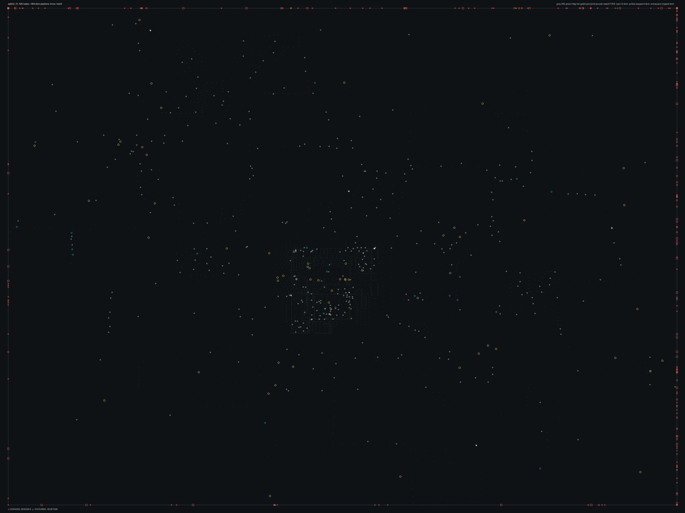

# SPBHD_15.bms - Irene

Back to [AIN Mission Index](../AIN%20Mission%20Index.md)

[Open full-size overlay image](overlays/spbhd_15_xy.png)

## Overlay Legend

| Marker | Meaning |
| --- | --- |
| Gray dots | Normal AIN navigation nodes. |
| Green dots | AIN nodes with `NodeFlags & 0x1C`. |
| Gold dots | AIN `NodeClass 6`. |
| Cyan-blue dots | AIN `NodeClass 7`. |
| Pink dots | AIN `NodeClass 8`. |
| Purple dots | AIN `NodeClass 9`. |
| Cyan circles | MIS items with `ai_textfile`. |
| Yellow circles | MIS items with `waypoint_id`. |
| White circles | Other MIS items with positions. |
| Red squares on frame | MIS items outside the AIN graph bounds. |

## Mission File Info

- Terrain: `dvd4`
- AIN nodes: `3434`
- AIN areas: `256`
- MIS items/events/waypoint defs: `1785` / `111` / `69`
- MIS AI-positioned items: `131`
- MIS items with `waypoint_id`: `226`
- AINODEPATH events: `0`

## AIN Plot Maps

| Field | Description | XY | XZ | YZ |
| --- | --- | --- | --- | --- |
| Area ID | Node area/sector grouping. | [XY](plots/SPBHD_15_area_id_xy.png) | [XZ](plots/SPBHD_15_area_id_xz.png) | [YZ](plots/SPBHD_15_area_id_yz.png) |
| Node Class | `NodeClass` values, including special classes `6`-`9`. | [XY](plots/SPBHD_15_node_class_xy.png) | [XZ](plots/SPBHD_15_node_class_xz.png) | [YZ](plots/SPBHD_15_node_class_yz.png) |
| Node Flags | `NodeFlags` byte values and flag clusters. | [XY](plots/SPBHD_15_node_flags_xy.png) | [XZ](plots/SPBHD_15_node_flags_xz.png) | [YZ](plots/SPBHD_15_node_flags_yz.png) |
| Radius | Node `Radius` byte values. | [XY](plots/SPBHD_15_radius_xy.png) | [XZ](plots/SPBHD_15_radius_xz.png) | [YZ](plots/SPBHD_15_radius_yz.png) |
| Edge Flags | Combined outgoing `EdgeFlags`. | [XY](plots/SPBHD_15_edge_flags_xy.png) | [XZ](plots/SPBHD_15_edge_flags_xz.png) | [YZ](plots/SPBHD_15_edge_flags_yz.png) |

## AINODEPATH Events

No `AINODEPATH` actions were found in this mission.

## Spatial Notes

| Check | Result |
| --- | --- |
| AI item coverage | `21 / 131` AI-positioned items are inside the AIN XY bounds. |
| Positioned item coverage | `497 / 1785` positioned MIS items are inside the AIN XY bounds. |
| AI nearest-node distance | min `1.0`, median `159.6`, max `2165.9`. |
| Area coverage | `4` `AreaId` values used; dominant areas: `[(0, 1495), (1, 1485), (100, 360), (101, 94)]`. |
| Special node classes | `{'6': 8, '7': 4, '8': 6, '9': 2}`. |
| Nonzero edge flags | `{'0x00': 14028}`. |

### Outside AIN Bounds

| Item |
| --- |
| item `0` / id `186` / type `1226` Friendly Hummer standard Version (`101226`) / ai `g_jeep` / wp `33` / team `1` / group `26` |
| item `1` / id `187` / type `1226` Friendly Hummer standard Version (`101226`) / ai `g_jeep` / wp `33` / team `1` / group `26` |
| item `2` / id `188` / type `1226` Friendly Hummer standard Version (`101226`) / ai `sitgrnd1` / group `63` |
| item `3` / id `189` / type `1226` Friendly Hummer standard Version (`101226`) / ai `sitgrnd1` / group `63` |
| item `4` / id `190` / type `1226` Friendly Hummer standard Version (`101226`) / ai `sitgrnd1` / group `63` |
| item `5` / id `191` / type `1226` Friendly Hummer standard Version (`101226`) / ai `sitgrnd1` / group `63` |
| item `6` / id `7930` / type `1226` Friendly Hummer standard Version (`101226`) / ai `sitgrnd1` / group `63` |
| item `7` / id `7931` / type `1226` Friendly Hummer standard Version (`101226`) / ai `sitgrnd1` / group `63` |

### Farthest AI Items From AIN Nodes

| Item | Nearest Node | Area | Distance |
| --- | ---: | ---: | ---: |
| item `1463` / id `8451` / type `6119` snd: desert lp3 (`106119`) / ai `null` | `2709` | `1` | `2165.9` |
| item `1466` / id `8454` / type `6119` snd: desert lp3 (`106119`) / ai `null` | `2709` | `1` | `2147.9` |
| item `1467` / id `8455` / type `6119` snd: desert lp3 (`106119`) / ai `null` | `2787` | `1` | `2129.1` |
| item `1523` / id `8511` / type `6182` snd: LpAirBase Activity1 (`106182`) / ai `null` | `2709` | `1` | `2068.5` |
| item `11` / id `195` / type `1230` Dune Buggy with mounted 50cal (`101230`) / ai `sitgrnd1` / team `1` / group `63` | `2709` | `1` | `2056.5` |

### Special Class Nodes

| Node | Class | Area | Flags | Nearest MIS Item | Distance |
| ---: | ---: | ---: | --- | --- | ---: |
| `1122` | `6` | `101` | `0x80` | item `1563` / id `113` / type `1696` Enemy Somalian Soldier with AK47 (`101696`) / team `2` / group `47` | `4.0` |
| `1188` | `6` | `101` | `0x80` | item `1628` / id `41` / type `1701` Enemy Somalian Malitia Member6 (`101701`) / team `2` / group `47` | `1.0` |
| `1221` | `6` | `101` | `0x80` | item `338` / id `8126` / type `1536` Old Damaged Sofa (`101536`) | `4.3` |
| `1253` | `6` | `101` | `0x80` | item `1619` / id `38` / type `1700` Enemy Somalian Malitia Member5 (`101700`) / team `2` / group `47` | `3.3` |
| `1699` | `6` | `100` | `0x00` | item `1626` / id `37` / type `1700` Enemy Somalian Malitia Member5 (`101700`) / team `2` / group `49` | `1.0` |
| `1803` | `6` | `100` | `0x80` | item `380` / id `8135` / type `1640` Long Half Table, interior decoration only (`101640`) | `2.8` |
| `1809` | `6` | `100` | `0x00` | item `1656` / id `151` / type `1703` Enemy Somalian Malitia Member8 (`101703`) / team `2` / group `49` | `1.5` |
| `1843` | `6` | `100` | `0x00` | item `370` / id `8137` / type `1610` Long End Table, interior decoration only (`101610`) | `2.6` |
| `1420` | `7` | `101` | `0x00` | item `1115` / id `8178` / type `2157` Destructable door for MCtarget (`102157`) | `4.8` |
| `1635` | `7` | `100` | `0x0C` | item `370` / id `8137` / type `1610` Long End Table, interior decoration only (`101610`) | `2.4` |
| `1653` | `7` | `100` | `0x0C` | item `1115` / id `8178` / type `2157` Destructable door for MCtarget (`102157`) | `1.3` |
| `1812` | `7` | `100` | `0x00` | item `1577` / id `4` / type `1696` Enemy Somalian Soldier with AK47 (`101696`) / team `2` / group `49` | `2.8` |

### Nonzero Edge Flags

| Flag | Source | Target | Areas | Classes | Reverse | Distance |
| --- | ---: | ---: | --- | --- | --- | ---: |
| | | | | | | |
