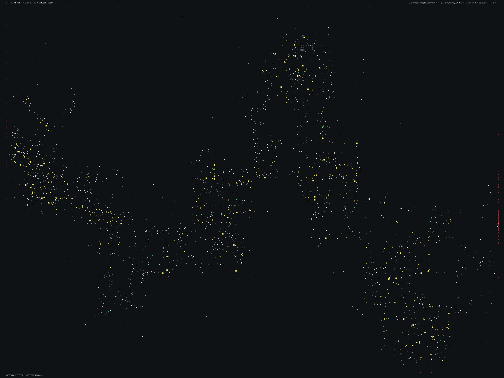

# SPBHD_17.bms - Valiant Solider

Back to [AIN Mission Index](../AIN%20Mission%20Index.md)

[Open full-size overlay image](overlays/spbhd_17_xy.png)

## Overlay Legend

| Marker | Meaning |
| --- | --- |
| Gray dots | Normal AIN navigation nodes. |
| Green dots | AIN nodes with `NodeFlags & 0x1C`. |
| Gold dots | AIN `NodeClass 6`. |
| Cyan-blue dots | AIN `NodeClass 7`. |
| Pink dots | AIN `NodeClass 8`. |
| Purple dots | AIN `NodeClass 9`. |
| Cyan circles | MIS items with `ai_textfile`. |
| Yellow circles | MIS items with `waypoint_id`. |
| White circles | Other MIS items with positions. |
| Red squares on frame | MIS items outside the AIN graph bounds. |

## Mission File Info

- Terrain: `mis17`
- AIN nodes: `7184`
- AIN areas: `256`
- MIS items/events/waypoint defs: `2170` / `137` / `79`
- MIS AI-positioned items: `602`
- MIS items with `waypoint_id`: `702`
- AINODEPATH events: `3`

## AIN Plot Maps

| Field | Description | XY | XZ | YZ |
| --- | --- | --- | --- | --- |
| Area ID | Node area/sector grouping. | [XY](plots/SPBHD_17_area_id_xy.png) | [XZ](plots/SPBHD_17_area_id_xz.png) | [YZ](plots/SPBHD_17_area_id_yz.png) |
| Node Class | `NodeClass` values, including special classes `6`-`9`. | [XY](plots/SPBHD_17_node_class_xy.png) | [XZ](plots/SPBHD_17_node_class_xz.png) | [YZ](plots/SPBHD_17_node_class_yz.png) |
| Node Flags | `NodeFlags` byte values and flag clusters. | [XY](plots/SPBHD_17_node_flags_xy.png) | [XZ](plots/SPBHD_17_node_flags_xz.png) | [YZ](plots/SPBHD_17_node_flags_yz.png) |
| Radius | Node `Radius` byte values. | [XY](plots/SPBHD_17_radius_xy.png) | [XZ](plots/SPBHD_17_radius_xz.png) | [YZ](plots/SPBHD_17_radius_yz.png) |
| Edge Flags | Combined outgoing `EdgeFlags`. | [XY](plots/SPBHD_17_edge_flags_xy.png) | [XZ](plots/SPBHD_17_edge_flags_xz.png) | [YZ](plots/SPBHD_17_edge_flags_yz.png) |

## AINODEPATH Events

### Event 0 - AINODEPATH_OFF

- Event block line: `788`
- AINODEPATH action line(s): `808`

**Trigger Items**

_None found._

**Referenced Items**

| Ref | Candidates |
| ---: | --- |
| `2` | item `2` / id `5385` / type `2041` Power Up Med Pack (`102041`); node `1527`, area `0`, dist `0.8` |
| `3` | item `3` / id `5387` / type `2041` Power Up Med Pack (`102041`); node `4082`, area `0`, dist `1.0` item `2000` / id `3` / type `1702` Enemy Somalian Malitia Member7 (`101702`) / team `2` / group `7`; node `1633`, area `0`, dist `1.0` |
| `4` | item `4` / id `5392` / type `2041` Power Up Med Pack (`102041`); node `6869`, area `0`, dist `0.7` item `1983` / id `4` / type `1701` Enemy Somalian Malitia Member6 (`101701`) / team `2` / group `9`; node `1516`, area `0`, dist `1.5` |
| `5` | item `5` / id `2520` / type `2041` Power Up Med Pack (`102041`); node `4122`, area `0`, dist `0.7` item `2061` / id `5` / type `1755` USE FOR ROOFTOPS ONLY (`101755`) / team `2` / group `10`; node `5262`, area `0`, dist `5.0` |
| `6` | item `6` / id `3621` / type `2041` Power Up Med Pack (`102041`); node `438`, area `0`, dist `0.4` item `1936` / id `6` / type `1696` Enemy Somalian Soldier with AK47 (`101696`) / team `2` / group `10`; node `2193`, area `0`, dist `1.4` |
| `7` | item `7` / id `5185` / type `2041` Power Up Med Pack (`102041`); node `5408`, area `0`, dist `1.1` item `2005` / id `7` / type `1702` Enemy Somalian Malitia Member7 (`101702`) / team `2` / group `8`; node `4601`, area `0`, dist `1.3` |

**Trigger Waypoints**

_None found._

### Event 6 - AINODEPATH_ON

- Event block line: `873`
- AINODEPATH action line(s): `880`

**Trigger Items**

| Ref | Candidates |
| ---: | --- |
| `9` | item `9` / id `5291` / type `2042` Power Up Ammo Pack (`102042`); node `5295`, area `0`, dist `1.6` item `1938` / id `9` / type `1696` Enemy Somalian Soldier with AK47 (`101696`) / team `2` / group `12`; node `4911`, area `0`, dist `1.6` |
| `10` | item `10` / id `5386` / type `2042` Power Up Ammo Pack (`102042`); node `4082`, area `0`, dist `1.4` |

**Referenced Items**

| Ref | Candidates |
| ---: | --- |
| `4` | item `4` / id `5392` / type `2041` Power Up Med Pack (`102041`); node `6869`, area `0`, dist `0.7` item `1983` / id `4` / type `1701` Enemy Somalian Malitia Member6 (`101701`) / team `2` / group `9`; node `1516`, area `0`, dist `1.5` |
| `5` | item `5` / id `2520` / type `2041` Power Up Med Pack (`102041`); node `4122`, area `0`, dist `0.7` item `2061` / id `5` / type `1755` USE FOR ROOFTOPS ONLY (`101755`) / team `2` / group `10`; node `5262`, area `0`, dist `5.0` |
| `9` | item `9` / id `5291` / type `2042` Power Up Ammo Pack (`102042`); node `5295`, area `0`, dist `1.6` item `1938` / id `9` / type `1696` Enemy Somalian Soldier with AK47 (`101696`) / team `2` / group `12`; node `4911`, area `0`, dist `1.6` |
| `10` | item `10` / id `5386` / type `2042` Power Up Ammo Pack (`102042`); node `4082`, area `0`, dist `1.4` |
| `15` | item `15` / id `2682` / type `1086` Mogadishu City Block2 Moderately Generic 64x64 (`101086`); node `6648`, area `0`, dist `16.1` item `2034` / id `15` / type `1704` Enemy Somalian Malitia Member9 (`101704`) / team `2` / group `10`; node `5018`, area `0`, dist `2.1` |
| `56` | item `56` / id `185` / type `1093` Mogadishu Slum Hut Single Unit (`101093`); node `1063`, area `0`, dist `2.7` item `2004` / id `56` / type `1702` Enemy Somalian Malitia Member7 (`101702`) / team `2` / group `12`; node `2263`, area `0`, dist `2.4` |

**Trigger Waypoints**

| Ref | Candidates |
| ---: | --- |
| `9` | item `1192` / wp `9` / id `4341` / type `6005` waypoint (`106005`) / ai `null` item `1312` / wp `9` / id `4342` / type `6005` waypoint (`106005`) / ai `null` item `1328` / wp `9` / id `4343` / type `6005` waypoint (`106005`) / ai `null` item `1432` / wp `9` / id `4344` / type `6005` waypoint (`106005`) / ai `null` +2 more |
| `10` | item `1193` / wp `10` / id `4347` / type `6005` waypoint (`106005`) / ai `null` item `1244` / wp `10` / id `4348` / type `6005` waypoint (`106005`) / ai `null` item `1381` / wp `10` / id `4349` / type `6005` waypoint (`106005`) / ai `null` item `1452` / wp `10` / id `4350` / type `6005` waypoint (`106005`) / ai `null` +4 more |

### Event 22 - AINODEPATH_ON

- Event block line: `1070`
- AINODEPATH action line(s): `1079`

**Trigger Items**

| Ref | Candidates |
| ---: | --- |
| `18` | item `18` / id `3624` / type `1086` Mogadishu City Block2 Moderately Generic 64x64 (`101086`); node `1172`, area `0`, dist `50.5` |

**Referenced Items**

| Ref | Candidates |
| ---: | --- |
| `2` | item `2` / id `5385` / type `2041` Power Up Med Pack (`102041`); node `1527`, area `0`, dist `0.8` |
| `18` | item `18` / id `3624` / type `1086` Mogadishu City Block2 Moderately Generic 64x64 (`101086`); node `1172`, area `0`, dist `50.5` |

**Trigger Waypoints**

| Ref | Candidates |
| ---: | --- |
| `18` | item `1201` / wp `18` / id `4424` / type `6005` waypoint (`106005`) / ai `null` item `1314` / wp `18` / id `4425` / type `6005` waypoint (`106005`) / ai `null` item `1340` / wp `18` / id `4426` / type `6005` waypoint (`106005`) / ai `null` item `1458` / wp `18` / id `4427` / type `6005` waypoint (`106005`) / ai `null` +4 more |

## Spatial Notes

| Check | Result |
| --- | --- |
| AI item coverage | `601 / 602` AI-positioned items are inside the AIN XY bounds. |
| Positioned item coverage | `2068 / 2170` positioned MIS items are inside the AIN XY bounds. |
| AI nearest-node distance | min `1.2`, median `1.6`, max `35.1`. |
| Area coverage | `1` `AreaId` values used; dominant areas: `[(0, 7184)]`. |
| Special node classes | `{}`. |
| Nonzero edge flags | `{'0x00': 40507, '0x01': 53, '0x08': 5}`. |

### Outside AIN Bounds

| Item |
| --- |
| item `18` / id `3624` / type `1086` Mogadishu City Block2 Moderately Generic 64x64 (`101086`) |
| item `21` / id `5181` / type `1086` Mogadishu City Block2 Moderately Generic 64x64 (`101086`) |
| item `22` / id `5416` / type `1086` Mogadishu City Block2 Moderately Generic 64x64 (`101086`) |
| item `28` / id `5417` / type `1087` Mogadishu City Block3 Moderately Generic 64x64 (`101087`) |
| item `30` / id `156` / type `1088` Mogadishu City Block4 Moderately Generic 64x64 (`101088`) |
| item `32` / id `154` / type `1088` Mogadishu City Block4 Moderately Generic 64x64 (`101088`) |
| item `34` / id `4033` / type `1088` Mogadishu City Block4 Moderately Generic 64x64 (`101088`) |
| item `37` / id `5418` / type `1088` Mogadishu City Block4 Moderately Generic 64x64 (`101088`) |

### Farthest AI Items From AIN Nodes

| Item | Nearest Node | Area | Distance |
| --- | ---: | ---: | ---: |
| item `1163` / id `4795` / type `4652` Use this for downed helicopter (`104652`) / ai `pretty` | `5561` | `0` | `35.1` |
| item `1631` / id `4498` / type `6005` waypoint (`106005`) / ai `null` / wp `55` | `6208` | `0` | `3.1` |
| item `240` / id `2253` / type `1257` Parked Version of Refugee Bus (`101257`) / ai `sitgrnd1` | `6433` | `0` | `2.7` |
| item `1425` / id `4604` / type `6005` waypoint (`106005`) / ai `null` / wp `68` | `1214` | `0` | `2.6` |
| item `1666` / id `4499` / type `6005` waypoint (`106005`) / ai `null` / wp `55` | `6945` | `0` | `2.6` |

### Special Class Nodes

| Node | Class | Area | Flags | Nearest MIS Item | Distance |
| ---: | ---: | ---: | --- | --- | ---: |
| | | | | | |

### Nonzero Edge Flags

| Flag | Source | Target | Areas | Classes | Reverse | Distance |
| --- | ---: | ---: | --- | --- | --- | ---: |
| `0x01` | `1132` | `1119` | `0` -> `0` | `0` -> `0` | `0x00` | `3.9` |
| `0x01` | `1133` | `1071` | `0` -> `0` | `0` -> `0` | `0x00` | `2.9` |
| `0x01` | `1929` | `1742` | `0` -> `0` | `0` -> `0` | `missing` | `4.1` |
| `0x01` | `1929` | `1745` | `0` -> `0` | `0` -> `0` | `missing` | `3.9` |
| `0x01` | `1929` | `3604` | `0` -> `0` | `0` -> `0` | `missing` | `3.8` |
| `0x01` | `4780` | `4744` | `0` -> `0` | `0` -> `0` | `missing` | `2.6` |
| `0x01` | `4780` | `4745` | `0` -> `0` | `0` -> `0` | `missing` | `2.1` |
| `0x01` | `4780` | `4746` | `0` -> `0` | `0` -> `0` | `missing` | `2.3` |
| `0x01` | `4781` | `4743` | `0` -> `0` | `0` -> `0` | `missing` | `2.5` |
| `0x01` | `4781` | `4744` | `0` -> `0` | `0` -> `0` | `missing` | `2.4` |
| `0x01` | `4782` | `4734` | `0` -> `0` | `0` -> `0` | `missing` | `2.6` |
| `0x01` | `4782` | `4735` | `0` -> `0` | `0` -> `0` | `missing` | `2.4` |
