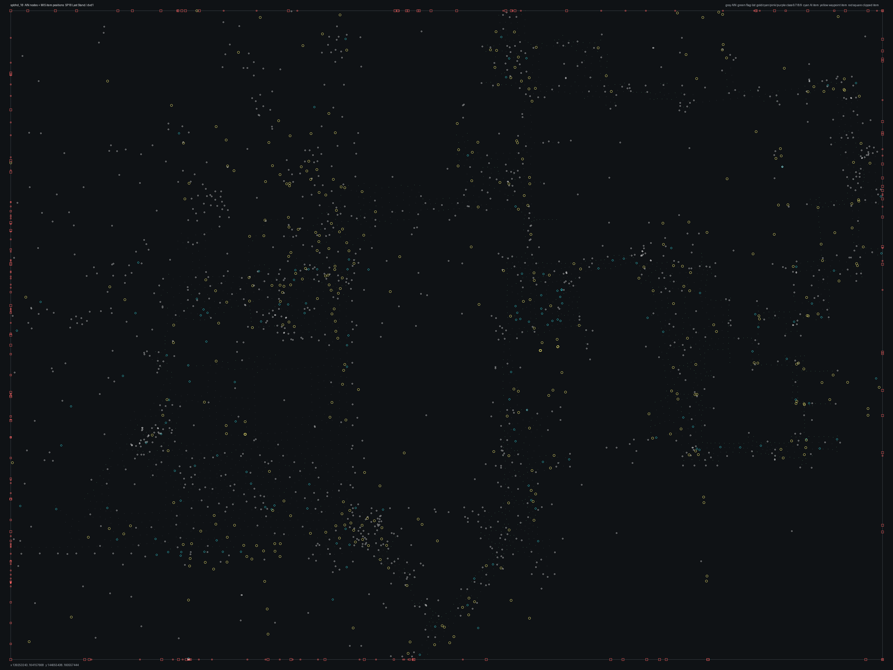

# SPBHD_18.bms - SP18 Last Stand

Back to [AIN Mission Index](../AIN%20Mission%20Index.md)

[Open full-size overlay image](overlays/spbhd_18_xy.png)

## Overlay Legend

| Marker | Meaning |
| --- | --- |
| Gray dots | Normal AIN navigation nodes. |
| Green dots | AIN nodes with `NodeFlags & 0x1C`. |
| Gold dots | AIN `NodeClass 6`. |
| Cyan-blue dots | AIN `NodeClass 7`. |
| Pink dots | AIN `NodeClass 8`. |
| Purple dots | AIN `NodeClass 9`. |
| Cyan circles | MIS items with `ai_textfile`. |
| Yellow circles | MIS items with `waypoint_id`. |
| White circles | Other MIS items with positions. |
| Red squares on frame | MIS items outside the AIN graph bounds. |

## Mission File Info

- Terrain: `dvd1`
- AIN nodes: `2704`
- AIN areas: `256`
- MIS items/events/waypoint defs: `2055` / `173` / `47`
- MIS AI-positioned items: `351`
- MIS items with `waypoint_id`: `489`
- AINODEPATH events: `0`

## AIN Plot Maps

| Field | Description | XY | XZ | YZ |
| --- | --- | --- | --- | --- |
| Area ID | Node area/sector grouping. | [XY](plots/SPBHD_18_area_id_xy.png) | [XZ](plots/SPBHD_18_area_id_xz.png) | [YZ](plots/SPBHD_18_area_id_yz.png) |
| Node Class | `NodeClass` values, including special classes `6`-`9`. | [XY](plots/SPBHD_18_node_class_xy.png) | [XZ](plots/SPBHD_18_node_class_xz.png) | [YZ](plots/SPBHD_18_node_class_yz.png) |
| Node Flags | `NodeFlags` byte values and flag clusters. | [XY](plots/SPBHD_18_node_flags_xy.png) | [XZ](plots/SPBHD_18_node_flags_xz.png) | [YZ](plots/SPBHD_18_node_flags_yz.png) |
| Radius | Node `Radius` byte values. | [XY](plots/SPBHD_18_radius_xy.png) | [XZ](plots/SPBHD_18_radius_xz.png) | [YZ](plots/SPBHD_18_radius_yz.png) |
| Edge Flags | Combined outgoing `EdgeFlags`. | [XY](plots/SPBHD_18_edge_flags_xy.png) | [XZ](plots/SPBHD_18_edge_flags_xz.png) | [YZ](plots/SPBHD_18_edge_flags_yz.png) |

## AINODEPATH Events

No `AINODEPATH` actions were found in this mission.

## Spatial Notes

| Check | Result |
| --- | --- |
| AI item coverage | `319 / 351` AI-positioned items are inside the AIN XY bounds. |
| Positioned item coverage | `1816 / 2055` positioned MIS items are inside the AIN XY bounds. |
| AI nearest-node distance | min `1.2`, median `2.0`, max `252.9`. |
| Area coverage | `1` `AreaId` values used; dominant areas: `[(0, 2704)]`. |
| Special node classes | `{}`. |
| Nonzero edge flags | `{'0x00': 11063}`. |

### Outside AIN Bounds

| Item |
| --- |
| item `0` / id `569` / type `1216` Armored Personell Carrier (`101216`) / ai `g_jeep` / group `17` |
| item `1` / id `3620` / type `1216` Armored Personell Carrier (`101216`) / ai `g_jeep` / group `17` |
| item `2` / id `4005` / type `1216` Armored Personell Carrier (`101216`) / ai `g_jeep` / group `17` |
| item `3` / id `4231` / type `1232` Friendly No Die Smoking LITTLE BIRD (`101232`) / ai `h_bhawkf` / group `31` |
| item `4` / id `4232` / type `1232` Friendly No Die Smoking LITTLE BIRD (`101232`) / ai `h_bhawkf` / group `30` |
| item `5` / id `3551` / type `1232` Friendly No Die Smoking LITTLE BIRD (`101232`) / ai `h_bhawkf` / group `15` |
| item `6` / id `3552` / type `1232` Friendly No Die Smoking LITTLE BIRD (`101232`) / ai `h_bhawkf` / group `16` |
| item `9` / id `568` / type `1276` Hummer with NON-Armored 50cal (`101276`) / ai `g_jeep` / group `17` |

### Farthest AI Items From AIN Nodes

| Item | Nearest Node | Area | Distance |
| --- | ---: | ---: | ---: |
| item `6` / id `3552` / type `1232` Friendly No Die Smoking LITTLE BIRD (`101232`) / ai `h_bhawkf` / group `16` | `2220` | `0` | `252.9` |
| item `5` / id `3551` / type `1232` Friendly No Die Smoking LITTLE BIRD (`101232`) / ai `h_bhawkf` / group `15` | `2220` | `0` | `234.7` |
| item `4` / id `4232` / type `1232` Friendly No Die Smoking LITTLE BIRD (`101232`) / ai `h_bhawkf` / group `30` | `1381` | `0` | `234.4` |
| item `3` / id `4231` / type `1232` Friendly No Die Smoking LITTLE BIRD (`101232`) / ai `h_bhawkf` / group `31` | `1381` | `0` | `215.0` |
| item `1924` / id `3619` / type `1754` Combat Friendly Soldier Ranger02 (`101754`) / ai `null` | `2198` | `0` | `84.2` |

### Special Class Nodes

| Node | Class | Area | Flags | Nearest MIS Item | Distance |
| ---: | ---: | ---: | --- | --- | ---: |
| | | | | | |

### Nonzero Edge Flags

| Flag | Source | Target | Areas | Classes | Reverse | Distance |
| --- | ---: | ---: | --- | --- | --- | ---: |
| | | | | | | |
