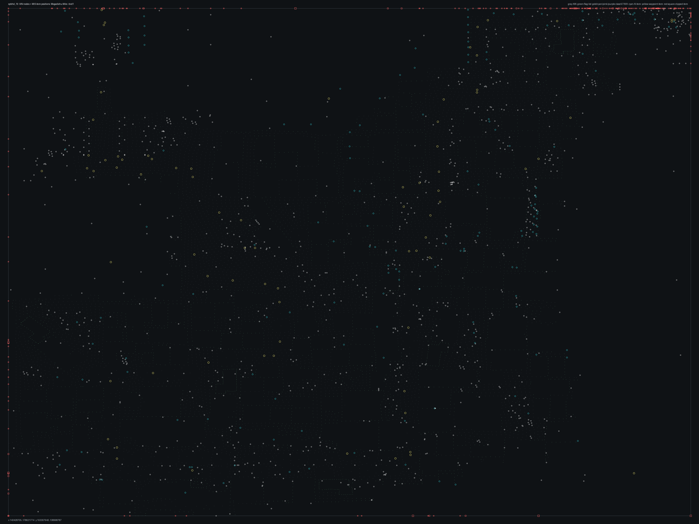

# SPBHD_19.bms - Mogadishu Mile

Back to [AIN Mission Index](../AIN%20Mission%20Index.md)

[Open full-size overlay image](overlays/spbhd_19_xy.png)

## Overlay Legend

| Marker | Meaning |
| --- | --- |
| Gray dots | Normal AIN navigation nodes. |
| Green dots | AIN nodes with `NodeFlags & 0x1C`. |
| Gold dots | AIN `NodeClass 6`. |
| Cyan-blue dots | AIN `NodeClass 7`. |
| Pink dots | AIN `NodeClass 8`. |
| Purple dots | AIN `NodeClass 9`. |
| Cyan circles | MIS items with `ai_textfile`. |
| Yellow circles | MIS items with `waypoint_id`. |
| White circles | Other MIS items with positions. |
| Red squares on frame | MIS items outside the AIN graph bounds. |

## Mission File Info

- Terrain: `dvd1`
- AIN nodes: `9903`
- AIN areas: `256`
- MIS items/events/waypoint defs: `1661` / `58` / `46`
- MIS AI-positioned items: `197`
- MIS items with `waypoint_id`: `84`
- AINODEPATH events: `0`

## AIN Plot Maps

| Field | Description | XY | XZ | YZ |
| --- | --- | --- | --- | --- |
| Area ID | Node area/sector grouping. | [XY](plots/SPBHD_19_area_id_xy.png) | [XZ](plots/SPBHD_19_area_id_xz.png) | [YZ](plots/SPBHD_19_area_id_yz.png) |
| Node Class | `NodeClass` values, including special classes `6`-`9`. | [XY](plots/SPBHD_19_node_class_xy.png) | [XZ](plots/SPBHD_19_node_class_xz.png) | [YZ](plots/SPBHD_19_node_class_yz.png) |
| Node Flags | `NodeFlags` byte values and flag clusters. | [XY](plots/SPBHD_19_node_flags_xy.png) | [XZ](plots/SPBHD_19_node_flags_xz.png) | [YZ](plots/SPBHD_19_node_flags_yz.png) |
| Radius | Node `Radius` byte values. | [XY](plots/SPBHD_19_radius_xy.png) | [XZ](plots/SPBHD_19_radius_xz.png) | [YZ](plots/SPBHD_19_radius_yz.png) |
| Edge Flags | Combined outgoing `EdgeFlags`. | [XY](plots/SPBHD_19_edge_flags_xy.png) | [XZ](plots/SPBHD_19_edge_flags_xz.png) | [YZ](plots/SPBHD_19_edge_flags_yz.png) |

## AINODEPATH Events

No `AINODEPATH` actions were found in this mission.

## Spatial Notes

| Check | Result |
| --- | --- |
| AI item coverage | `164 / 197` AI-positioned items are inside the AIN XY bounds. |
| Positioned item coverage | `1379 / 1661` positioned MIS items are inside the AIN XY bounds. |
| AI nearest-node distance | min `1.3`, median `2.8`, max `182.6`. |
| Area coverage | `1` `AreaId` values used; dominant areas: `[(0, 9903)]`. |
| Special node classes | `{}`. |
| Nonzero edge flags | `{'0x00': 45828}`. |

### Outside AIN Bounds

| Item |
| --- |
| item `4` / id `3` / type `1232` Friendly No Die Smoking LITTLE BIRD (`101232`) / ai `h_ah6z` / team `1` |
| item `25` / id `3391` / type `1034` Desert Nomadic Tent 1 (`101034`) |
| item `26` / id `3392` / type `1034` Desert Nomadic Tent 1 (`101034`) |
| item `27` / id `3393` / type `1034` Desert Nomadic Tent 1 (`101034`) |
| item `28` / id `3394` / type `1034` Desert Nomadic Tent 1 (`101034`) |
| item `29` / id `3395` / type `1034` Desert Nomadic Tent 1 (`101034`) / ai `null` |
| item `30` / id `3396` / type `1034` Desert Nomadic Tent 1 (`101034`) / ai `null` |
| item `31` / id `3397` / type `1034` Desert Nomadic Tent 1 (`101034`) |

### Farthest AI Items From AIN Nodes

| Item | Nearest Node | Area | Distance |
| --- | ---: | ---: | ---: |
| item `4` / id `3` / type `1232` Friendly No Die Smoking LITTLE BIRD (`101232`) / ai `h_ah6z` / team `1` | `4475` | `0` | `182.6` |
| item `611` / id `2538` / type `1573` Long Straight Wall Piece, Type A (`101573`) / ai `null` | `531` | `0` | `106.9` |
| item `30` / id `3396` / type `1034` Desert Nomadic Tent 1 (`101034`) / ai `null` | `9830` | `0` | `101.3` |
| item `29` / id `3395` / type `1034` Desert Nomadic Tent 1 (`101034`) / ai `null` | `9830` | `0` | `92.2` |
| item `185` / id `324` / type `1121` Long Corridor Block Piece Type #2 (`101121`) / ai `null` | `7565` | `0` | `91.0` |

### Special Class Nodes

| Node | Class | Area | Flags | Nearest MIS Item | Distance |
| ---: | ---: | ---: | --- | --- | ---: |
| | | | | | |

### Nonzero Edge Flags

| Flag | Source | Target | Areas | Classes | Reverse | Distance |
| --- | ---: | ---: | --- | --- | --- | ---: |
| | | | | | | |
