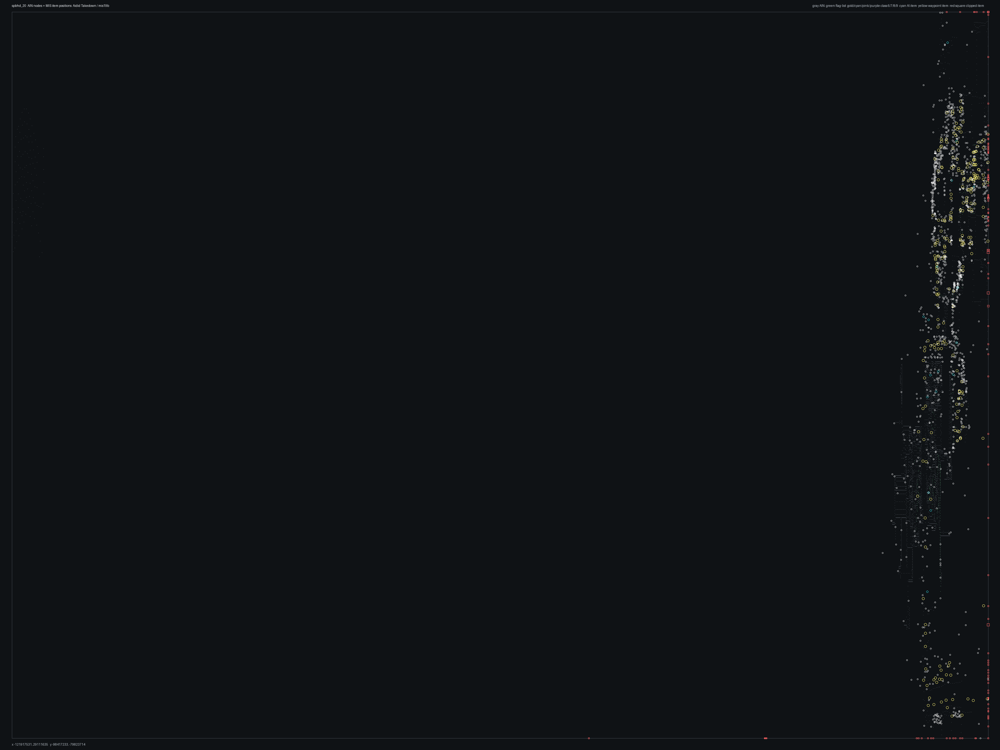

# SPBHD_20.bms - Aidid Takedown

Back to [AIN Mission Index](../AIN%20Mission%20Index.md)

[Open full-size overlay image](overlays/spbhd_20_xy.png)

## Overlay Legend

| Marker | Meaning |
| --- | --- |
| Gray dots | Normal AIN navigation nodes. |
| Green dots | AIN nodes with `NodeFlags & 0x1C`. |
| Gold dots | AIN `NodeClass 6`. |
| Cyan-blue dots | AIN `NodeClass 7`. |
| Pink dots | AIN `NodeClass 8`. |
| Purple dots | AIN `NodeClass 9`. |
| Cyan circles | MIS items with `ai_textfile`. |
| Yellow circles | MIS items with `waypoint_id`. |
| White circles | Other MIS items with positions. |
| Red squares on frame | MIS items outside the AIN graph bounds. |

## Mission File Info

- Terrain: `mis19b`
- AIN nodes: `5915`
- AIN areas: `256`
- MIS items/events/waypoint defs: `1729` / `76` / `40`
- MIS AI-positioned items: `99`
- MIS items with `waypoint_id`: `255`
- AINODEPATH events: `4`

## AIN Plot Maps

| Field | Description | XY | XZ | YZ |
| --- | --- | --- | --- | --- |
| Area ID | Node area/sector grouping. | [XY](plots/SPBHD_20_area_id_xy.png) | [XZ](plots/SPBHD_20_area_id_xz.png) | [YZ](plots/SPBHD_20_area_id_yz.png) |
| Node Class | `NodeClass` values, including special classes `6`-`9`. | [XY](plots/SPBHD_20_node_class_xy.png) | [XZ](plots/SPBHD_20_node_class_xz.png) | [YZ](plots/SPBHD_20_node_class_yz.png) |
| Node Flags | `NodeFlags` byte values and flag clusters. | [XY](plots/SPBHD_20_node_flags_xy.png) | [XZ](plots/SPBHD_20_node_flags_xz.png) | [YZ](plots/SPBHD_20_node_flags_yz.png) |
| Radius | Node `Radius` byte values. | [XY](plots/SPBHD_20_radius_xy.png) | [XZ](plots/SPBHD_20_radius_xz.png) | [YZ](plots/SPBHD_20_radius_yz.png) |
| Edge Flags | Combined outgoing `EdgeFlags`. | [XY](plots/SPBHD_20_edge_flags_xy.png) | [XZ](plots/SPBHD_20_edge_flags_xz.png) | [YZ](plots/SPBHD_20_edge_flags_yz.png) |

## AINODEPATH Events

### Event 0 - AINODEPATH_OFF

- Event block line: `650`
- AINODEPATH action line(s): `672`

**Trigger Items**

_None found._

**Referenced Items**

| Ref | Candidates |
| ---: | --- |
| `2` | item `2` / id `142` / type `1880` 50cal on Tripod with bunker (`101880`); node `5860`, area `0`, dist `4.6` item `1518` / id `2` / type `1661` Civilian Woman Somalian #2 (`101661`); node `1014`, area `0`, dist `2.2` |
| `3` | item `3` / id `140` / type `1881` 50cal on 360 tripod (`101881`); node `323`, area `0`, dist `2.0` item `1520` / id `3` / type `1696` Enemy Somalian Soldier with AK47 (`101696`) / team `2` / group `32`; node `1140`, area `0`, dist `345.5` |
| `4` | item `4` / id `55` / type `1881` 50cal on 360 tripod (`101881`); node `3145`, area `0`, dist `13.0` item `1522` / id `4` / type `1696` Enemy Somalian Soldier with AK47 (`101696`) / team `1` / group `5`; node `1511`, area `0`, dist `1.2` |
| `5` | item `5` / id `2878` / type `1881` 50cal on 360 tripod (`101881`); node `332`, area `0`, dist `2.0` item `1523` / id `5` / type `1696` Enemy Somalian Soldier with AK47 (`101696`) / team `1` / group `5`; node `2691`, area `0`, dist `1.2` |
| `6` | item `6` / id `141` / type `1881` 50cal on 360 tripod (`101881`); node `117`, area `0`, dist `4.5` item `1525` / id `6` / type `1697` Enemy Somalian Soldier with AK47 (`101697`) / team `2` / group `37`; node `642`, area `0`, dist `1.4` |
| `7` | item `7` / id `143` / type `1881` 50cal on 360 tripod (`101881`); node `5443`, area `0`, dist `1.6` item `1527` / id `7` / type `1697` Enemy Somalian Soldier with AK47 (`101697`) / team `2` / group `32`; node `1140`, area `0`, dist `345.2` |

**Trigger Waypoints**

_None found._

### Event 17 - AINODEPATH_ON

- Event block line: `895`
- AINODEPATH action line(s): `904`

**Trigger Items**

| Ref | Candidates |
| ---: | --- |
| `2` | item `2` / id `142` / type `1880` 50cal on Tripod with bunker (`101880`); node `5860`, area `0`, dist `4.6` item `1518` / id `2` / type `1661` Civilian Woman Somalian #2 (`101661`); node `1014`, area `0`, dist `2.2` |
| `3` | item `3` / id `140` / type `1881` 50cal on 360 tripod (`101881`); node `323`, area `0`, dist `2.0` item `1520` / id `3` / type `1696` Enemy Somalian Soldier with AK47 (`101696`) / team `2` / group `32`; node `1140`, area `0`, dist `345.5` |
| `7` | item `7` / id `143` / type `1881` 50cal on 360 tripod (`101881`); node `5443`, area `0`, dist `1.6` item `1527` / id `7` / type `1697` Enemy Somalian Soldier with AK47 (`101697`) / team `2` / group `32`; node `1140`, area `0`, dist `345.2` |
| `10` | item `10` / id `144` / type `2042` Power Up Ammo Pack (`102042`); node `4990`, area `0`, dist `1.3` item `1532` / id `10` / type `1697` Enemy Somalian Soldier with AK47 (`101697`) / team `2` / group `6`; node `4214`, area `0`, dist `1.0` |

**Referenced Items**

| Ref | Candidates |
| ---: | --- |
| `2` | item `2` / id `142` / type `1880` 50cal on Tripod with bunker (`101880`); node `5860`, area `0`, dist `4.6` item `1518` / id `2` / type `1661` Civilian Woman Somalian #2 (`101661`); node `1014`, area `0`, dist `2.2` |
| `3` | item `3` / id `140` / type `1881` 50cal on 360 tripod (`101881`); node `323`, area `0`, dist `2.0` item `1520` / id `3` / type `1696` Enemy Somalian Soldier with AK47 (`101696`) / team `2` / group `32`; node `1140`, area `0`, dist `345.5` |
| `7` | item `7` / id `143` / type `1881` 50cal on 360 tripod (`101881`); node `5443`, area `0`, dist `1.6` item `1527` / id `7` / type `1697` Enemy Somalian Soldier with AK47 (`101697`) / team `2` / group `32`; node `1140`, area `0`, dist `345.2` |
| `10` | item `10` / id `144` / type `2042` Power Up Ammo Pack (`102042`); node `4990`, area `0`, dist `1.3` item `1532` / id `10` / type `1697` Enemy Somalian Soldier with AK47 (`101697`) / team `2` / group `6`; node `4214`, area `0`, dist `1.0` |
| `29` | item `29` / id `161` / type `1088` Mogadishu City Block4 Moderately Generic 64x64 (`101088`); node `1038`, area `0`, dist `29.1` item `1568` / id `29` / type `1701` Enemy Somalian Malitia Member6 (`101701`) / team `2`; node `5497`, area `0`, dist `1.4` |
| `30` | item `30` / id `162` / type `1088` Mogadishu City Block4 Moderately Generic 64x64 (`101088`); node `5681`, area `0`, dist `32.7` item `1570` / id `30` / type `1701` Enemy Somalian Malitia Member6 (`101701`) / team `2`; node `5524`, area `0`, dist `1.3` |

**Trigger Waypoints**

| Ref | Candidates |
| ---: | --- |
| `2` | item `1186` / wp `2` / id `1976` / type `6005` waypoint (`106005`) item `1241` / wp `2` / id `2010` / type `6005` waypoint (`106005`) item `1257` / wp `2` / id `2036` / type `6005` waypoint (`106005`) item `1284` / wp `2` / id `2064` / type `6005` waypoint (`106005`) +4 more |
| `3` | item `1200` / wp `3` / id `1983` / type `6005` waypoint (`106005`) / ai `null` item `1235` / wp `3` / id `2033` / type `6005` waypoint (`106005`) / ai `null` item `1283` / wp `3` / id `2058` / type `6005` waypoint (`106005`) / ai `null` item `1308` / wp `3` / id `2063` / type `6005` waypoint (`106005`) / ai `null` +4 more |
| `7` | item `1189` / wp `7` / id `1979` / type `6005` waypoint (`106005`) item `1251` / wp `7` / id `2019` / type `6005` waypoint (`106005`) item `1645` / wp `7` / id `136` / type `4523` Civilian Man Somalian #3 (`104523`) |
| `10` | item `1183` / wp `10` / id `1973` / type `6005` waypoint (`106005`) |

### Event 37 - AINODEPATH_OFF

- Event block line: `1133`
- AINODEPATH action line(s): `1139`

**Trigger Items**

| Ref | Candidates |
| ---: | --- |
| `4` | item `4` / id `55` / type `1881` 50cal on 360 tripod (`101881`); node `3145`, area `0`, dist `13.0` item `1522` / id `4` / type `1696` Enemy Somalian Soldier with AK47 (`101696`) / team `1` / group `5`; node `1511`, area `0`, dist `1.2` |
| `57` | item `57` / id `189` / type `1094` Mogadishu Slum Hut double unit (`101094`); node `3854`, area `0`, dist `2.6` item `1515` / id `57` / type `1550` Large African Crocodile (`101550`); node `5285`, area `0`, dist `6472.9` |

**Referenced Items**

| Ref | Candidates |
| ---: | --- |
| `3` | item `3` / id `140` / type `1881` 50cal on 360 tripod (`101881`); node `323`, area `0`, dist `2.0` item `1520` / id `3` / type `1696` Enemy Somalian Soldier with AK47 (`101696`) / team `2` / group `32`; node `1140`, area `0`, dist `345.5` |
| `4` | item `4` / id `55` / type `1881` 50cal on 360 tripod (`101881`); node `3145`, area `0`, dist `13.0` item `1522` / id `4` / type `1696` Enemy Somalian Soldier with AK47 (`101696`) / team `1` / group `5`; node `1511`, area `0`, dist `1.2` |
| `5` | item `5` / id `2878` / type `1881` 50cal on 360 tripod (`101881`); node `332`, area `0`, dist `2.0` item `1523` / id `5` / type `1696` Enemy Somalian Soldier with AK47 (`101696`) / team `1` / group `5`; node `2691`, area `0`, dist `1.2` |
| `57` | item `57` / id `189` / type `1094` Mogadishu Slum Hut double unit (`101094`); node `3854`, area `0`, dist `2.6` item `1515` / id `57` / type `1550` Large African Crocodile (`101550`); node `5285`, area `0`, dist `6472.9` |

**Trigger Waypoints**

| Ref | Candidates |
| ---: | --- |
| `4` | item `1212` / wp `4` / id `1996` / type `6005` waypoint (`106005`) / ai `null` item `1223` / wp `4` / id `2024` / type `6005` waypoint (`106005`) / ai `null` item `1265` / wp `4` / id `2044` / type `6005` waypoint (`106005`) / ai `null` item `1299` / wp `4` / id `2541` / type `6005` waypoint (`106005`) / ai `null` |

### Event 54 - AINODEPATH_ON

- Event block line: `1354`
- AINODEPATH action line(s): `1362`

**Trigger Items**

| Ref | Candidates |
| ---: | --- |
| `10` | item `10` / id `144` / type `2042` Power Up Ammo Pack (`102042`); node `4990`, area `0`, dist `1.3` item `1532` / id `10` / type `1697` Enemy Somalian Soldier with AK47 (`101697`) / team `2` / group `6`; node `4214`, area `0`, dist `1.0` |
| `18` | item `18` / id `150` / type `1086` Mogadishu City Block2 Moderately Generic 64x64 (`101086`); node `147`, area `0`, dist `12.4` item `1547` / id `18` / type `1700` Enemy Somalian Malitia Member5 (`101700`) / team `2`; node `3117`, area `0`, dist `13.0` |

**Referenced Items**

| Ref | Candidates |
| ---: | --- |
| `8` | item `8` / id `2757` / type `2041` Power Up Med Pack (`102041`); node `4989`, area `0`, dist `0.7` item `1529` / id `8` / type `1697` Enemy Somalian Soldier with AK47 (`101697`) / team `1` / group `5`; node `1332`, area `0`, dist `1.1` |
| `10` | item `10` / id `144` / type `2042` Power Up Ammo Pack (`102042`); node `4990`, area `0`, dist `1.3` item `1532` / id `10` / type `1697` Enemy Somalian Soldier with AK47 (`101697`) / team `2` / group `6`; node `4214`, area `0`, dist `1.0` |
| `18` | item `18` / id `150` / type `1086` Mogadishu City Block2 Moderately Generic 64x64 (`101086`); node `147`, area `0`, dist `12.4` item `1547` / id `18` / type `1700` Enemy Somalian Malitia Member5 (`101700`) / team `2`; node `3117`, area `0`, dist `13.0` |

**Trigger Waypoints**

| Ref | Candidates |
| ---: | --- |
| `10` | item `1183` / wp `10` / id `1973` / type `6005` waypoint (`106005`) |
| `18` | item `1216` / wp `18` / id `1999` / type `6005` waypoint (`106005`) item `1226` / wp `18` / id `2025` / type `6005` waypoint (`106005`) item `1278` / wp `18` / id `2053` / type `6005` waypoint (`106005`) item `1292` / wp `18` / id `2071` / type `6005` waypoint (`106005`) +1 more |

## Spatial Notes

| Check | Result |
| --- | --- |
| AI item coverage | `93 / 99` AI-positioned items are inside the AIN XY bounds. |
| Positioned item coverage | `1595 / 1729` positioned MIS items are inside the AIN XY bounds. |
| AI nearest-node distance | min `0.3`, median `1.4`, max `55.6`. |
| Area coverage | `3` `AreaId` values used; dominant areas: `[(0, 5912), (88, 2), (77, 1)]`. |
| Special node classes | `{}`. |
| Nonzero edge flags | `{'0x00': 27232, '0x20': 1}`. |

### Outside AIN Bounds

| Item |
| --- |
| item `1` / id `2876` / type `1288` Technical enemy vehicle #6 (`101288`) / ai `g_jeep` / group `8` |
| item `15` / id `147` / type `1085` Mogadishu City Block1 Moderately Generic 64x64 (`101085`) |
| item `16` / id `148` / type `1085` Mogadishu City Block1 Moderately Generic 64x64 (`101085`) |
| item `17` / id `149` / type `1086` Mogadishu City Block2 Moderately Generic 64x64 (`101086`) |
| item `20` / id `152` / type `1086` Mogadishu City Block2 Moderately Generic 64x64 (`101086`) |
| item `21` / id `153` / type `1087` Mogadishu City Block3 Moderately Generic 64x64 (`101087`) |
| item `23` / id `155` / type `1087` Mogadishu City Block3 Moderately Generic 64x64 (`101087`) |
| item `24` / id `156` / type `1088` Mogadishu City Block4 Moderately Generic 64x64 (`101088`) |

### Farthest AI Items From AIN Nodes

| Item | Nearest Node | Area | Distance |
| --- | ---: | ---: | ---: |
| item `1085` / id `1896` / type `2115` 32m stone wall piece (`102115`) / ai `null` | `5696` | `0` | `55.6` |
| item `0` / id `2874` / type `1288` Technical enemy vehicle #6 (`101288`) / ai `g_jeep` / wp `24` / group `3` | `1025` | `0` | `37.4` |
| item `813` / id `1627` / type `1590` Modular Wall Debris, Left End Cap (`101590`) / ai `null` | `5306` | `0` | `21.0` |
| item `755` / id `1579` / type `1588` Modular Wall Debris, straight Piece (`101588`) / ai `null` | `5306` | `0` | `21.0` |
| item `760` / id `2694` / type `1588` Modular Wall Debris, straight Piece (`101588`) / ai `null` | `4941` | `0` | `13.1` |

### Special Class Nodes

| Node | Class | Area | Flags | Nearest MIS Item | Distance |
| ---: | ---: | ---: | --- | --- | ---: |
| | | | | | |

### Nonzero Edge Flags

| Flag | Source | Target | Areas | Classes | Reverse | Distance |
| --- | ---: | ---: | --- | --- | --- | ---: |
| `0x20` | `5287` | `5253` | `0` -> `0` | `0` -> `0` | `0x00` | `5.5` |
