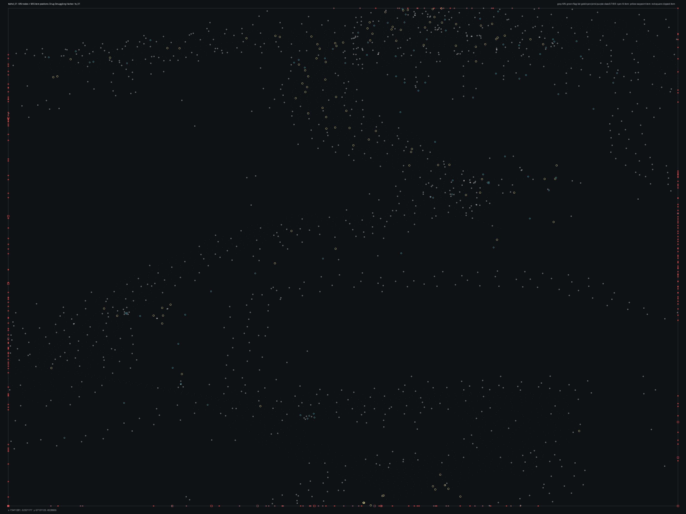

# tsbhd_01.bms - Drug Smuggling Harbor

Back to [AIN Mission Index](../AIN%20Mission%20Index.md)

[Open full-size overlay image](overlays/tsbhd_01_xy.png)

## Overlay Legend

| Marker | Meaning |
| --- | --- |
| Gray dots | Normal AIN navigation nodes. |
| Green dots | AIN nodes with `NodeFlags & 0x1C`. |
| Gold dots | AIN `NodeClass 6`. |
| Cyan-blue dots | AIN `NodeClass 7`. |
| Pink dots | AIN `NodeClass 8`. |
| Purple dots | AIN `NodeClass 9`. |
| Cyan circles | MIS items with `ai_textfile`. |
| Yellow circles | MIS items with `waypoint_id`. |
| White circles | Other MIS items with positions. |
| Red squares on frame | MIS items outside the AIN graph bounds. |

## Mission File Info

- Terrain: `ts_01`
- AIN nodes: `2699`
- AIN areas: `256`
- MIS items/events/waypoint defs: `1589` / `66` / `31`
- MIS AI-positioned items: `114`
- MIS items with `waypoint_id`: `127`
- AINODEPATH events: `2`

## AIN Plot Maps

| Field | Description | XY | XZ | YZ |
| --- | --- | --- | --- | --- |
| Area ID | Node area/sector grouping. | [XY](plots/tsbhd_01_area_id_xy.png) | [XZ](plots/tsbhd_01_area_id_xz.png) | [YZ](plots/tsbhd_01_area_id_yz.png) |
| Node Class | `NodeClass` values, including special classes `6`-`9`. | [XY](plots/tsbhd_01_node_class_xy.png) | [XZ](plots/tsbhd_01_node_class_xz.png) | [YZ](plots/tsbhd_01_node_class_yz.png) |
| Node Flags | `NodeFlags` byte values and flag clusters. | [XY](plots/tsbhd_01_node_flags_xy.png) | [XZ](plots/tsbhd_01_node_flags_xz.png) | [YZ](plots/tsbhd_01_node_flags_yz.png) |
| Radius | Node `Radius` byte values. | [XY](plots/tsbhd_01_radius_xy.png) | [XZ](plots/tsbhd_01_radius_xz.png) | [YZ](plots/tsbhd_01_radius_yz.png) |
| Edge Flags | Combined outgoing `EdgeFlags`. | [XY](plots/tsbhd_01_edge_flags_xy.png) | [XZ](plots/tsbhd_01_edge_flags_xz.png) | [YZ](plots/tsbhd_01_edge_flags_yz.png) |

## AINODEPATH Events

### Event 0 - AINODEPATH_OFF

- Event block line: `650`
- AINODEPATH action line(s): `656`

**Trigger Items**

| Ref | Candidates |
| ---: | --- |
| `5` | item `5` / id `69` / type `1287` Blackhawk, weak AI miniguns, both doors open (`101287`) / ai `H_BHawk` / group `3`; node `2148`, area `0`, dist `963.1` item `1436` / id `5` / type `6237` Columbian Smuggler 1 (`106237`) / team `2` / group `14`; node `2075`, area `0`, dist `1.7` |

**Referenced Items**

| Ref | Candidates |
| ---: | --- |
| `2` | item `2` / id `35` / type `1239` Technical enemy vehicle with mounted 50cal (`101239`) / ai `G_Jeep` / group `16`; node `2648`, area `0`, dist `2.9` item `1462` / id `2` / type `6239` Columbian Smuggler 3 (`106239`) / team `2` / group `12`; node `776`, area `0`, dist `0.7` |
| `3` | item `3` / id `36` / type `1239` Technical enemy vehicle with mounted 50cal (`101239`) / ai `G_Jeep` / group `15`; node `2144`, area `0`, dist `4.8` item `1435` / id `3` / type `6237` Columbian Smuggler 1 (`106237`) / team `2` / group `12`; node `899`, area `0`, dist `4.3` |
| `4` | item `4` / id `37` / type `1239` Technical enemy vehicle with mounted 50cal (`101239`) / ai `G_Jeep` / group `9`; node `1449`, area `0`, dist `2.0` item `1491` / id `4` / type `6242` / ai `null` / team `2` / group `14`; node `2079`, area `0`, dist `2.1` |
| `5` | item `5` / id `69` / type `1287` Blackhawk, weak AI miniguns, both doors open (`101287`) / ai `H_BHawk` / group `3`; node `2148`, area `0`, dist `963.1` item `1436` / id `5` / type `6237` Columbian Smuggler 1 (`106237`) / team `2` / group `14`; node `2075`, area `0`, dist `1.7` |
| `6` | item `6` / id `68` / type `1287` Blackhawk, weak AI miniguns, both doors open (`101287`) / ai `H_BHawk` / group `17`; node `512`, area `0`, dist `616.0` item `1490` / id `6` / type `6242` / ai `null` / team `2` / group `14`; node `2115`, area `0`, dist `3.8` |
| `10` | item `10` / id `73` / type `1493` Small fishing boat type #2 (`101493`) / ai `wu`; node `1706`, area `0`, dist `8.9` item `1442` / id `10` / type `6237` Columbian Smuggler 1 (`106237`) / team `2` / group `14`; node `2143`, area `0`, dist `5.3` |

**Trigger Waypoints**

| Ref | Candidates |
| ---: | --- |
| `5` | item `1235` / wp `5` / id `1582` / type `6005` waypoint (`106005`) item `1272` / wp `5` / id `588` / type `6005` waypoint (`106005`) item `1287` / wp `5` / id `612` / type `6005` waypoint (`106005`) |

### Event 3 - AINODEPATH_ON

- Event block line: `700`
- AINODEPATH action line(s): `711`

**Trigger Items**

| Ref | Candidates |
| ---: | --- |
| `2` | item `2` / id `35` / type `1239` Technical enemy vehicle with mounted 50cal (`101239`) / ai `G_Jeep` / group `16`; node `2648`, area `0`, dist `2.9` item `1462` / id `2` / type `6239` Columbian Smuggler 3 (`106239`) / team `2` / group `12`; node `776`, area `0`, dist `0.7` |

**Referenced Items**

| Ref | Candidates |
| ---: | --- |
| `2` | item `2` / id `35` / type `1239` Technical enemy vehicle with mounted 50cal (`101239`) / ai `G_Jeep` / group `16`; node `2648`, area `0`, dist `2.9` item `1462` / id `2` / type `6239` Columbian Smuggler 3 (`106239`) / team `2` / group `12`; node `776`, area `0`, dist `0.7` |
| `4` | item `4` / id `37` / type `1239` Technical enemy vehicle with mounted 50cal (`101239`) / ai `G_Jeep` / group `9`; node `1449`, area `0`, dist `2.0` item `1491` / id `4` / type `6242` / ai `null` / team `2` / group `14`; node `2079`, area `0`, dist `2.1` |
| `5` | item `5` / id `69` / type `1287` Blackhawk, weak AI miniguns, both doors open (`101287`) / ai `H_BHawk` / group `3`; node `2148`, area `0`, dist `963.1` item `1436` / id `5` / type `6237` Columbian Smuggler 1 (`106237`) / team `2` / group `14`; node `2075`, area `0`, dist `1.7` |
| `6` | item `6` / id `68` / type `1287` Blackhawk, weak AI miniguns, both doors open (`101287`) / ai `H_BHawk` / group `17`; node `512`, area `0`, dist `616.0` item `1490` / id `6` / type `6242` / ai `null` / team `2` / group `14`; node `2115`, area `0`, dist `3.8` |
| `32` | item `32` / id `88` / type `1093` Mogadishu Slum Hut Single Unit (`101093`); node `2652`, area `0`, dist `5.0` item `1419` / id `32` / type `6200` Team Sabre Teammate 1 (`106200`) / ai `null` / team `1` / group `6`; node `2148`, area `0`, dist `962.3` |
| `33` | item `33` / id `89` / type `1093` Mogadishu Slum Hut Single Unit (`101093`); node `1679`, area `0`, dist `3.2` item `1421` / id `33` / type `6218` Team Sabre Teammate 5 Do Rag (`106218`) / ai `null` / team `1` / group `6`; node `2148`, area `0`, dist `963.7` |

**Trigger Waypoints**

_None found._

## Spatial Notes

| Check | Result |
| --- | --- |
| AI item coverage | `99 / 114` AI-positioned items are inside the AIN XY bounds. |
| Positioned item coverage | `1248 / 1589` positioned MIS items are inside the AIN XY bounds. |
| AI nearest-node distance | min `1.4`, median `5.3`, max `963.7`. |
| Area coverage | `1` `AreaId` values used; dominant areas: `[(0, 2699)]`. |
| Special node classes | `{}`. |
| Nonzero edge flags | `{'0x00': 13327, '0x10': 3, '0x20': 1}`. |

### Outside AIN Bounds

| Item |
| --- |
| item `5` / id `69` / type `1287` Blackhawk, weak AI miniguns, both doors open (`101287`) / ai `H_BHawk` / group `3` |
| item `6` / id `68` / type `1287` Blackhawk, weak AI miniguns, both doors open (`101287`) / ai `H_BHawk` / group `17` |
| item `9` / id `72` / type `1289` Blackhawk fast roping NO Die (`101289`) / ai `H_BHawk` / group `5` |
| item `13` / id `76` / type `1493` Small fishing boat type #2 (`101493`) / ai `wu` |
| item `214` / id `533` / type `2136` |
| item `215` / id `534` / type `2136` |
| item `216` / id `535` / type `2136` |
| item `217` / id `536` / type `2136` |

### Farthest AI Items From AIN Nodes

| Item | Nearest Node | Area | Distance |
| --- | ---: | ---: | ---: |
| item `1421` / id `33` / type `6218` Team Sabre Teammate 5 Do Rag (`106218`) / ai `null` / team `1` / group `6` | `2148` | `0` | `963.7` |
| item `5` / id `69` / type `1287` Blackhawk, weak AI miniguns, both doors open (`101287`) / ai `H_BHawk` / group `3` | `2148` | `0` | `963.1` |
| item `1227` / id `571` / type `6001` start, player (`106001`) / ai `null` / team `2` | `2148` | `0` | `962.8` |
| item `1419` / id `32` / type `6200` Team Sabre Teammate 1 (`106200`) / ai `null` / team `1` / group `6` | `2148` | `0` | `962.3` |
| item `1420` / id `34` / type `6217` Team Sabre Teammate 4 Boonie Hat (`106217`) / ai `null` / team `1` / group `6` | `2148` | `0` | `961.4` |

### Special Class Nodes

| Node | Class | Area | Flags | Nearest MIS Item | Distance |
| ---: | ---: | ---: | --- | --- | ---: |
| | | | | | |

### Nonzero Edge Flags

| Flag | Source | Target | Areas | Classes | Reverse | Distance |
| --- | ---: | ---: | --- | --- | --- | ---: |
| `0x10` | `18` | `17` | `0` -> `0` | `0` -> `0` | `0x00` | `2.8` |
| `0x10` | `18` | `138` | `0` -> `0` | `0` -> `0` | `0x00` | `4.9` |
| `0x10` | `138` | `17` | `0` -> `0` | `0` -> `0` | `0x00` | `5.1` |
| `0x20` | `16` | `15` | `0` -> `0` | `0` -> `0` | `missing` | `3.1` |
