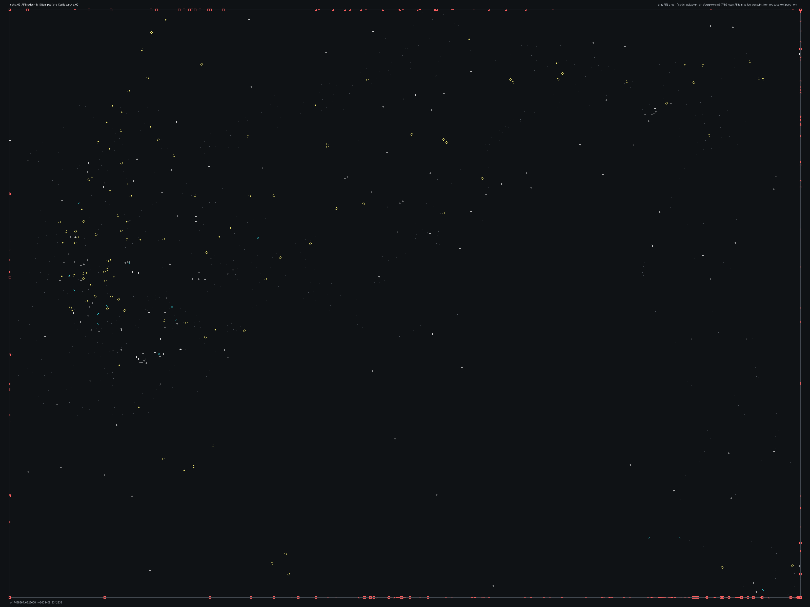

# tsbhd_03.bms - Castle start

Back to [AIN Mission Index](../AIN%20Mission%20Index.md)

[Open full-size overlay image](overlays/tsbhd_03_xy.png)

## Overlay Legend

| Marker | Meaning |
| --- | --- |
| Gray dots | Normal AIN navigation nodes. |
| Green dots | AIN nodes with `NodeFlags & 0x1C`. |
| Gold dots | AIN `NodeClass 6`. |
| Cyan-blue dots | AIN `NodeClass 7`. |
| Pink dots | AIN `NodeClass 8`. |
| Purple dots | AIN `NodeClass 9`. |
| Cyan circles | MIS items with `ai_textfile`. |
| Yellow circles | MIS items with `waypoint_id`. |
| White circles | Other MIS items with positions. |
| Red squares on frame | MIS items outside the AIN graph bounds. |

## Mission File Info

- Terrain: `ts_02`
- AIN nodes: `1903`
- AIN areas: `256`
- MIS items/events/waypoint defs: `863` / `57` / `47`
- MIS AI-positioned items: `119`
- MIS items with `waypoint_id`: `189`
- AINODEPATH events: `1`

## AIN Plot Maps

| Field | Description | XY | XZ | YZ |
| --- | --- | --- | --- | --- |
| Area ID | Node area/sector grouping. | [XY](plots/tsbhd_03_area_id_xy.png) | [XZ](plots/tsbhd_03_area_id_xz.png) | [YZ](plots/tsbhd_03_area_id_yz.png) |
| Node Class | `NodeClass` values, including special classes `6`-`9`. | [XY](plots/tsbhd_03_node_class_xy.png) | [XZ](plots/tsbhd_03_node_class_xz.png) | [YZ](plots/tsbhd_03_node_class_yz.png) |
| Node Flags | `NodeFlags` byte values and flag clusters. | [XY](plots/tsbhd_03_node_flags_xy.png) | [XZ](plots/tsbhd_03_node_flags_xz.png) | [YZ](plots/tsbhd_03_node_flags_yz.png) |
| Radius | Node `Radius` byte values. | [XY](plots/tsbhd_03_radius_xy.png) | [XZ](plots/tsbhd_03_radius_xz.png) | [YZ](plots/tsbhd_03_radius_yz.png) |
| Edge Flags | Combined outgoing `EdgeFlags`. | [XY](plots/tsbhd_03_edge_flags_xy.png) | [XZ](plots/tsbhd_03_edge_flags_xz.png) | [YZ](plots/tsbhd_03_edge_flags_yz.png) |

## AINODEPATH Events

### Event 11 - AINODEPATH_OFF

- Event block line: `865`
- AINODEPATH action line(s): `872`

**Trigger Items**

| Ref | Candidates |
| ---: | --- |
| `10` | item `10` / id `1138` / type `1273` Technical with Emplaced Cannon #4 (`101273`) / ai `G_Jeep` / group `53`; node `1262`, area `0`, dist `357.7` |
| `11` | item `11` / id `1140` / type `1273` Technical with Emplaced Cannon #4 (`101273`) / ai `G_Jeep` / group `56`; node `1262`, area `0`, dist `354.9` |
| `18` | item `18` / id `1603` / type `1288` Technical enemy vehicle #6 (`101288`) / ai `G_Jeep`; node `1810`, area `0`, dist `3.2` |
| `30` | item `30` / id `1135` / type `2041` Power Up Med Pack (`102041`); node `1902`, area `0`, dist `0.8` |

**Referenced Items**

| Ref | Candidates |
| ---: | --- |
| `10` | item `10` / id `1138` / type `1273` Technical with Emplaced Cannon #4 (`101273`) / ai `G_Jeep` / group `53`; node `1262`, area `0`, dist `357.7` |
| `11` | item `11` / id `1140` / type `1273` Technical with Emplaced Cannon #4 (`101273`) / ai `G_Jeep` / group `56`; node `1262`, area `0`, dist `354.9` |
| `18` | item `18` / id `1603` / type `1288` Technical enemy vehicle #6 (`101288`) / ai `G_Jeep`; node `1810`, area `0`, dist `3.2` |
| `30` | item `30` / id `1135` / type `2041` Power Up Med Pack (`102041`); node `1902`, area `0`, dist `0.8` |
| `126` | item `126` / id `424` / type `6197` Tropical Tree Grouping 03 No ferns (`106197`); node `258`, area `0`, dist `131.9` |

**Trigger Waypoints**

| Ref | Candidates |
| ---: | --- |
| `10` | item `391` / wp `10` / id `765` / type `6005` waypoint (`106005`) / ai `null` |
| `11` | item `393` / wp `11` / id `859` / type `6005` waypoint (`106005`) |
| `30` | item `394` / wp `30` / id `928` / type `6005` waypoint (`106005`) |

## Spatial Notes

| Check | Result |
| --- | --- |
| AI item coverage | `30 / 119` AI-positioned items are inside the AIN XY bounds. |
| Positioned item coverage | `321 / 863` positioned MIS items are inside the AIN XY bounds. |
| AI nearest-node distance | min `1.3`, median `314.7`, max `1515.8`. |
| Area coverage | `1` `AreaId` values used; dominant areas: `[(0, 1903)]`. |
| Special node classes | `{}`. |
| Nonzero edge flags | `{'0x00': 12988}`. |

### Outside AIN Bounds

| Item |
| --- |
| item `0` / id `1684` / type `1216` Armored Personell Carrier (`101216`) / ai `gu` / team `1` / group `13` |
| item `1` / id `1139` / type `1239` Technical enemy vehicle with mounted 50cal (`101239`) / ai `G_Jeep` / group `50` |
| item `2` / id `1147` / type `1239` Technical enemy vehicle with mounted 50cal (`101239`) / ai `g_jeep` / group `57` |
| item `3` / id `1146` / type `1239` Technical enemy vehicle with mounted 50cal (`101239`) / ai `G_Jeep` / group `58` |
| item `4` / id `719` / type `1239` Technical enemy vehicle with mounted 50cal (`101239`) / ai `G_Jeep` / group `30` |
| item `5` / id `1144` / type `1239` Technical enemy vehicle with mounted 50cal (`101239`) / ai `g_jeep` / group `60` |
| item `6` / id `1145` / type `1239` Technical enemy vehicle with mounted 50cal (`101239`) / ai `g_jeep` / group `55` |
| item `7` / id `1142` / type `1239` Technical enemy vehicle with mounted 50cal (`101239`) / ai `g_jeep` / group `52` |

### Farthest AI Items From AIN Nodes

| Item | Nearest Node | Area | Distance |
| --- | ---: | ---: | ---: |
| item `647` / id `248` / type `6218` Team Sabre Teammate 5 Do Rag (`106218`) / ai `null` / team `1` / group `7` | `9` | `0` | `1515.8` |
| item `644` / id `255` / type `6217` Team Sabre Teammate 4 Boonie Hat (`106217`) / ai `null` / team `1` / group `7` | `9` | `0` | `1515.0` |
| item `642` / id `266` / type `6202` Team Sabre Teammate 3 (`106202`) / ai `null` / team `1` / group `6` | `9` | `0` | `1514.8` |
| item `632` / id `265` / type `6200` Team Sabre Teammate 1 (`106200`) / ai `null` / team `1` / group `6` | `9` | `0` | `1513.9` |
| item `32` / id `258` / type `6214` Rigid Hull Inflatable Boat (collision bow) (`106214`) / ai `wu` / group `3` | `9` | `0` | `1513.7` |

### Special Class Nodes

| Node | Class | Area | Flags | Nearest MIS Item | Distance |
| ---: | ---: | ---: | --- | --- | ---: |
| | | | | | |

### Nonzero Edge Flags

| Flag | Source | Target | Areas | Classes | Reverse | Distance |
| --- | ---: | ---: | --- | --- | --- | ---: |
| | | | | | | |
