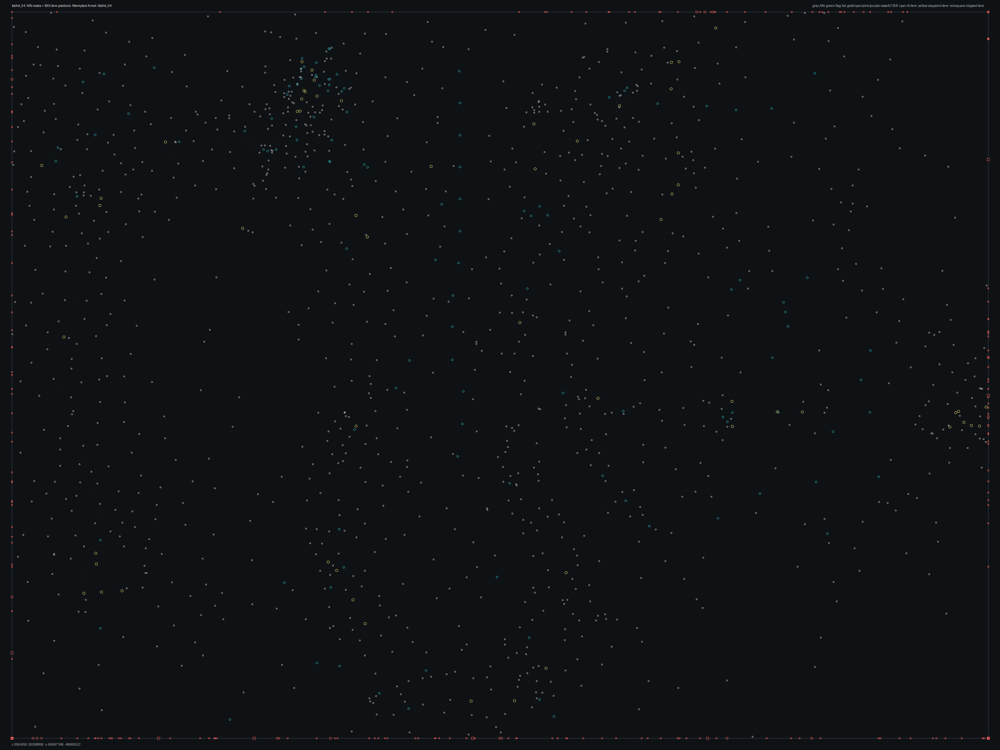

# tsbhd_04.bms - Attempted Arrest

Back to [AIN Mission Index](../AIN%20Mission%20Index.md)

[Open full-size overlay image](overlays/tsbhd_04_xy.png)

## Overlay Legend

| Marker | Meaning |
| --- | --- |
| Gray dots | Normal AIN navigation nodes. |
| Green dots | AIN nodes with `NodeFlags & 0x1C`. |
| Gold dots | AIN `NodeClass 6`. |
| Cyan-blue dots | AIN `NodeClass 7`. |
| Pink dots | AIN `NodeClass 8`. |
| Purple dots | AIN `NodeClass 9`. |
| Cyan circles | MIS items with `ai_textfile`. |
| Yellow circles | MIS items with `waypoint_id`. |
| White circles | Other MIS items with positions. |
| Red squares on frame | MIS items outside the AIN graph bounds. |

## Mission File Info

- Terrain: `tsbhd_04`
- AIN nodes: `849`
- AIN areas: `256`
- MIS items/events/waypoint defs: `1632` / `68` / `41`
- MIS AI-positioned items: `183`
- MIS items with `waypoint_id`: `71`
- AINODEPATH events: `11`

## AIN Plot Maps

| Field | Description | XY | XZ | YZ |
| --- | --- | --- | --- | --- |
| Area ID | Node area/sector grouping. | [XY](plots/tsbhd_04_area_id_xy.png) | [XZ](plots/tsbhd_04_area_id_xz.png) | [YZ](plots/tsbhd_04_area_id_yz.png) |
| Node Class | `NodeClass` values, including special classes `6`-`9`. | [XY](plots/tsbhd_04_node_class_xy.png) | [XZ](plots/tsbhd_04_node_class_xz.png) | [YZ](plots/tsbhd_04_node_class_yz.png) |
| Node Flags | `NodeFlags` byte values and flag clusters. | [XY](plots/tsbhd_04_node_flags_xy.png) | [XZ](plots/tsbhd_04_node_flags_xz.png) | [YZ](plots/tsbhd_04_node_flags_yz.png) |
| Radius | Node `Radius` byte values. | [XY](plots/tsbhd_04_radius_xy.png) | [XZ](plots/tsbhd_04_radius_xz.png) | [YZ](plots/tsbhd_04_radius_yz.png) |
| Edge Flags | Combined outgoing `EdgeFlags`. | [XY](plots/tsbhd_04_edge_flags_xy.png) | [XZ](plots/tsbhd_04_edge_flags_xz.png) | [YZ](plots/tsbhd_04_edge_flags_yz.png) |

## AINODEPATH Events

### Event 8 - AINODEPATH_ON

- Event block line: `959`
- AINODEPATH action line(s): `971`

**Trigger Items**

| Ref | Candidates |
| ---: | --- |
| `4` | item `4` / id `58` / type `1272` Blackhawk, miniguns, both doors open (`101272`) / ai `H_BHawk` / wp `9` / team `1` / group `3`; node `847`, area `0`, dist `1276.2` |
| `18` | item `18` / id `1923` / type `2041` Power Up Med Pack (`102041`); node `382`, area `0`, dist `10.5` item `545` / id `18` / type `6191` Tropical Tree Grouping 1A (`106191`); node `279`, area `0`, dist `5.0` |
| `48` | item `48` / id `1041` / type `1481` Wooden Crate with Tarp (`101481`); node `310`, area `0`, dist `3.4` |
| `49` | item `49` / id `1040` / type `1481` Wooden Crate with Tarp (`101481`); node `264`, area `0`, dist `9.6` |

**Referenced Items**

| Ref | Candidates |
| ---: | --- |
| `3` | item `3` / id `1449` / type `1272` Blackhawk, miniguns, both doors open (`101272`) / ai `H_BHawk` / wp `4` / team `1` / group `20`; node `808`, area `0`, dist `505.2` item `1220` / id `3` / type `6346` Mogadishu Slum Hut 4 connected Units B - moss skin (`106346`); node `85`, area `0`, dist `6.0` |
| `4` | item `4` / id `58` / type `1272` Blackhawk, miniguns, both doors open (`101272`) / ai `H_BHawk` / wp `9` / team `1` / group `3`; node `847`, area `0`, dist `1276.2` |
| `5` | item `5` / id `55` / type `1493` Small fishing boat type #2 (`101493`) / ai `wu`; node `358`, area `0`, dist `38.2` |
| `6` | item `6` / id `1071` / type `1869` Mounted Grenade Launcher on Tripod (`101869`) / ai `null`; node `254`, area `0`, dist `2.7` item `582` / id `6` / type `6191` Tropical Tree Grouping 1A (`106191`); node `6`, area `0`, dist `6.3` |
| `18` | item `18` / id `1923` / type `2041` Power Up Med Pack (`102041`); node `382`, area `0`, dist `10.5` item `545` / id `18` / type `6191` Tropical Tree Grouping 1A (`106191`); node `279`, area `0`, dist `5.0` |
| `32` | item `32` / id `1073` / type `1255` Technical Husk with working 50 Cal (`101255`); node `108`, area `0`, dist `9.7` |

**Trigger Waypoints**

| Ref | Candidates |
| ---: | --- |
| `4` | item `3` / wp `4` / id `1449` / type `1272` Blackhawk, miniguns, both doors open (`101272`) / ai `H_BHawk` |
| `18` | item `1243` / wp `18` / id `1606` / type `6005` waypoint (`106005`) |

### Event 38 - AINODEPATH_ON

- Event block line: `1317`
- AINODEPATH action line(s): `1326`

**Trigger Items**

| Ref | Candidates |
| ---: | --- |
| `4` | item `4` / id `58` / type `1272` Blackhawk, miniguns, both doors open (`101272`) / ai `H_BHawk` / wp `9` / team `1` / group `3`; node `847`, area `0`, dist `1276.2` |
| `55` | item `5` / id `55` / type `1493` Small fishing boat type #2 (`101493`) / ai `wu`; node `358`, area `0`, dist `38.2` item `55` / id `1457` / type `1534` Domestic Radio on top of Crate (`101534`); node `423`, area `0`, dist `10.3` |

**Referenced Items**

| Ref | Candidates |
| ---: | --- |
| `4` | item `4` / id `58` / type `1272` Blackhawk, miniguns, both doors open (`101272`) / ai `H_BHawk` / wp `9` / team `1` / group `3`; node `847`, area `0`, dist `1276.2` |
| `7` | item `7` / id `1455` / type `1881` 50cal on 360 tripod (`101881`); node `132`, area `0`, dist `9.8` item `583` / id `7` / type `6191` Tropical Tree Grouping 1A (`106191`); node `10`, area `0`, dist `5.0` |
| `55` | item `5` / id `55` / type `1493` Small fishing boat type #2 (`101493`) / ai `wu`; node `358`, area `0`, dist `38.2` item `55` / id `1457` / type `1534` Domestic Radio on top of Crate (`101534`); node `423`, area `0`, dist `10.3` |
| `1035` | item `88` / id `1035` / type `1978` Fire 1m tall (`101978`) / ai `null`; node `138`, area `0`, dist `4.2` item `1035` / id `2115` / type `6215` Tropical Tree Grouping 01 (`106215`); node `328`, area `0`, dist `757.9` |
| `2212` | item `89` / id `2212` / type `1978` Fire 1m tall (`101978`) / ai `null`; node `139`, area `0`, dist `4.0` |

**Trigger Waypoints**

| Ref | Candidates |
| ---: | --- |
| `4` | item `3` / wp `4` / id `1449` / type `1272` Blackhawk, miniguns, both doors open (`101272`) / ai `H_BHawk` |

### Event 43 - AINODEPATH_ON

- Event block line: `1374`
- AINODEPATH action line(s): `1389`

**Trigger Items**

| Ref | Candidates |
| ---: | --- |
| `5` | item `5` / id `55` / type `1493` Small fishing boat type #2 (`101493`) / ai `wu`; node `358`, area `0`, dist `38.2` |
| `1449` | item `3` / id `1449` / type `1272` Blackhawk, miniguns, both doors open (`101272`) / ai `H_BHawk` / wp `4` / team `1` / group `20`; node `808`, area `0`, dist `505.2` item `1449` / id `248` / type `6243` Columbian Guerilla 3 (`106243`) / ai `null` / team `2` / group `46`; node `248`, area `0`, dist `1.3` |

**Referenced Items**

| Ref | Candidates |
| ---: | --- |
| `2` | item `2` / id `1126` / type `1272` Blackhawk, miniguns, both doors open (`101272`) / ai `H_BHawk` / team `1` / group `14`; node `182`, area `0`, dist `469.5` |
| `3` | item `3` / id `1449` / type `1272` Blackhawk, miniguns, both doors open (`101272`) / ai `H_BHawk` / wp `4` / team `1` / group `20`; node `808`, area `0`, dist `505.2` item `1220` / id `3` / type `6346` Mogadishu Slum Hut 4 connected Units B - moss skin (`106346`); node `85`, area `0`, dist `6.0` |
| `5` | item `5` / id `55` / type `1493` Small fishing boat type #2 (`101493`) / ai `wu`; node `358`, area `0`, dist `38.2` |
| `1449` | item `3` / id `1449` / type `1272` Blackhawk, miniguns, both doors open (`101272`) / ai `H_BHawk` / wp `4` / team `1` / group `20`; node `808`, area `0`, dist `505.2` item `1449` / id `248` / type `6243` Columbian Guerilla 3 (`106243`) / ai `null` / team `2` / group `46`; node `248`, area `0`, dist `1.3` |
| `1559` | item `1367` / id `1559` / type `6217` Team Sabre Teammate 4 Boonie Hat (`106217`) / ai `null` / team `1`; node `808`, area `0`, dist `506.1` item `1559` / id `2415` / type `6013` Area Trigger (`106013`); node `608`, area `0`, dist `27.4` |
| `1560` | item `1368` / id `1560` / type `6217` Team Sabre Teammate 4 Boonie Hat (`106217`) / ai `null` / team `1`; node `808`, area `0`, dist `506.5` item `1560` / id `2416` / type `6013` Area Trigger (`106013`); node `584`, area `0`, dist `26.6` |

**Trigger Waypoints**

_None found._

### Event 51 - AINODEPATH_OFF

- Event block line: `1481`
- AINODEPATH action line(s): `1487`

**Trigger Items**

| Ref | Candidates |
| ---: | --- |
| `10` | item `10` / id `1604` / type `1881` 50cal on 360 tripod (`101881`); node `369`, area `0`, dist `14.5` |
| `52` | item `52` / id `908` / type `1483` Single wooden Barrel2 (`101483`); node `88`, area `0`, dist `5.7` item `581` / id `52` / type `6191` Tropical Tree Grouping 1A (`106191`); node `133`, area `0`, dist `4.5` |

**Referenced Items**

| Ref | Candidates |
| ---: | --- |
| `10` | item `10` / id `1604` / type `1881` 50cal on 360 tripod (`101881`); node `369`, area `0`, dist `14.5` |
| `52` | item `52` / id `908` / type `1483` Single wooden Barrel2 (`101483`); node `88`, area `0`, dist `5.7` item `581` / id `52` / type `6191` Tropical Tree Grouping 1A (`106191`); node `133`, area `0`, dist `4.5` |

**Trigger Waypoints**

| Ref | Candidates |
| ---: | --- |
| `10` | item `1230` / wp `10` / id `1441` / type `6005` waypoint (`106005`) / ai `null` |

### Event 52 - AINODEPATH_OFF

- Event block line: `1491`
- AINODEPATH action line(s): `1497`

**Trigger Items**

| Ref | Candidates |
| ---: | --- |
| `10` | item `10` / id `1604` / type `1881` 50cal on 360 tripod (`101881`); node `369`, area `0`, dist `14.5` |
| `53` | item `53` / id `1417` / type `1532` Desktop Fan with moving blades (`101532`); node `269`, area `0`, dist `4.3` |

**Referenced Items**

| Ref | Candidates |
| ---: | --- |
| `10` | item `10` / id `1604` / type `1881` 50cal on 360 tripod (`101881`); node `369`, area `0`, dist `14.5` |
| `53` | item `53` / id `1417` / type `1532` Desktop Fan with moving blades (`101532`); node `269`, area `0`, dist `4.3` |

**Trigger Waypoints**

| Ref | Candidates |
| ---: | --- |
| `10` | item `1230` / wp `10` / id `1441` / type `6005` waypoint (`106005`) / ai `null` |

### Event 53 - AINODEPATH_OFF

- Event block line: `1501`
- AINODEPATH action line(s): `1507`

**Trigger Items**

| Ref | Candidates |
| ---: | --- |
| `10` | item `10` / id `1604` / type `1881` 50cal on 360 tripod (`101881`); node `369`, area `0`, dist `14.5` |
| `54` | item `54` / id `1154` / type `1534` Domestic Radio on top of Crate (`101534`); node `380`, area `0`, dist `9.5` |

**Referenced Items**

| Ref | Candidates |
| ---: | --- |
| `10` | item `10` / id `1604` / type `1881` 50cal on 360 tripod (`101881`); node `369`, area `0`, dist `14.5` |
| `54` | item `54` / id `1154` / type `1534` Domestic Radio on top of Crate (`101534`); node `380`, area `0`, dist `9.5` |

**Trigger Waypoints**

| Ref | Candidates |
| ---: | --- |
| `10` | item `1230` / wp `10` / id `1441` / type `6005` waypoint (`106005`) / ai `null` |

### Event 54 - AINODEPATH_ON

- Event block line: `1511`
- AINODEPATH action line(s): `1518`

**Trigger Items**

| Ref | Candidates |
| ---: | --- |
| `10` | item `10` / id `1604` / type `1881` 50cal on 360 tripod (`101881`); node `369`, area `0`, dist `14.5` |
| `26` | item `26` / id `1186` / type `1186` Armory Version #3 (`101186`); node `609`, area `0`, dist `8.1` |

**Referenced Items**

| Ref | Candidates |
| ---: | --- |
| `10` | item `10` / id `1604` / type `1881` 50cal on 360 tripod (`101881`); node `369`, area `0`, dist `14.5` |
| `26` | item `26` / id `1186` / type `1186` Armory Version #3 (`101186`); node `609`, area `0`, dist `8.1` |

**Trigger Waypoints**

| Ref | Candidates |
| ---: | --- |
| `10` | item `1230` / wp `10` / id `1441` / type `6005` waypoint (`106005`) / ai `null` |
| `26` | item `1224` / wp `26` / id `2018` / type `6005` waypoint (`106005`) / ai `null` item `1267` / wp `26` / id `2214` / type `6005` waypoint (`106005`) / ai `null` |

### Event 56 - AINODEPATH_OFF

- Event block line: `1533`
- AINODEPATH action line(s): `1539`

**Trigger Items**

| Ref | Candidates |
| ---: | --- |
| `10` | item `10` / id `1604` / type `1881` 50cal on 360 tripod (`101881`); node `369`, area `0`, dist `14.5` |
| `55` | item `5` / id `55` / type `1493` Small fishing boat type #2 (`101493`) / ai `wu`; node `358`, area `0`, dist `38.2` item `55` / id `1457` / type `1534` Domestic Radio on top of Crate (`101534`); node `423`, area `0`, dist `10.3` |

**Referenced Items**

| Ref | Candidates |
| ---: | --- |
| `10` | item `10` / id `1604` / type `1881` 50cal on 360 tripod (`101881`); node `369`, area `0`, dist `14.5` |
| `55` | item `5` / id `55` / type `1493` Small fishing boat type #2 (`101493`) / ai `wu`; node `358`, area `0`, dist `38.2` item `55` / id `1457` / type `1534` Domestic Radio on top of Crate (`101534`); node `423`, area `0`, dist `10.3` |

**Trigger Waypoints**

| Ref | Candidates |
| ---: | --- |
| `10` | item `1230` / wp `10` / id `1441` / type `6005` waypoint (`106005`) / ai `null` |

### Event 57 - AINODEPATH_ON

- Event block line: `1543`
- AINODEPATH action line(s): `1550`

**Trigger Items**

| Ref | Candidates |
| ---: | --- |
| `10` | item `10` / id `1604` / type `1881` 50cal on 360 tripod (`101881`); node `369`, area `0`, dist `14.5` |
| `55` | item `5` / id `55` / type `1493` Small fishing boat type #2 (`101493`) / ai `wu`; node `358`, area `0`, dist `38.2` item `55` / id `1457` / type `1534` Domestic Radio on top of Crate (`101534`); node `423`, area `0`, dist `10.3` |

**Referenced Items**

| Ref | Candidates |
| ---: | --- |
| `5` | item `5` / id `55` / type `1493` Small fishing boat type #2 (`101493`) / ai `wu`; node `358`, area `0`, dist `38.2` |
| `10` | item `10` / id `1604` / type `1881` 50cal on 360 tripod (`101881`); node `369`, area `0`, dist `14.5` |
| `55` | item `5` / id `55` / type `1493` Small fishing boat type #2 (`101493`) / ai `wu`; node `358`, area `0`, dist `38.2` item `55` / id `1457` / type `1534` Domestic Radio on top of Crate (`101534`); node `423`, area `0`, dist `10.3` |

**Trigger Waypoints**

| Ref | Candidates |
| ---: | --- |
| `10` | item `1230` / wp `10` / id `1441` / type `6005` waypoint (`106005`) / ai `null` |

### Event 58 - AINODEPATH_OFF

- Event block line: `1555`
- AINODEPATH action line(s): `1562`

**Trigger Items**

| Ref | Candidates |
| ---: | --- |
| `10` | item `10` / id `1604` / type `1881` 50cal on 360 tripod (`101881`); node `369`, area `0`, dist `14.5` |
| `27` | item `27` / id `1864` / type `1186` Armory Version #3 (`101186`); node `369`, area `0`, dist `15.9` item `586` / id `27` / type `6191` Tropical Tree Grouping 1A (`106191`); node `413`, area `0`, dist `4.0` |
| `57` | item `1` / id `57` / type `1256` Enemy Motorized River Boat (`101256`) / ai `wu`; node `725`, area `0`, dist `13.9` item `57` / id `2008` / type `1539` Broken Office Chair (`101539`) / ai `null`; node `373`, area `0`, dist `4.1` |

**Referenced Items**

| Ref | Candidates |
| ---: | --- |
| `10` | item `10` / id `1604` / type `1881` 50cal on 360 tripod (`101881`); node `369`, area `0`, dist `14.5` |
| `27` | item `27` / id `1864` / type `1186` Armory Version #3 (`101186`); node `369`, area `0`, dist `15.9` item `586` / id `27` / type `6191` Tropical Tree Grouping 1A (`106191`); node `413`, area `0`, dist `4.0` |
| `57` | item `1` / id `57` / type `1256` Enemy Motorized River Boat (`101256`) / ai `wu`; node `725`, area `0`, dist `13.9` item `57` / id `2008` / type `1539` Broken Office Chair (`101539`) / ai `null`; node `373`, area `0`, dist `4.1` |

**Trigger Waypoints**

| Ref | Candidates |
| ---: | --- |
| `10` | item `1230` / wp `10` / id `1441` / type `6005` waypoint (`106005`) / ai `null` |
| `27` | item `1227` / wp `27` / id `2046` / type `6005` waypoint (`106005`) / ai `null` |

### Event 59 - AINODEPATH_OFF

- Event block line: `1566`
- AINODEPATH action line(s): `1573`

**Trigger Items**

| Ref | Candidates |
| ---: | --- |
| `8` | item `8` / id `1180` / type `1881` 50cal on 360 tripod (`101881`); node `67`, area `0`, dist `1.8` item `584` / id `8` / type `6191` Tropical Tree Grouping 1A (`106191`); node `1`, area `0`, dist `3.2` |
| `10` | item `10` / id `1604` / type `1881` 50cal on 360 tripod (`101881`); node `369`, area `0`, dist `14.5` |
| `58` | item `4` / id `58` / type `1272` Blackhawk, miniguns, both doors open (`101272`) / ai `H_BHawk` / wp `9` / team `1` / group `3`; node `847`, area `0`, dist `1276.2` item `58` / id `1416` / type `1540` Damaged File Cabinets with scattered papers (`101540`); node `269`, area `0`, dist `4.0` |

**Referenced Items**

| Ref | Candidates |
| ---: | --- |
| `8` | item `8` / id `1180` / type `1881` 50cal on 360 tripod (`101881`); node `67`, area `0`, dist `1.8` item `584` / id `8` / type `6191` Tropical Tree Grouping 1A (`106191`); node `1`, area `0`, dist `3.2` |
| `10` | item `10` / id `1604` / type `1881` 50cal on 360 tripod (`101881`); node `369`, area `0`, dist `14.5` |
| `58` | item `4` / id `58` / type `1272` Blackhawk, miniguns, both doors open (`101272`) / ai `H_BHawk` / wp `9` / team `1` / group `3`; node `847`, area `0`, dist `1276.2` item `58` / id `1416` / type `1540` Damaged File Cabinets with scattered papers (`101540`); node `269`, area `0`, dist `4.0` |

**Trigger Waypoints**

| Ref | Candidates |
| ---: | --- |
| `8` | item `1253` / wp `8` / id `1138` / type `6005` waypoint (`106005`) item `1262` / wp `8` / id `1137` / type `6005` waypoint (`106005`) item `1397` / wp `8` / id `1080` / type `6241` Columbian Guerilla 1 (`106241`) / ai `null` |
| `10` | item `1230` / wp `10` / id `1441` / type `6005` waypoint (`106005`) / ai `null` |

## Spatial Notes

| Check | Result |
| --- | --- |
| AI item coverage | `151 / 183` AI-positioned items are inside the AIN XY bounds. |
| Positioned item coverage | `1281 / 1632` positioned MIS items are inside the AIN XY bounds. |
| AI nearest-node distance | min `1.3`, median `11.9`, max `1276.2`. |
| Area coverage | `1` `AreaId` values used; dominant areas: `[(0, 849)]`. |
| Special node classes | `{}`. |
| Nonzero edge flags | `{'0x00': 2906}`. |

### Outside AIN Bounds

| Item |
| --- |
| item `2` / id `1126` / type `1272` Blackhawk, miniguns, both doors open (`101272`) / ai `H_BHawk` / team `1` / group `14` |
| item `3` / id `1449` / type `1272` Blackhawk, miniguns, both doors open (`101272`) / ai `H_BHawk` / wp `4` / team `1` / group `20` |
| item `4` / id `58` / type `1272` Blackhawk, miniguns, both doors open (`101272`) / ai `H_BHawk` / wp `9` / team `1` / group `3` |
| item `27` / id `1864` / type `1186` Armory Version #3 (`101186`) |
| item `165` / id `1541` / type `4331` |
| item `166` / id `1542` / type `4331` |
| item `167` / id `1499` / type `4331` |
| item `168` / id `1485` / type `4331` |

### Farthest AI Items From AIN Nodes

| Item | Nearest Node | Area | Distance |
| --- | ---: | ---: | ---: |
| item `4` / id `58` / type `1272` Blackhawk, miniguns, both doors open (`101272`) / ai `H_BHawk` / wp `9` / team `1` / group `3` | `847` | `0` | `1276.2` |
| item `1222` / id `1680` / type `6001` start, player (`106001`) / ai `null` / team `1` | `847` | `0` | `1274.3` |
| item `1094` / id `2182` / type `6215` Tropical Tree Grouping 01 (`106215`) / ai `null` | `328` | `0` | `1007.5` |
| item `1095` / id `2183` / type `6215` Tropical Tree Grouping 01 (`106215`) / ai `null` | `600` | `0` | `904.3` |
| item `1106` / id `2194` / type `6215` Tropical Tree Grouping 01 (`106215`) / ai `null` | `328` | `0` | `790.1` |

### Special Class Nodes

| Node | Class | Area | Flags | Nearest MIS Item | Distance |
| ---: | ---: | ---: | --- | --- | ---: |
| | | | | | |

### Nonzero Edge Flags

| Flag | Source | Target | Areas | Classes | Reverse | Distance |
| --- | ---: | ---: | --- | --- | --- | ---: |
| | | | | | | |
