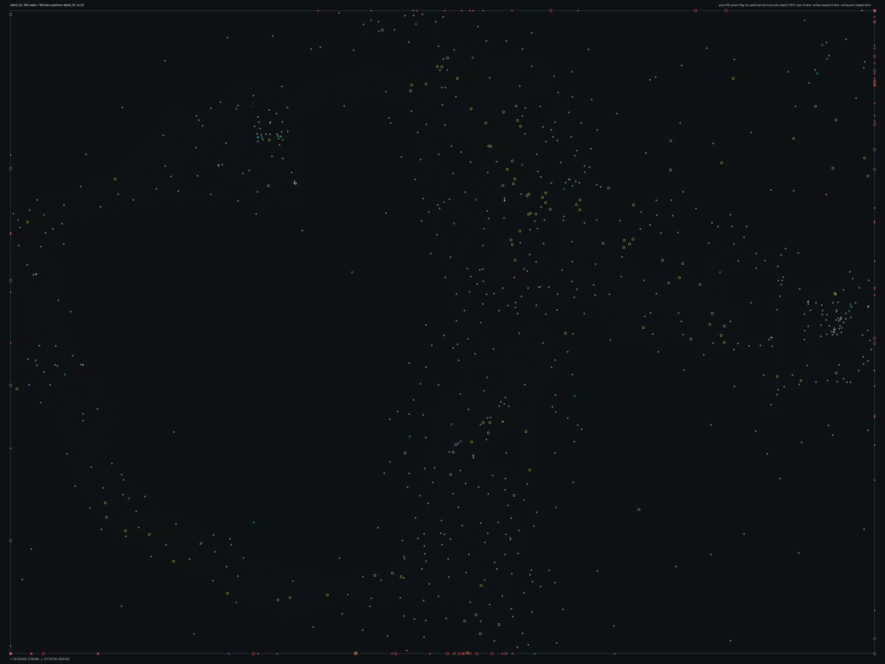

# tsbhd_05.bms - tsbhd_05

Back to [AIN Mission Index](../AIN%20Mission%20Index.md)

[Open full-size overlay image](overlays/tsbhd_05_xy.png)

## Overlay Legend

| Marker | Meaning |
| --- | --- |
| Gray dots | Normal AIN navigation nodes. |
| Green dots | AIN nodes with `NodeFlags & 0x1C`. |
| Gold dots | AIN `NodeClass 6`. |
| Cyan-blue dots | AIN `NodeClass 7`. |
| Pink dots | AIN `NodeClass 8`. |
| Purple dots | AIN `NodeClass 9`. |
| Cyan circles | MIS items with `ai_textfile`. |
| Yellow circles | MIS items with `waypoint_id`. |
| White circles | Other MIS items with positions. |
| Red squares on frame | MIS items outside the AIN graph bounds. |

## Mission File Info

- Terrain: `ts_05`
- AIN nodes: `2549`
- AIN areas: `256`
- MIS items/events/waypoint defs: `974` / `257` / `46`
- MIS AI-positioned items: `80`
- MIS items with `waypoint_id`: `160`
- AINODEPATH events: `0`

## AIN Plot Maps

| Field | Description | XY | XZ | YZ |
| --- | --- | --- | --- | --- |
| Area ID | Node area/sector grouping. | [XY](plots/tsbhd_05_area_id_xy.png) | [XZ](plots/tsbhd_05_area_id_xz.png) | [YZ](plots/tsbhd_05_area_id_yz.png) |
| Node Class | `NodeClass` values, including special classes `6`-`9`. | [XY](plots/tsbhd_05_node_class_xy.png) | [XZ](plots/tsbhd_05_node_class_xz.png) | [YZ](plots/tsbhd_05_node_class_yz.png) |
| Node Flags | `NodeFlags` byte values and flag clusters. | [XY](plots/tsbhd_05_node_flags_xy.png) | [XZ](plots/tsbhd_05_node_flags_xz.png) | [YZ](plots/tsbhd_05_node_flags_yz.png) |
| Radius | Node `Radius` byte values. | [XY](plots/tsbhd_05_radius_xy.png) | [XZ](plots/tsbhd_05_radius_xz.png) | [YZ](plots/tsbhd_05_radius_yz.png) |
| Edge Flags | Combined outgoing `EdgeFlags`. | [XY](plots/tsbhd_05_edge_flags_xy.png) | [XZ](plots/tsbhd_05_edge_flags_xz.png) | [YZ](plots/tsbhd_05_edge_flags_yz.png) |

## AINODEPATH Events

No `AINODEPATH` actions were found in this mission.

## Spatial Notes

| Check | Result |
| --- | --- |
| AI item coverage | `52 / 80` AI-positioned items are inside the AIN XY bounds. |
| Positioned item coverage | `774 / 974` positioned MIS items are inside the AIN XY bounds. |
| AI nearest-node distance | min `1.2`, median `9.1`, max `1973.7`. |
| Area coverage | `1` `AreaId` values used; dominant areas: `[(0, 2549)]`. |
| Special node classes | `{}`. |
| Nonzero edge flags | `{'0x00': 14503}`. |

### Outside AIN Bounds

| Item |
| --- |
| item `26` / id `1166` / type `6206` Enemy Littlebird (`106206`) / ai `hmg` / team `2` / group `13` |
| item `27` / id `1428` / type `6214` Rigid Hull Inflatable Boat (collision bow) (`106214`) / ai `wu` / group `62` |
| item `28` / id `1429` / type `6214` Rigid Hull Inflatable Boat (collision bow) (`106214`) / ai `wu` / group `63` |
| item `30` / id `2` / type `6284` MH53 Pavelow (`106284`) / ai `h_bhawk` / group `3` |
| item `31` / id `1381` / type `6284` MH53 Pavelow (`106284`) / ai `h_bhawk` / group `56` |
| item `52` / id `155` / type `1141` Warehouse building #12 (`101141`) |
| item `154` / id `176` / type `2116` Weathered light post with light (`102116`) |
| item `155` / id `177` / type `2116` Weathered light post with light (`102116`) |

### Farthest AI Items From AIN Nodes

| Item | Nearest Node | Area | Distance |
| --- | ---: | ---: | ---: |
| item `808` / id `1340` / type `6241` Columbian Guerilla 1 (`106241`) / ai `null` / team `2` / group `42` | `2316` | `0` | `1973.7` |
| item `778` / id `1316` / type `6241` Columbian Guerilla 1 (`106241`) / ai `null` / team `2` / group `38` | `2316` | `0` | `1928.1` |
| item `907` / id `1315` / type `6242` / ai `null` / team `2` / group `34` | `2316` | `0` | `1923.5` |
| item `870` / id `1105` / type `6241` Columbian Guerilla 1 (`106241`) / ai `null` / team `2` / group `45` | `2316` | `0` | `1896.0` |
| item `864` / id `1098` / type `6241` Columbian Guerilla 1 (`106241`) / ai `null` / team `2` / group `44` | `2316` | `0` | `1893.6` |

### Special Class Nodes

| Node | Class | Area | Flags | Nearest MIS Item | Distance |
| ---: | ---: | ---: | --- | --- | ---: |
| | | | | | |

### Nonzero Edge Flags

| Flag | Source | Target | Areas | Classes | Reverse | Distance |
| --- | ---: | ---: | --- | --- | --- | ---: |
| | | | | | | |
