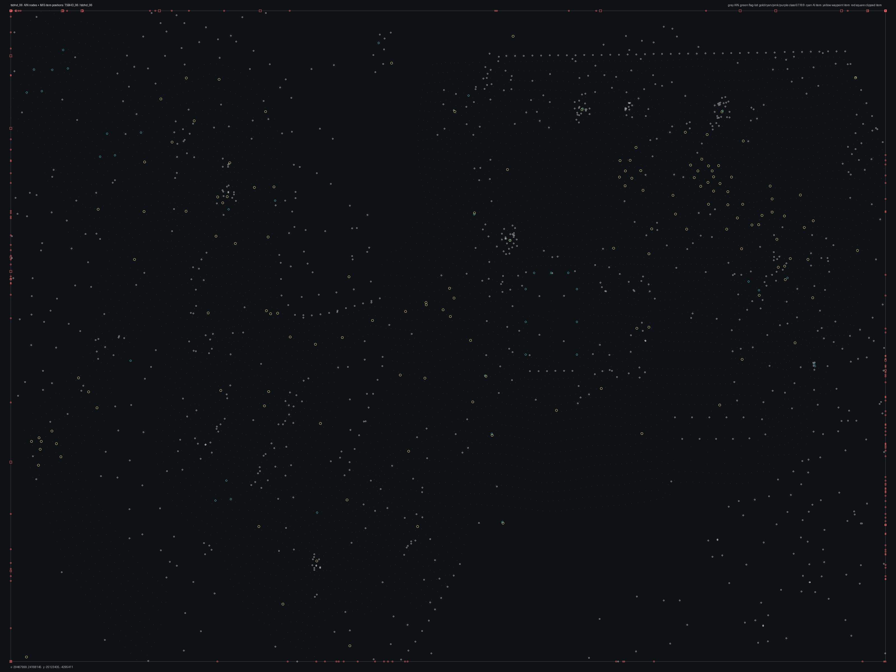

# TSBHD_06.bms - TSBHD_06

Back to [AIN Mission Index](../AIN%20Mission%20Index.md)

[Open full-size overlay image](overlays/tsbhd_06_xy.png)

## Overlay Legend

| Marker | Meaning |
| --- | --- |
| Gray dots | Normal AIN navigation nodes. |
| Green dots | AIN nodes with `NodeFlags & 0x1C`. |
| Gold dots | AIN `NodeClass 6`. |
| Cyan-blue dots | AIN `NodeClass 7`. |
| Pink dots | AIN `NodeClass 8`. |
| Purple dots | AIN `NodeClass 9`. |
| Cyan circles | MIS items with `ai_textfile`. |
| Yellow circles | MIS items with `waypoint_id`. |
| White circles | Other MIS items with positions. |
| Red squares on frame | MIS items outside the AIN graph bounds. |

## Mission File Info

- Terrain: `tsbhd_06`
- AIN nodes: `6184`
- AIN areas: `256`
- MIS items/events/waypoint defs: `1413` / `227` / `73`
- MIS AI-positioned items: `81`
- MIS items with `waypoint_id`: `194`
- AINODEPATH events: `3`

## AIN Plot Maps

| Field | Description | XY | XZ | YZ |
| --- | --- | --- | --- | --- |
| Area ID | Node area/sector grouping. | [XY](plots/TSBHD_06_area_id_xy.png) | [XZ](plots/TSBHD_06_area_id_xz.png) | [YZ](plots/TSBHD_06_area_id_yz.png) |
| Node Class | `NodeClass` values, including special classes `6`-`9`. | [XY](plots/TSBHD_06_node_class_xy.png) | [XZ](plots/TSBHD_06_node_class_xz.png) | [YZ](plots/TSBHD_06_node_class_yz.png) |
| Node Flags | `NodeFlags` byte values and flag clusters. | [XY](plots/TSBHD_06_node_flags_xy.png) | [XZ](plots/TSBHD_06_node_flags_xz.png) | [YZ](plots/TSBHD_06_node_flags_yz.png) |
| Radius | Node `Radius` byte values. | [XY](plots/TSBHD_06_radius_xy.png) | [XZ](plots/TSBHD_06_radius_xz.png) | [YZ](plots/TSBHD_06_radius_yz.png) |
| Edge Flags | Combined outgoing `EdgeFlags`. | [XY](plots/TSBHD_06_edge_flags_xy.png) | [XZ](plots/TSBHD_06_edge_flags_xz.png) | [YZ](plots/TSBHD_06_edge_flags_yz.png) |

## AINODEPATH Events

### Event 0 - AINODEPATH_OFF

- Event block line: `1036`
- AINODEPATH action line(s): `1039`

**Trigger Items**

_None found._

**Referenced Items**

| Ref | Candidates |
| ---: | --- |
| `2` | item `2` / id `778` / type `1269` Indestructible Blackhawk with two miniguns (`101269`) / ai `H_BHawk` / team `1` / group `24`; node `3845`, area `0`, dist `711.5` |
| `29` | item `29` / id `1818` / type `6330` Iranian Patrol Boat (`106330`) / ai `wmg_f` / group `38`; node `1181`, area `0`, dist `433.5` |
| `30` | item `30` / id `612` / type `6330` Iranian Patrol Boat (`106330`) / ai `wmg_f` / group `38`; node `1293`, area `0`, dist `207.7` |
| `32` | item `32` / id `833` / type `6334` / ai `gu` / group `44`; node `4833`, area `0`, dist `2.2` |
| `69` | item `69` / id `2126` / type `1094` Mogadishu Slum Hut double unit (`101094`); node `4124`, area `0`, dist `52.6` |
| `140` | item `140` / id `1990` / type `1175` Above ground bunker firing wall straight piece (`101175`); node `3981`, area `0`, dist `4.5` |

**Trigger Waypoints**

_None found._

### Event 33 - AINODEPATH_ON

- Event block line: `1445`
- AINODEPATH action line(s): `1454`

**Trigger Items**

| Ref | Candidates |
| ---: | --- |
| `10` | item `10` / id `842` / type `2041` Power Up Med Pack (`102041`); node `27`, area `0`, dist `1.5` |

**Referenced Items**

| Ref | Candidates |
| ---: | --- |
| `2` | item `2` / id `778` / type `1269` Indestructible Blackhawk with two miniguns (`101269`) / ai `H_BHawk` / team `1` / group `24`; node `3845`, area `0`, dist `711.5` |
| `5` | item `5` / id `775` / type `1289` Blackhawk fast roping NO Die (`101289`) / ai `H_BHawk` / team `1` / group `19`; node `3845`, area `0`, dist `778.6` |
| `10` | item `10` / id `842` / type `2041` Power Up Med Pack (`102041`); node `27`, area `0`, dist `1.5` |
| `15` | item `15` / id `2229` / type `4622` Cargo truck (`104622`) / ai `gu_s`; node `6183`, area `0`, dist `4.6` |
| `43` | item `43` / id `2211` / type `1093` Mogadishu Slum Hut Single Unit (`101093`); node `4097`, area `0`, dist `84.6` |

**Trigger Waypoints**

| Ref | Candidates |
| ---: | --- |
| `10` | item `897` / wp `10` / id `647` / type `6005` waypoint (`106005`) item `944` / wp `10` / id `648` / type `6005` waypoint (`106005`) item `985` / wp `10` / id `649` / type `6005` waypoint (`106005`) |

### Event 78 - AINODEPATH_OFF

- Event block line: `1972`
- AINODEPATH action line(s): `1996`

**Trigger Items**

| Ref | Candidates |
| ---: | --- |
| `4` | item `4` / id `852` / type `1289` Blackhawk fast roping NO Die (`101289`) / ai `H_BHawk` / team `1` / group `20`; node `3845`, area `0`, dist `853.0` |
| `832` | item `33` / id `832` / type `6334` / ai `gu` / group `44`; node `3981`, area `0`, dist `3.3` item `832` / id `1373` / type `6272` Desert Palm Grouping (`106272`); node `1537`, area `0`, dist `39.3` |
| `833` | item `32` / id `833` / type `6334` / ai `gu` / group `44`; node `4833`, area `0`, dist `2.2` item `833` / id `1374` / type `6272` Desert Palm Grouping (`106272`); node `1533`, area `0`, dist `42.9` |
| `834` | item `31` / id `834` / type `6334` / ai `gu` / group `44`; node `5022`, area `0`, dist `2.1` item `834` / id `1378` / type `6272` Desert Palm Grouping (`106272`); node `1537`, area `0`, dist `49.6` |

**Referenced Items**

| Ref | Candidates |
| ---: | --- |
| `2` | item `2` / id `778` / type `1269` Indestructible Blackhawk with two miniguns (`101269`) / ai `H_BHawk` / team `1` / group `24`; node `3845`, area `0`, dist `711.5` |
| `3` | item `3` / id `781` / type `1269` Indestructible Blackhawk with two miniguns (`101269`) / ai `H_BHawk` / team `1` / group `25`; node `3845`, area `0`, dist `784.2` |
| `4` | item `4` / id `852` / type `1289` Blackhawk fast roping NO Die (`101289`) / ai `H_BHawk` / team `1` / group `20`; node `3845`, area `0`, dist `853.0` |
| `15` | item `15` / id `2229` / type `4622` Cargo truck (`104622`) / ai `gu_s`; node `6183`, area `0`, dist `4.6` |
| `18` | item `18` / id `2090` / type `6207` VBL with 7.62mm turret (`106207`) / ai `G_Jeep` / group `41`; node `1297`, area `0`, dist `26.3` |
| `19` | item `19` / id `2092` / type `6207` VBL with 7.62mm turret (`106207`) / ai `G_Jeep` / group `41`; node `1454`, area `0`, dist `30.0` |

**Trigger Waypoints**

| Ref | Candidates |
| ---: | --- |
| `4` | item `921` / wp `4` / id `320` / type `6005` waypoint (`106005`) item `954` / wp `4` / id `321` / type `6005` waypoint (`106005`) item `990` / wp `4` / id `322` / type `6005` waypoint (`106005`) item `1004` / wp `4` / id `323` / type `6005` waypoint (`106005`) +2 more |

## Spatial Notes

| Check | Result |
| --- | --- |
| AI item coverage | `52 / 81` AI-positioned items are inside the AIN XY bounds. |
| Positioned item coverage | `1136 / 1413` positioned MIS items are inside the AIN XY bounds. |
| AI nearest-node distance | min `1.5`, median `3.9`, max `3496.4`. |
| Area coverage | `1` `AreaId` values used; dominant areas: `[(0, 6184)]`. |
| Special node classes | `{}`. |
| Nonzero edge flags | `{'0x00': 31456}`. |

### Outside AIN Bounds

| Item |
| --- |
| item `2` / id `778` / type `1269` Indestructible Blackhawk with two miniguns (`101269`) / ai `H_BHawk` / team `1` / group `24` |
| item `3` / id `781` / type `1269` Indestructible Blackhawk with two miniguns (`101269`) / ai `H_BHawk` / team `1` / group `25` |
| item `4` / id `852` / type `1289` Blackhawk fast roping NO Die (`101289`) / ai `H_BHawk` / team `1` / group `20` |
| item `5` / id `775` / type `1289` Blackhawk fast roping NO Die (`101289`) / ai `H_BHawk` / team `1` / group `19` |
| item `6` / id `280` / type `1493` Small fishing boat type #2 (`101493`) / ai `wu` |
| item `7` / id `279` / type `1493` Small fishing boat type #2 (`101493`) / ai `wu` |
| item `8` / id `278` / type `1494` Small fishing boat type #3 (`101494`) / ai `wu` |
| item `18` / id `2090` / type `6207` VBL with 7.62mm turret (`106207`) / ai `G_Jeep` / group `41` |

### Farthest AI Items From AIN Nodes

| Item | Nearest Node | Area | Distance |
| --- | ---: | ---: | ---: |
| item `22` / id `1700` / type `6284` MH53 Pavelow (`106284`) / ai `H_BHawk` / team `1` | `1295` | `0` | `3496.4` |
| item `939` / id `2256` / type `6005` waypoint (`106005`) / ai `null` / wp `72` | `1295` | `0` | `1705.8` |
| item `23` / id `268` / type `6324` Rigid Hull Inflatable Boat (collision perimeter) (`106324`) / ai `w_zode` / group `3` | `1295` | `0` | `1684.0` |
| item `901` / id `1701` / type `6005` waypoint (`106005`) / ai `null` / wp `45` | `1295` | `0` | `1606.1` |
| item `905` / id `273` / type `6005` waypoint (`106005`) / ai `null` / wp `1` | `1295` | `0` | `1244.1` |

### Special Class Nodes

| Node | Class | Area | Flags | Nearest MIS Item | Distance |
| ---: | ---: | ---: | --- | --- | ---: |
| | | | | | |

### Nonzero Edge Flags

| Flag | Source | Target | Areas | Classes | Reverse | Distance |
| --- | ---: | ---: | --- | --- | --- | ---: |
| | | | | | | |
