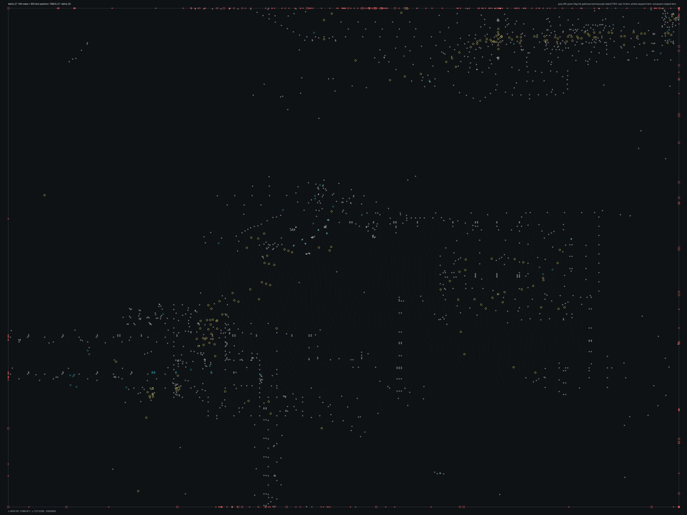

# TSBHD_07.bms - TSBHD_07

Back to [AIN Mission Index](../AIN%20Mission%20Index.md)

[Open full-size overlay image](overlays/tsbhd_07_xy.png)

## Overlay Legend

| Marker | Meaning |
| --- | --- |
| Gray dots | Normal AIN navigation nodes. |
| Green dots | AIN nodes with `NodeFlags & 0x1C`. |
| Gold dots | AIN `NodeClass 6`. |
| Cyan-blue dots | AIN `NodeClass 7`. |
| Pink dots | AIN `NodeClass 8`. |
| Purple dots | AIN `NodeClass 9`. |
| Cyan circles | MIS items with `ai_textfile`. |
| Yellow circles | MIS items with `waypoint_id`. |
| White circles | Other MIS items with positions. |
| Red squares on frame | MIS items outside the AIN graph bounds. |

## Mission File Info

- Terrain: `tsbhd_06`
- AIN nodes: `4956`
- AIN areas: `256`
- MIS items/events/waypoint defs: `1917` / `257` / `81`
- MIS AI-positioned items: `90`
- MIS items with `waypoint_id`: `238`
- AINODEPATH events: `8`

## AIN Plot Maps

| Field | Description | XY | XZ | YZ |
| --- | --- | --- | --- | --- |
| Area ID | Node area/sector grouping. | [XY](plots/TSBHD_07_area_id_xy.png) | [XZ](plots/TSBHD_07_area_id_xz.png) | [YZ](plots/TSBHD_07_area_id_yz.png) |
| Node Class | `NodeClass` values, including special classes `6`-`9`. | [XY](plots/TSBHD_07_node_class_xy.png) | [XZ](plots/TSBHD_07_node_class_xz.png) | [YZ](plots/TSBHD_07_node_class_yz.png) |
| Node Flags | `NodeFlags` byte values and flag clusters. | [XY](plots/TSBHD_07_node_flags_xy.png) | [XZ](plots/TSBHD_07_node_flags_xz.png) | [YZ](plots/TSBHD_07_node_flags_yz.png) |
| Radius | Node `Radius` byte values. | [XY](plots/TSBHD_07_radius_xy.png) | [XZ](plots/TSBHD_07_radius_xz.png) | [YZ](plots/TSBHD_07_radius_yz.png) |
| Edge Flags | Combined outgoing `EdgeFlags`. | [XY](plots/TSBHD_07_edge_flags_xy.png) | [XZ](plots/TSBHD_07_edge_flags_xz.png) | [YZ](plots/TSBHD_07_edge_flags_yz.png) |

## AINODEPATH Events

### Event 0 - AINODEPATH_OFF

- Event block line: `1188`
- AINODEPATH action line(s): `1191`

**Trigger Items**

_None found._

**Referenced Items**

| Ref | Candidates |
| ---: | --- |
| `2` | item `2` / id `1472` / type `1220` Neutral Compact Pickup Truck (`101220`) / ai `G_buggy`; node `611`, area `0`, dist `4.6` |
| `3` | item `3` / id `2674` / type `1253` Friendly 5.5 ton with closed tarp (`101253`) / ai `G_Jeep` / team `1`; node `586`, area `0`, dist `127.2` |
| `4` | item `4` / id `1803` / type `1276` Hummer with NON-Armored 50cal (`101276`) / ai `G_Jeep` / team `1`; node `87`, area `0`, dist `146.5` |
| `5` | item `5` / id `1820` / type `1276` Hummer with NON-Armored 50cal (`101276`) / ai `G_Jeep` / team `1`; node `87`, area `0`, dist `140.2` |
| `43` | item `43` / id `3268` / type `6330` Iranian Patrol Boat (`106330`) / ai `wmg_f` / group `41`; node `2346`, area `0`, dist `405.5` |
| `1803` | item `4` / id `1803` / type `1276` Hummer with NON-Armored 50cal (`101276`) / ai `G_Jeep` / team `1`; node `87`, area `0`, dist `146.5` item `1803` / id `3388` / type `6013` Area Trigger (`106013`); node `20`, area `0`, dist `3.6` |

**Trigger Waypoints**

_None found._

### Event 3 - AINODEPATH_ON

- Event block line: `1225`
- AINODEPATH action line(s): `1232`

**Trigger Items**

| Ref | Candidates |
| ---: | --- |
| `2` | item `2` / id `1472` / type `1220` Neutral Compact Pickup Truck (`101220`) / ai `G_buggy`; node `611`, area `0`, dist `4.6` |

**Referenced Items**

| Ref | Candidates |
| ---: | --- |
| `2` | item `2` / id `1472` / type `1220` Neutral Compact Pickup Truck (`101220`) / ai `G_buggy`; node `611`, area `0`, dist `4.6` |

**Trigger Waypoints**

| Ref | Candidates |
| ---: | --- |
| `2` | item `1297` / wp `2` / id `1822` / type `6005` waypoint (`106005`) item `1341` / wp `2` / id `1823` / type `6005` waypoint (`106005`) |

### Event 8 - AINODEPATH_OFF

- Event block line: `1286`
- AINODEPATH action line(s): `1299`

**Trigger Items**

| Ref | Candidates |
| ---: | --- |
| `3` | item `3` / id `2674` / type `1253` Friendly 5.5 ton with closed tarp (`101253`) / ai `G_Jeep` / team `1`; node `586`, area `0`, dist `127.2` |
| `5` | item `5` / id `1820` / type `1276` Hummer with NON-Armored 50cal (`101276`) / ai `G_Jeep` / team `1`; node `87`, area `0`, dist `140.2` |
| `6` | item `6` / id `1821` / type `1276` Hummer with NON-Armored 50cal (`101276`) / ai `G_Jeep` / team `1`; node `87`, area `0`, dist `153.1` item `643` / id `6` / type `4209` Small steel hangar with rounded roof (`104209`); node `586`, area `0`, dist `178.3` |
| `7` | item `7` / id `2132` / type `1287` Blackhawk, weak AI miniguns, both doors open (`101287`) / ai `H_BHawk` / team `1`; node `3831`, area `0`, dist `18.0` item `644` / id `7` / type `4209` Small steel hangar with rounded roof (`104209`); node `586`, area `0`, dist `198.8` |

**Referenced Items**

| Ref | Candidates |
| ---: | --- |
| `3` | item `3` / id `2674` / type `1253` Friendly 5.5 ton with closed tarp (`101253`) / ai `G_Jeep` / team `1`; node `586`, area `0`, dist `127.2` |
| `4` | item `4` / id `1803` / type `1276` Hummer with NON-Armored 50cal (`101276`) / ai `G_Jeep` / team `1`; node `87`, area `0`, dist `146.5` |
| `5` | item `5` / id `1820` / type `1276` Hummer with NON-Armored 50cal (`101276`) / ai `G_Jeep` / team `1`; node `87`, area `0`, dist `140.2` |
| `6` | item `6` / id `1821` / type `1276` Hummer with NON-Armored 50cal (`101276`) / ai `G_Jeep` / team `1`; node `87`, area `0`, dist `153.1` item `643` / id `6` / type `4209` Small steel hangar with rounded roof (`104209`); node `586`, area `0`, dist `178.3` |
| `7` | item `7` / id `2132` / type `1287` Blackhawk, weak AI miniguns, both doors open (`101287`) / ai `H_BHawk` / team `1`; node `3831`, area `0`, dist `18.0` item `644` / id `7` / type `4209` Small steel hangar with rounded roof (`104209`); node `586`, area `0`, dist `198.8` |
| `29` | item `29` / id `2842` / type `6207` VBL with 7.62mm turret (`106207`) / ai `G_Jeep` / group `19`; node `3445`, area `0`, dist `1.4` |

**Trigger Waypoints**

| Ref | Candidates |
| ---: | --- |
| `3` | item `1261` / wp `3` / id `1827` / type `6005` waypoint (`106005`) item `1334` / wp `3` / id `1826` / type `6005` waypoint (`106005`) |
| `5` | item `1267` / wp `5` / id `1828` / type `6005` waypoint (`106005`) item `1344` / wp `5` / id `1819` / type `6005` waypoint (`106005`) |
| `6` | item `1288` / wp `6` / id `1834` / type `6005` waypoint (`106005`) item `1326` / wp `6` / id `1835` / type `6005` waypoint (`106005`) |
| `7` | item `1289` / wp `7` / id `1836` / type `6005` waypoint (`106005`) item `1332` / wp `7` / id `1829` / type `6005` waypoint (`106005`) |

### Event 12 - AINODEPATH_ON

- Event block line: `1350`
- AINODEPATH action line(s): `1358`

**Trigger Items**

| Ref | Candidates |
| ---: | --- |
| `3` | item `3` / id `2674` / type `1253` Friendly 5.5 ton with closed tarp (`101253`) / ai `G_Jeep` / team `1`; node `586`, area `0`, dist `127.2` |
| `10` | item `10` / id `280` / type `1493` Small fishing boat type #2 (`101493`) / ai `wu`; node `664`, area `0`, dist `16.6` |

**Referenced Items**

| Ref | Candidates |
| ---: | --- |
| `2` | item `2` / id `1472` / type `1220` Neutral Compact Pickup Truck (`101220`) / ai `G_buggy`; node `611`, area `0`, dist `4.6` |
| `3` | item `3` / id `2674` / type `1253` Friendly 5.5 ton with closed tarp (`101253`) / ai `G_Jeep` / team `1`; node `586`, area `0`, dist `127.2` |
| `4` | item `4` / id `1803` / type `1276` Hummer with NON-Armored 50cal (`101276`) / ai `G_Jeep` / team `1`; node `87`, area `0`, dist `146.5` |
| `5` | item `5` / id `1820` / type `1276` Hummer with NON-Armored 50cal (`101276`) / ai `G_Jeep` / team `1`; node `87`, area `0`, dist `140.2` |
| `8` | item `8` / id `2133` / type `1287` Blackhawk, weak AI miniguns, both doors open (`101287`) / ai `H_BHawk` / team `1`; node `768`, area `0`, dist `24.5` |
| `9` | item `9` / id `279` / type `1493` Small fishing boat type #2 (`101493`) / ai `wu`; node `664`, area `0`, dist `13.9` |

**Trigger Waypoints**

| Ref | Candidates |
| ---: | --- |
| `3` | item `1261` / wp `3` / id `1827` / type `6005` waypoint (`106005`) item `1334` / wp `3` / id `1826` / type `6005` waypoint (`106005`) |
| `10` | item `1325` / wp `10` / id `2033` / type `6005` waypoint (`106005`) |

### Event 38 - AINODEPATH_OFF

- Event block line: `1681`
- AINODEPATH action line(s): `1691`

**Trigger Items**

| Ref | Candidates |
| ---: | --- |
| `10` | item `10` / id `280` / type `1493` Small fishing boat type #2 (`101493`) / ai `wu`; node `664`, area `0`, dist `16.6` |
| `11` | item `11` / id `278` / type `1494` Small fishing boat type #3 (`101494`) / ai `wu`; node `652`, area `0`, dist `13.6` |
| `20` | item `20` / id `2512` / type `4622` Cargo truck (`104622`) / ai `gu_s`; node `607`, area `0`, dist `19.4` |
| `1080` | item `1080` / id `1283` / type `6222` Oil Pipe Section 4 (`106222`); node `2532`, area `0`, dist `9.8` item `1528` / id `1080` / type `1744` Delta Force Teammate 2 (`101744`) / team `1` / group `3`; node `87`, area `0`, dist `140.8` |
| `1082` | item `1082` / id `3289` / type `6222` Oil Pipe Section 4 (`106222`); node `2966`, area `0`, dist `9.3` item `1534` / id `1082` / type `1747` Delta Force Teammate 4 (`101747`) / ai `null` / team `1` / group `2`; node `87`, area `0`, dist `153.2` |

**Referenced Items**

| Ref | Candidates |
| ---: | --- |
| `2` | item `2` / id `1472` / type `1220` Neutral Compact Pickup Truck (`101220`) / ai `G_buggy`; node `611`, area `0`, dist `4.6` |
| `3` | item `3` / id `2674` / type `1253` Friendly 5.5 ton with closed tarp (`101253`) / ai `G_Jeep` / team `1`; node `586`, area `0`, dist `127.2` |
| `10` | item `10` / id `280` / type `1493` Small fishing boat type #2 (`101493`) / ai `wu`; node `664`, area `0`, dist `16.6` |
| `11` | item `11` / id `278` / type `1494` Small fishing boat type #3 (`101494`) / ai `wu`; node `652`, area `0`, dist `13.6` |
| `20` | item `20` / id `2512` / type `4622` Cargo truck (`104622`) / ai `gu_s`; node `607`, area `0`, dist `19.4` |
| `39` | item `39` / id `2168` / type `6330` Iranian Patrol Boat (`106330`) / ai `wmg_f` / group `7`; node `19`, area `0`, dist `614.4` item `640` / id `39` / type `4202` One-story wooden L-shaped headquarters1 (`104202`); node `702`, area `0`, dist `235.5` |

**Trigger Waypoints**

| Ref | Candidates |
| ---: | --- |
| `10` | item `1325` / wp `10` / id `2033` / type `6005` waypoint (`106005`) |
| `11` | item `1316` / wp `11` / id `2035` / type `6005` waypoint (`106005`) |
| `20` | item `1320` / wp `20` / id `2046` / type `6005` waypoint (`106005`) / ai `null` |

### Event 56 - AINODEPATH_ON

- Event block line: `1893`
- AINODEPATH action line(s): `1903`

**Trigger Items**

| Ref | Candidates |
| ---: | --- |
| `2` | item `2` / id `1472` / type `1220` Neutral Compact Pickup Truck (`101220`) / ai `G_buggy`; node `611`, area `0`, dist `4.6` |
| `3` | item `3` / id `2674` / type `1253` Friendly 5.5 ton with closed tarp (`101253`) / ai `G_Jeep` / team `1`; node `586`, area `0`, dist `127.2` |
| `10` | item `10` / id `280` / type `1493` Small fishing boat type #2 (`101493`) / ai `wu`; node `664`, area `0`, dist `16.6` |
| `21` | item `21` / id `2584` / type `4622` Cargo truck (`104622`) / ai `gu_s`; node `588`, area `0`, dist `35.3` |
| `22` | item `22` / id `2828` / type `4622` Cargo truck (`104622`) / ai `gu_s` / group `24`; node `771`, area `0`, dist `2.6` |

**Referenced Items**

| Ref | Candidates |
| ---: | --- |
| `2` | item `2` / id `1472` / type `1220` Neutral Compact Pickup Truck (`101220`) / ai `G_buggy`; node `611`, area `0`, dist `4.6` |
| `3` | item `3` / id `2674` / type `1253` Friendly 5.5 ton with closed tarp (`101253`) / ai `G_Jeep` / team `1`; node `586`, area `0`, dist `127.2` |
| `10` | item `10` / id `280` / type `1493` Small fishing boat type #2 (`101493`) / ai `wu`; node `664`, area `0`, dist `16.6` |
| `14` | item `14` / id `2985` / type `1901` Emplaced weapon on tripod DESTROYABLE (`101901`); node `4899`, area `0`, dist `1.4` |
| `15` | item `15` / id `3114` / type `2041` Power Up Med Pack (`102041`); node `289`, area `0`, dist `4.5` |
| `21` | item `21` / id `2584` / type `4622` Cargo truck (`104622`) / ai `gu_s`; node `588`, area `0`, dist `35.3` |

**Trigger Waypoints**

| Ref | Candidates |
| ---: | --- |
| `2` | item `1297` / wp `2` / id `1822` / type `6005` waypoint (`106005`) item `1341` / wp `2` / id `1823` / type `6005` waypoint (`106005`) |
| `3` | item `1261` / wp `3` / id `1827` / type `6005` waypoint (`106005`) item `1334` / wp `3` / id `1826` / type `6005` waypoint (`106005`) |
| `10` | item `1325` / wp `10` / id `2033` / type `6005` waypoint (`106005`) |
| `21` | item `1259` / wp `21` / id `2049` / type `6005` waypoint (`106005`) |
| `22` | item `1318` / wp `22` / id `2070` / type `6005` waypoint (`106005`) |

### Event 64 - AINODEPATH_OFF

- Event block line: `2041`
- AINODEPATH action line(s): `2048`

**Trigger Items**

| Ref | Candidates |
| ---: | --- |
| `6` | item `6` / id `1821` / type `1276` Hummer with NON-Armored 50cal (`101276`) / ai `G_Jeep` / team `1`; node `87`, area `0`, dist `153.1` item `643` / id `6` / type `4209` Small steel hangar with rounded roof (`104209`); node `586`, area `0`, dist `178.3` |
| `2463` | item `26` / id `2463` / type `4643` Blackhawk with two miniguns (`104643`) / ai `H_BHawk` / team `1` / group `14`; node `696`, area `0`, dist `848.6` |

**Referenced Items**

| Ref | Candidates |
| ---: | --- |
| `6` | item `6` / id `1821` / type `1276` Hummer with NON-Armored 50cal (`101276`) / ai `G_Jeep` / team `1`; node `87`, area `0`, dist `153.1` item `643` / id `6` / type `4209` Small steel hangar with rounded roof (`104209`); node `586`, area `0`, dist `178.3` |
| `14` | item `14` / id `2985` / type `1901` Emplaced weapon on tripod DESTROYABLE (`101901`); node `4899`, area `0`, dist `1.4` |
| `2463` | item `26` / id `2463` / type `4643` Blackhawk with two miniguns (`104643`) / ai `H_BHawk` / team `1` / group `14`; node `696`, area `0`, dist `848.6` |

**Trigger Waypoints**

| Ref | Candidates |
| ---: | --- |
| `6` | item `1288` / wp `6` / id `1834` / type `6005` waypoint (`106005`) item `1326` / wp `6` / id `1835` / type `6005` waypoint (`106005`) |

### Event 85 - AINODEPATH_ON

- Event block line: `2315`
- AINODEPATH action line(s): `2323`

**Trigger Items**

| Ref | Candidates |
| ---: | --- |
| `84` | item `84` / id `2586` / type `1094` Mogadishu Slum Hut double unit (`101094`); node `607`, area `0`, dist `24.4` item `187` / id `84` / type `1250` Parked Version of C130 (`101250`); node `87`, area `0`, dist `167.3` |

**Referenced Items**

| Ref | Candidates |
| ---: | --- |
| `3` | item `3` / id `2674` / type `1253` Friendly 5.5 ton with closed tarp (`101253`) / ai `G_Jeep` / team `1`; node `586`, area `0`, dist `127.2` |
| `55` | item `55` / id `347` / type `1093` Mogadishu Slum Hut Single Unit (`101093`); node `42`, area `0`, dist `3.5` |
| `84` | item `84` / id `2586` / type `1094` Mogadishu Slum Hut double unit (`101094`); node `607`, area `0`, dist `24.4` item `187` / id `84` / type `1250` Parked Version of C130 (`101250`); node `87`, area `0`, dist `167.3` |

**Trigger Waypoints**

_None found._

## Spatial Notes

| Check | Result |
| --- | --- |
| AI item coverage | `61 / 90` AI-positioned items are inside the AIN XY bounds. |
| Positioned item coverage | `1621 / 1917` positioned MIS items are inside the AIN XY bounds. |
| AI nearest-node distance | min `1.1`, median `11.7`, max `910.5`. |
| Area coverage | `1` `AreaId` values used; dominant areas: `[(0, 4956)]`. |
| Special node classes | `{}`. |
| Nonzero edge flags | `{'0x00': 27158}`. |

### Outside AIN Bounds

| Item |
| --- |
| item `0` / id `1937` / type `1048` Desert Power Generator (`101048`) |
| item `4` / id `1803` / type `1276` Hummer with NON-Armored 50cal (`101276`) / ai `G_Jeep` / team `1` |
| item `5` / id `1820` / type `1276` Hummer with NON-Armored 50cal (`101276`) / ai `G_Jeep` / team `1` |
| item `6` / id `1821` / type `1276` Hummer with NON-Armored 50cal (`101276`) / ai `G_Jeep` / team `1` |
| item `10` / id `280` / type `1493` Small fishing boat type #2 (`101493`) / ai `wu` |
| item `25` / id `2464` / type `4643` Blackhawk with two miniguns (`104643`) / ai `H_BHawk` / team `1` / group `15` |
| item `26` / id `2463` / type `4643` Blackhawk with two miniguns (`104643`) / ai `H_BHawk` / team `1` / group `14` |
| item `38` / id `269` / type `6251` Iranian Oil Tanker (`106251`) / ai `wu` |

### Farthest AI Items From AIN Nodes

| Item | Nearest Node | Area | Distance |
| --- | ---: | ---: | ---: |
| item `25` / id `2464` / type `4643` Blackhawk with two miniguns (`104643`) / ai `H_BHawk` / team `1` / group `15` | `696` | `0` | `910.5` |
| item `26` / id `2463` / type `4643` Blackhawk with two miniguns (`104643`) / ai `H_BHawk` / team `1` / group `14` | `696` | `0` | `848.6` |
| item `39` / id `2168` / type `6330` Iranian Patrol Boat (`106330`) / ai `wmg_f` / group `7` | `19` | `0` | `614.4` |
| item `1647` / id `2166` / type `6267` Iranian Rebel Regular 1 (`106267`) / ai `null` / team `2` | `19` | `0` | `610.6` |
| item `45` / id `612` / type `6330` Iranian Patrol Boat (`106330`) / ai `wmg_f` / group `8` | `414` | `0` | `565.6` |

### Special Class Nodes

| Node | Class | Area | Flags | Nearest MIS Item | Distance |
| ---: | ---: | ---: | --- | --- | ---: |
| | | | | | |

### Nonzero Edge Flags

| Flag | Source | Target | Areas | Classes | Reverse | Distance |
| --- | ---: | ---: | --- | --- | --- | ---: |
| | | | | | | |
