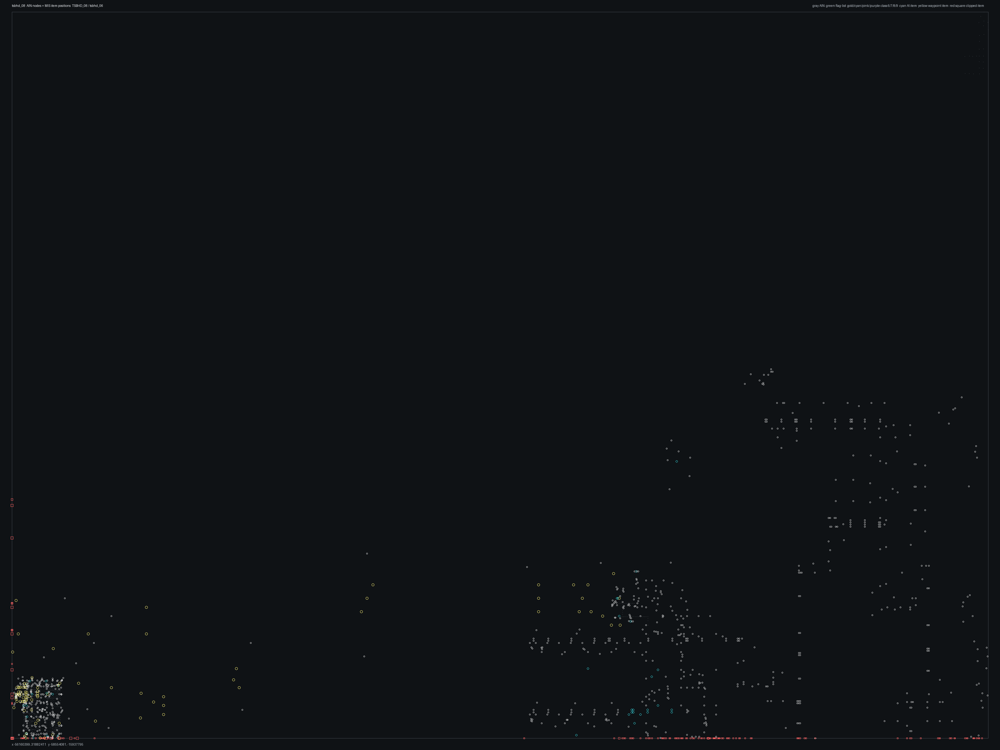

# tsbhd_08.bms - TSBHD_08

Back to [AIN Mission Index](../AIN%20Mission%20Index.md)

[Open full-size overlay image](overlays/tsbhd_08_xy.png)

## Overlay Legend

| Marker | Meaning |
| --- | --- |
| Gray dots | Normal AIN navigation nodes. |
| Green dots | AIN nodes with `NodeFlags & 0x1C`. |
| Gold dots | AIN `NodeClass 6`. |
| Cyan-blue dots | AIN `NodeClass 7`. |
| Pink dots | AIN `NodeClass 8`. |
| Purple dots | AIN `NodeClass 9`. |
| Cyan circles | MIS items with `ai_textfile`. |
| Yellow circles | MIS items with `waypoint_id`. |
| White circles | Other MIS items with positions. |
| Red squares on frame | MIS items outside the AIN graph bounds. |

## Mission File Info

- Terrain: `tsbhd_06`
- AIN nodes: `847`
- AIN areas: `256`
- MIS items/events/waypoint defs: `1241` / `134` / `37`
- MIS AI-positioned items: `45`
- MIS items with `waypoint_id`: `109`
- AINODEPATH events: `1`

## AIN Plot Maps

| Field | Description | XY | XZ | YZ |
| --- | --- | --- | --- | --- |
| Area ID | Node area/sector grouping. | [XY](plots/tsbhd_08_area_id_xy.png) | [XZ](plots/tsbhd_08_area_id_xz.png) | [YZ](plots/tsbhd_08_area_id_yz.png) |
| Node Class | `NodeClass` values, including special classes `6`-`9`. | [XY](plots/tsbhd_08_node_class_xy.png) | [XZ](plots/tsbhd_08_node_class_xz.png) | [YZ](plots/tsbhd_08_node_class_yz.png) |
| Node Flags | `NodeFlags` byte values and flag clusters. | [XY](plots/tsbhd_08_node_flags_xy.png) | [XZ](plots/tsbhd_08_node_flags_xz.png) | [YZ](plots/tsbhd_08_node_flags_yz.png) |
| Radius | Node `Radius` byte values. | [XY](plots/tsbhd_08_radius_xy.png) | [XZ](plots/tsbhd_08_radius_xz.png) | [YZ](plots/tsbhd_08_radius_yz.png) |
| Edge Flags | Combined outgoing `EdgeFlags`. | [XY](plots/tsbhd_08_edge_flags_xy.png) | [XZ](plots/tsbhd_08_edge_flags_xz.png) | [YZ](plots/tsbhd_08_edge_flags_yz.png) |

## AINODEPATH Events

### Event 0 - AINODEPATH_OFF, AINODEPATH_ON

- Event block line: `715`
- AINODEPATH action line(s): `719`, `723`

**Trigger Items**

_None found._

**Referenced Items**

| Ref | Candidates |
| ---: | --- |
| `6` | item `6` / id `2592` / type `1902` 50cal on 180 tripod (`101902`) / group `10`; node `275`, area `0`, dist `3.6` |
| `14` | item `14` / id `2213` / type `6251` Iranian Oil Tanker (`106251`) / ai `wu`; node `54`, area `0`, dist `65.4` |
| `15` | item `15` / id `269` / type `6251` Iranian Oil Tanker (`106251`) / ai `wu`; node `30`, area `0`, dist `322.4` |
| `32` | item `32` / id `1258` / type `1143` Warehouse building #14 (`101143`); node `30`, area `0`, dist `47.2` |

**Trigger Waypoints**

_None found._

## Spatial Notes

| Check | Result |
| --- | --- |
| AI item coverage | `39 / 45` AI-positioned items are inside the AIN XY bounds. |
| Positioned item coverage | `987 / 1241` positioned MIS items are inside the AIN XY bounds. |
| AI nearest-node distance | min `0.5`, median `35.1`, max `408.9`. |
| Area coverage | `1` `AreaId` values used; dominant areas: `[(0, 847)]`. |
| Special node classes | `{}`. |
| Nonzero edge flags | `{'0x00': 1979}`. |

### Outside AIN Bounds

| Item |
| --- |
| item `1` / id `2919` / type `1272` Blackhawk, miniguns, both doors open (`101272`) / ai `H_BHawk` / team `1` / group `26` |
| item `6` / id `2592` / type `1902` 50cal on 180 tripod (`101902`) / group `10` |
| item `15` / id `269` / type `6251` Iranian Oil Tanker (`106251`) / ai `wu` |
| item `19` / id `2716` / type `6330` Iranian Patrol Boat (`106330`) / ai `wu` / group `18` |
| item `20` / id `3020` / type `6330` Iranian Patrol Boat (`106330`) / ai `wu` / group `29` |
| item `41` / id `2257` / type `1436` Weathered light post no light (`101436`) |
| item `44` / id `2270` / type `1436` Weathered light post no light (`101436`) |
| item `45` / id `1775` / type `1436` Weathered light post no light (`101436`) |

### Farthest AI Items From AIN Nodes

| Item | Nearest Node | Area | Distance |
| --- | ---: | ---: | ---: |
| item `1` / id `2919` / type `1272` Blackhawk, miniguns, both doors open (`101272`) / ai `H_BHawk` / team `1` / group `26` | `183` | `0` | `408.9` |
| item `20` / id `3020` / type `6330` Iranian Patrol Boat (`106330`) / ai `wu` / group `29` | `184` | `0` | `331.0` |
| item `15` / id `269` / type `6251` Iranian Oil Tanker (`106251`) / ai `wu` | `30` | `0` | `322.4` |
| item `19` / id `2716` / type `6330` Iranian Patrol Boat (`106330`) / ai `wu` / group `18` | `184` | `0` | `294.6` |
| item `983` / id `2476` / type `6005` waypoint (`106005`) / ai `null` / wp `33` | `245` | `0` | `142.3` |

### Special Class Nodes

| Node | Class | Area | Flags | Nearest MIS Item | Distance |
| ---: | ---: | ---: | --- | --- | ---: |
| | | | | | |

### Nonzero Edge Flags

| Flag | Source | Target | Areas | Classes | Reverse | Distance |
| --- | ---: | ---: | --- | --- | --- | ---: |
| | | | | | | |
