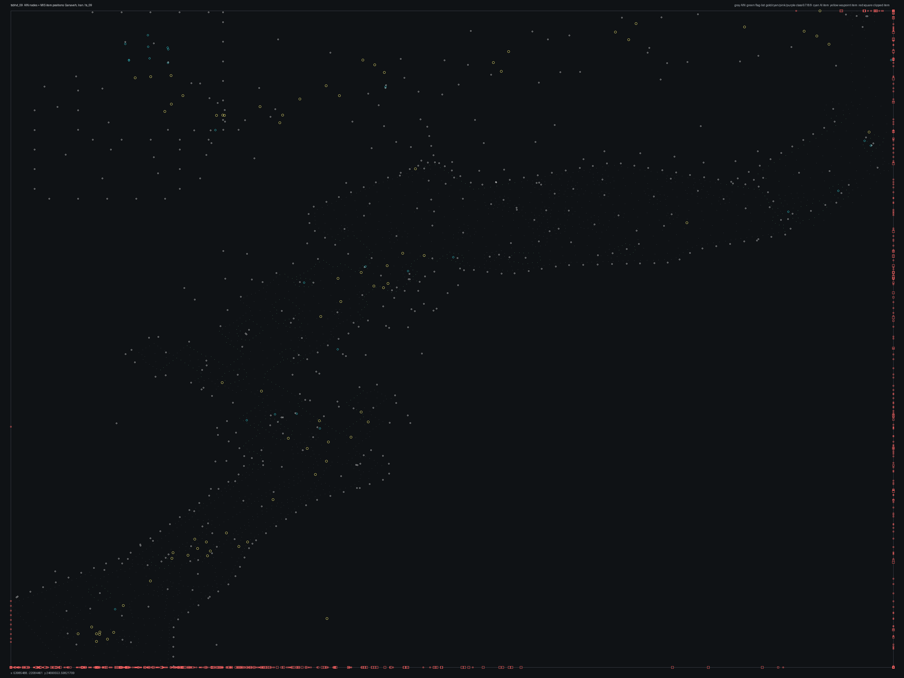

# TSBHD_09.bms - Ganaveh, Iran

Back to [AIN Mission Index](../AIN%20Mission%20Index.md)

[Open full-size overlay image](overlays/tsbhd_09_xy.png)

## Overlay Legend

| Marker | Meaning |
| --- | --- |
| Gray dots | Normal AIN navigation nodes. |
| Green dots | AIN nodes with `NodeFlags & 0x1C`. |
| Gold dots | AIN `NodeClass 6`. |
| Cyan-blue dots | AIN `NodeClass 7`. |
| Pink dots | AIN `NodeClass 8`. |
| Purple dots | AIN `NodeClass 9`. |
| Cyan circles | MIS items with `ai_textfile`. |
| Yellow circles | MIS items with `waypoint_id`. |
| White circles | Other MIS items with positions. |
| Red squares on frame | MIS items outside the AIN graph bounds. |

## Mission File Info

- Terrain: `ts_09`
- AIN nodes: `2151`
- AIN areas: `256`
- MIS items/events/waypoint defs: `1652` / `98` / `62`
- MIS AI-positioned items: `145`
- MIS items with `waypoint_id`: `267`
- AINODEPATH events: `3`

## AIN Plot Maps

| Field | Description | XY | XZ | YZ |
| --- | --- | --- | --- | --- |
| Area ID | Node area/sector grouping. | [XY](plots/TSBHD_09_area_id_xy.png) | [XZ](plots/TSBHD_09_area_id_xz.png) | [YZ](plots/TSBHD_09_area_id_yz.png) |
| Node Class | `NodeClass` values, including special classes `6`-`9`. | [XY](plots/TSBHD_09_node_class_xy.png) | [XZ](plots/TSBHD_09_node_class_xz.png) | [YZ](plots/TSBHD_09_node_class_yz.png) |
| Node Flags | `NodeFlags` byte values and flag clusters. | [XY](plots/TSBHD_09_node_flags_xy.png) | [XZ](plots/TSBHD_09_node_flags_xz.png) | [YZ](plots/TSBHD_09_node_flags_yz.png) |
| Radius | Node `Radius` byte values. | [XY](plots/TSBHD_09_radius_xy.png) | [XZ](plots/TSBHD_09_radius_xz.png) | [YZ](plots/TSBHD_09_radius_yz.png) |
| Edge Flags | Combined outgoing `EdgeFlags`. | [XY](plots/TSBHD_09_edge_flags_xy.png) | [XZ](plots/TSBHD_09_edge_flags_xz.png) | [YZ](plots/TSBHD_09_edge_flags_yz.png) |

## AINODEPATH Events

### Event 0 - AINODEPATH_OFF

- Event block line: `880`
- AINODEPATH action line(s): `885`

**Trigger Items**

_None found._

**Referenced Items**

| Ref | Candidates |
| ---: | --- |
| `2` | item `2` / id `155` / type `1239` Technical enemy vehicle with mounted 50cal (`101239`) / ai `G_Jeep`; node `1987`, area `0`, dist `4.0` item `1435` / id `2` / type `1744` Delta Force Teammate 2 (`101744`) / team `1` / group `1`; node `1424`, area `0`, dist `2272.3` |
| `3` | item `3` / id `156` / type `1239` Technical enemy vehicle with mounted 50cal (`101239`) / ai `G_Jeep` / team `2` / group `13`; node `1439`, area `0`, dist `1032.4` item `1436` / id `3` / type `1745` Delta Force Teammate 3 (`101745`) / team `1` / group `1`; node `1424`, area `0`, dist `2275.2` |
| `4` | item `4` / id `136` / type `1239` Technical enemy vehicle with mounted 50cal (`101239`) / ai `G_Jeep` / group `15`; node `1594`, area `0`, dist `3.2` item `1439` / id `4` / type `1747` Delta Force Teammate 4 (`101747`) / team `1` / group `1`; node `1424`, area `0`, dist `2273.8` |
| `5` | item `5` / id `139` / type `1239` Technical enemy vehicle with mounted 50cal (`101239`) / ai `G_Jeep`; node `669`, area `0`, dist `3.0` item `1441` / id `5` / type `4523` Civilian Man Somalian #3 (`104523`) / team `1` / group `4`; node `1439`, area `0`, dist `1605.8` |
| `6` | item `6` / id `141` / type `1239` Technical enemy vehicle with mounted 50cal (`101239`) / ai `G_Jeep` / team `2` / group `52`; node `1349`, area `0`, dist `154.8` item `1442` / id `6` / type `4524` Civilian Man Somalian #4 (`104524`) / ai `null` / team `1` / group `4`; node `1439`, area `0`, dist `1606.8` |
| `43` | item `43` / id `138` / type `6369` Technical enemy vehicle - mounted 50cal - B - variant color (`106369`) / ai `G_Jeep`; node `755`, area `0`, dist `3.5` item `1513` / id `43` / type `6269` Iranian Rebel Regular 3 (`106269`) / ai `null` / team `2` / group `49`; node `1349`, area `0`, dist `86.0` |

**Trigger Waypoints**

_None found._

### Event 27 - AINODEPATH_ON

- Event block line: `1201`
- AINODEPATH action line(s): `1212`

**Trigger Items**

| Ref | Candidates |
| ---: | --- |
| `18` | item `18` / id `166` / type `1869` Mounted Grenade Launcher on Tripod (`101869`) / team `2`; node `719`, area `0`, dist `2.0` item `1478` / id `18` / type `6267` Iranian Rebel Regular 1 (`106267`) / team `2`; node `393`, area `0`, dist `1.8` |

**Referenced Items**

| Ref | Candidates |
| ---: | --- |
| `2` | item `2` / id `155` / type `1239` Technical enemy vehicle with mounted 50cal (`101239`) / ai `G_Jeep`; node `1987`, area `0`, dist `4.0` item `1435` / id `2` / type `1744` Delta Force Teammate 2 (`101744`) / team `1` / group `1`; node `1424`, area `0`, dist `2272.3` |
| `3` | item `3` / id `156` / type `1239` Technical enemy vehicle with mounted 50cal (`101239`) / ai `G_Jeep` / team `2` / group `13`; node `1439`, area `0`, dist `1032.4` item `1436` / id `3` / type `1745` Delta Force Teammate 3 (`101745`) / team `1` / group `1`; node `1424`, area `0`, dist `2275.2` |
| `4` | item `4` / id `136` / type `1239` Technical enemy vehicle with mounted 50cal (`101239`) / ai `G_Jeep` / group `15`; node `1594`, area `0`, dist `3.2` item `1439` / id `4` / type `1747` Delta Force Teammate 4 (`101747`) / team `1` / group `1`; node `1424`, area `0`, dist `2273.8` |
| `5` | item `5` / id `139` / type `1239` Technical enemy vehicle with mounted 50cal (`101239`) / ai `G_Jeep`; node `669`, area `0`, dist `3.0` item `1441` / id `5` / type `4523` Civilian Man Somalian #3 (`104523`) / team `1` / group `4`; node `1439`, area `0`, dist `1605.8` |
| `6` | item `6` / id `141` / type `1239` Technical enemy vehicle with mounted 50cal (`101239`) / ai `G_Jeep` / team `2` / group `52`; node `1349`, area `0`, dist `154.8` item `1442` / id `6` / type `4524` Civilian Man Somalian #4 (`104524`) / ai `null` / team `1` / group `4`; node `1439`, area `0`, dist `1606.8` |
| `7` | item `7` / id `144` / type `1239` Technical enemy vehicle with mounted 50cal (`101239`) / ai `G_Jeep` / team `2`; node `1439`, area `0`, dist `573.1` item `1543` / id `7` / type `6279` Iranian Armed Civilian (`106279`) / team `2`; node `586`, area `0`, dist `2.4` |

**Trigger Waypoints**

| Ref | Candidates |
| ---: | --- |
| `18` | item `1208` / wp `18` / id `1485` / type `6005` waypoint (`106005`) item `1255` / wp `18` / id `1507` / type `6005` waypoint (`106005`) item `1292` / wp `18` / id `1571` / type `6005` waypoint (`106005`) item `1303` / wp `18` / id `1591` / type `6005` waypoint (`106005`) +1 more |

### Event 71 - AINODEPATH_OFF

- Event block line: `1774`
- AINODEPATH action line(s): `1784`

**Trigger Items**

| Ref | Candidates |
| ---: | --- |
| `255` | item `134` / id `255` / type `1095` Mogadishu Slum Hut Triple Unit (`101095`); node `2099`, area `0`, dist `422.2` item `255` / id `412` / type `1143` Warehouse building #14 (`101143`); node `1570`, area `0`, dist `556.8` |

**Referenced Items**

| Ref | Candidates |
| ---: | --- |
| `5` | item `5` / id `139` / type `1239` Technical enemy vehicle with mounted 50cal (`101239`) / ai `G_Jeep`; node `669`, area `0`, dist `3.0` item `1441` / id `5` / type `4523` Civilian Man Somalian #3 (`104523`) / team `1` / group `4`; node `1439`, area `0`, dist `1605.8` |
| `6` | item `6` / id `141` / type `1239` Technical enemy vehicle with mounted 50cal (`101239`) / ai `G_Jeep` / team `2` / group `52`; node `1349`, area `0`, dist `154.8` item `1442` / id `6` / type `4524` Civilian Man Somalian #4 (`104524`) / ai `null` / team `1` / group `4`; node `1439`, area `0`, dist `1606.8` |
| `29` | item `29` / id `177` / type `2042` Power Up Ammo Pack (`102042`); node `2133`, area `0`, dist `1.9` item `1490` / id `29` / type `6268` Iranian Rebel Regular 2 (`106268`) / team `2`; node `171`, area `0`, dist `2.9` |
| `30` | item `30` / id `178` / type `2042` Power Up Ammo Pack (`102042`); node `678`, area `0`, dist `1.5` item `1491` / id `30` / type `6268` Iranian Rebel Regular 2 (`106268`) / team `2`; node `1439`, area `0`, dist `1097.5` |
| `50` | item `50` / id `143` / type `6369` Technical enemy vehicle - mounted 50cal - B - variant color (`106369`) / ai `G_Jeep` / team `2` / group `11`; node `1439`, area `0`, dist `1019.9` item `1537` / id `50` / type `6271` / team `2`; node `1424`, area `0`, dist `502.2` |
| `255` | item `134` / id `255` / type `1095` Mogadishu Slum Hut Triple Unit (`101095`); node `2099`, area `0`, dist `422.2` item `255` / id `412` / type `1143` Warehouse building #14 (`101143`); node `1570`, area `0`, dist `556.8` |

**Trigger Waypoints**

_None found._

## Spatial Notes

| Check | Result |
| --- | --- |
| AI item coverage | `30 / 145` AI-positioned items are inside the AIN XY bounds. |
| Positioned item coverage | `615 / 1652` positioned MIS items are inside the AIN XY bounds. |
| AI nearest-node distance | min `1.4`, median `497.0`, max `2302.7`. |
| Area coverage | `1` `AreaId` values used; dominant areas: `[(0, 2151)]`. |
| Special node classes | `{}`. |
| Nonzero edge flags | `{'0x00': 12123}`. |

### Outside AIN Bounds

| Item |
| --- |
| item `0` / id `133` / type `1152` Large Cargo Ship with interior in Shore Patrol (`101152`) / ai `wu` |
| item `1` / id `134` / type `1226` Friendly Hummer standard Version (`101226`) / ai `G_Jeep` / team `1` |
| item `3` / id `156` / type `1239` Technical enemy vehicle with mounted 50cal (`101239`) / ai `G_Jeep` / team `2` / group `13` |
| item `7` / id `144` / type `1239` Technical enemy vehicle with mounted 50cal (`101239`) / ai `G_Jeep` / team `2` |
| item `8` / id `146` / type `1239` Technical enemy vehicle with mounted 50cal (`101239`) / ai `G_Jeep` / team `2` |
| item `9` / id `147` / type `1239` Technical enemy vehicle with mounted 50cal (`101239`) / ai `G_Jeep` / team `2` |
| item `10` / id `57` / type `1239` Technical enemy vehicle with mounted 50cal (`101239`) / ai `G_Jeep` / team `2` |
| item `11` / id `158` / type `1265` UN Truck with smoking engine used in Marka Breakdown (`101265`) / ai `gu_s` / team `1` |

### Farthest AI Items From AIN Nodes

| Item | Nearest Node | Area | Distance |
| --- | ---: | ---: | ---: |
| item `13` / id `59` / type `1269` Indestructible Blackhawk with two miniguns (`101269`) / ai `h_bhawk` / team `1` / group `2` | `1424` | `0` | `2302.7` |
| item `14` / id `60` / type `1272` Blackhawk, miniguns, both doors open (`101272`) / ai `h_bhawk` / team `1` / group `3` | `1424` | `0` | `2274.1` |
| item `1165` / id `1437` / type `6001` start, player (`106001`) / ai `null` | `1424` | `0` | `2273.6` |
| item `1202` / id `1479` / type `6005` waypoint (`106005`) / ai `null` / wp `2` | `1424` | `0` | `2257.7` |
| item `1209` / id `1486` / type `6005` waypoint (`106005`) / ai `null` / wp `33` | `1424` | `0` | `2249.1` |

### Special Class Nodes

| Node | Class | Area | Flags | Nearest MIS Item | Distance |
| ---: | ---: | ---: | --- | --- | ---: |
| | | | | | |

### Nonzero Edge Flags

| Flag | Source | Target | Areas | Classes | Reverse | Distance |
| --- | ---: | ---: | --- | --- | --- | ---: |
| | | | | | | |
