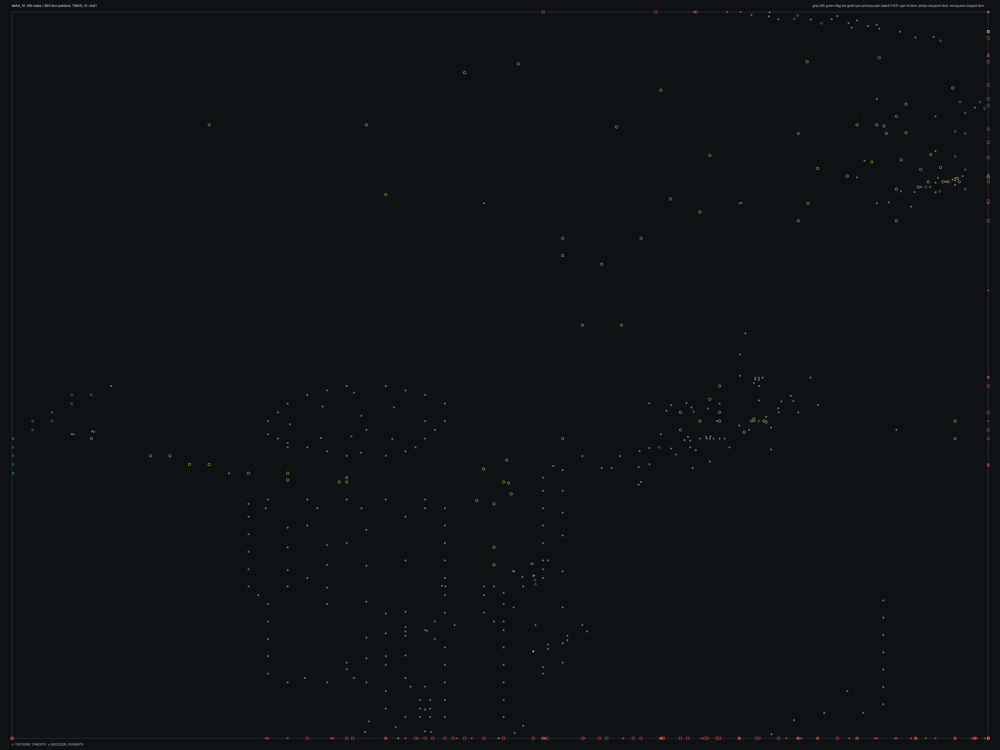

# TSBHD_10.bms - TSBHD_10

Back to [AIN Mission Index](../AIN%20Mission%20Index.md)

[Open full-size overlay image](overlays/tsbhd_10_xy.png)

## Overlay Legend

| Marker | Meaning |
| --- | --- |
| Gray dots | Normal AIN navigation nodes. |
| Green dots | AIN nodes with `NodeFlags & 0x1C`. |
| Gold dots | AIN `NodeClass 6`. |
| Cyan-blue dots | AIN `NodeClass 7`. |
| Pink dots | AIN `NodeClass 8`. |
| Purple dots | AIN `NodeClass 9`. |
| Cyan circles | MIS items with `ai_textfile`. |
| Yellow circles | MIS items with `waypoint_id`. |
| White circles | Other MIS items with positions. |
| Red squares on frame | MIS items outside the AIN graph bounds. |

## Mission File Info

- Terrain: `dvd1`
- AIN nodes: `1095`
- AIN areas: `256`
- MIS items/events/waypoint defs: `959` / `139` / `57`
- MIS AI-positioned items: `95`
- MIS items with `waypoint_id`: `243`
- AINODEPATH events: `8`

## AIN Plot Maps

| Field | Description | XY | XZ | YZ |
| --- | --- | --- | --- | --- |
| Area ID | Node area/sector grouping. | [XY](plots/tsbhd_10_area_id_xy.png) | [XZ](plots/tsbhd_10_area_id_xz.png) | [YZ](plots/tsbhd_10_area_id_yz.png) |
| Node Class | `NodeClass` values, including special classes `6`-`9`. | [XY](plots/tsbhd_10_node_class_xy.png) | [XZ](plots/tsbhd_10_node_class_xz.png) | [YZ](plots/tsbhd_10_node_class_yz.png) |
| Node Flags | `NodeFlags` byte values and flag clusters. | [XY](plots/tsbhd_10_node_flags_xy.png) | [XZ](plots/tsbhd_10_node_flags_xz.png) | [YZ](plots/tsbhd_10_node_flags_yz.png) |
| Radius | Node `Radius` byte values. | [XY](plots/tsbhd_10_radius_xy.png) | [XZ](plots/tsbhd_10_radius_xz.png) | [YZ](plots/tsbhd_10_radius_yz.png) |
| Edge Flags | Combined outgoing `EdgeFlags`. | [XY](plots/tsbhd_10_edge_flags_xy.png) | [XZ](plots/tsbhd_10_edge_flags_xz.png) | [YZ](plots/tsbhd_10_edge_flags_yz.png) |

## AINODEPATH Events

### Event 14 - AINODEPATH_ON

- Event block line: `916`
- AINODEPATH action line(s): `930`

**Trigger Items**

| Ref | Candidates |
| ---: | --- |
| `4` | item `2` / id `4` / type `1226` Friendly Hummer standard Version (`101226`) / ai `G_Jeep` / team `1` / group `3`; node `117`, area `0`, dist `3183.1` item `4` / id `340` / type `1241` Hummer with Armored 50cal (`101241`) / ai `G_Jeep` / team `1` / group `13`; node `233`, area `0`, dist `1.5` |
| `6` | item `6` / id `342` / type `1241` Hummer with Armored 50cal (`101241`) / ai `G_Jeep` / team `1` / group `13`; node `231`, area `0`, dist `3.5` item `9` / id `6` / type `1276` Hummer with NON-Armored 50cal (`101276`) / ai `G_Jeep` / team `1` / group `3`; node `117`, area `0`, dist `3178.0` |
| `7` | item `7` / id `5` / type `1241` Hummer with Armored 50cal (`101241`) / ai `G_Jeep` / team `1` / group `3`; node `117`, area `0`, dist `3188.2` item `10` / id `7` / type `1276` Hummer with NON-Armored 50cal (`101276`) / ai `G_Jeep` / team `1` / group `3`; node `117`, area `0`, dist `3194.2` |
| `13` | item `13` / id `208` / type `6207` VBL with 7.62mm turret (`106207`) / ai `G_Jeep` / team `2` / group `7`; node `117`, area `0`, dist `1863.3` item `395` / id `13` / type `6005` waypoint (`106005`) / wp `55`; node `117`, area `0`, dist `2259.9` |
| `15` | item `15` / id `161` / type `6207` VBL with 7.62mm turret (`106207`) / ai `G_Jeep` / team `2` / group `6`; node `117`, area `0`, dist `2181.7` item `445` / id `15` / type `6005` waypoint (`106005`) / wp `55`; node `117`, area `0`, dist `2092.6` |

**Referenced Items**

| Ref | Candidates |
| ---: | --- |
| `4` | item `2` / id `4` / type `1226` Friendly Hummer standard Version (`101226`) / ai `G_Jeep` / team `1` / group `3`; node `117`, area `0`, dist `3183.1` item `4` / id `340` / type `1241` Hummer with Armored 50cal (`101241`) / ai `G_Jeep` / team `1` / group `13`; node `233`, area `0`, dist `1.5` |
| `6` | item `6` / id `342` / type `1241` Hummer with Armored 50cal (`101241`) / ai `G_Jeep` / team `1` / group `13`; node `231`, area `0`, dist `3.5` item `9` / id `6` / type `1276` Hummer with NON-Armored 50cal (`101276`) / ai `G_Jeep` / team `1` / group `3`; node `117`, area `0`, dist `3178.0` |
| `7` | item `7` / id `5` / type `1241` Hummer with Armored 50cal (`101241`) / ai `G_Jeep` / team `1` / group `3`; node `117`, area `0`, dist `3188.2` item `10` / id `7` / type `1276` Hummer with NON-Armored 50cal (`101276`) / ai `G_Jeep` / team `1` / group `3`; node `117`, area `0`, dist `3194.2` |
| `13` | item `13` / id `208` / type `6207` VBL with 7.62mm turret (`106207`) / ai `G_Jeep` / team `2` / group `7`; node `117`, area `0`, dist `1863.3` item `395` / id `13` / type `6005` waypoint (`106005`) / wp `55`; node `117`, area `0`, dist `2259.9` |
| `15` | item `15` / id `161` / type `6207` VBL with 7.62mm turret (`106207`) / ai `G_Jeep` / team `2` / group `6`; node `117`, area `0`, dist `2181.7` item `445` / id `15` / type `6005` waypoint (`106005`) / wp `55`; node `117`, area `0`, dist `2092.6` |
| `31` | item `31` / id `195` / type `1240` Technical Enemy Vehicle placable husk (`101240`) / group `32`; node `117`, area `0`, dist `1035.9` |

**Trigger Waypoints**

| Ref | Candidates |
| ---: | --- |
| `4` | item `389` / wp `4` / id `121` / type `6005` waypoint (`106005`) |
| `6` | item `383` / wp `6` / id `117` / type `6005` waypoint (`106005`) |
| `7` | item `412` / wp `7` / id `115` / type `6005` waypoint (`106005`) |
| `13` | item `394` / wp `13` / id `148` / type `6005` waypoint (`106005`) item `414` / wp `13` / id `149` / type `6005` waypoint (`106005`) item `444` / wp `13` / id `150` / type `6005` waypoint (`106005`) item `472` / wp `13` / id `151` / type `6005` waypoint (`106005`) |
| `15` | item `374` / wp `15` / id `209` / type `6005` waypoint (`106005`) item `421` / wp `15` / id `210` / type `6005` waypoint (`106005`) item `464` / wp `15` / id `211` / type `6005` waypoint (`106005`) item `469` / wp `15` / id `212` / type `6005` waypoint (`106005`) +4 more |

### Event 24 - AINODEPATH_OFF

- Event block line: `1041`
- AINODEPATH action line(s): `1050`

**Trigger Items**

| Ref | Candidates |
| ---: | --- |
| `2` | item `1` / id `2` / type `1216` Armored Personell Carrier (`101216`) / ai `gu` / team `1` / group `3`; node `117`, area `0`, dist `3203.3` item `2` / id `4` / type `1226` Friendly Hummer standard Version (`101226`) / ai `G_Jeep` / team `1` / group `3`; node `117`, area `0`, dist `3183.1` |
| `10` | item `10` / id `7` / type `1276` Hummer with NON-Armored 50cal (`101276`) / ai `G_Jeep` / team `1` / group `3`; node `117`, area `0`, dist `3194.2` |

**Referenced Items**

| Ref | Candidates |
| ---: | --- |
| `2` | item `1` / id `2` / type `1216` Armored Personell Carrier (`101216`) / ai `gu` / team `1` / group `3`; node `117`, area `0`, dist `3203.3` item `2` / id `4` / type `1226` Friendly Hummer standard Version (`101226`) / ai `G_Jeep` / team `1` / group `3`; node `117`, area `0`, dist `3183.1` |
| `10` | item `10` / id `7` / type `1276` Hummer with NON-Armored 50cal (`101276`) / ai `G_Jeep` / team `1` / group `3`; node `117`, area `0`, dist `3194.2` |
| `13` | item `13` / id `208` / type `6207` VBL with 7.62mm turret (`106207`) / ai `G_Jeep` / team `2` / group `7`; node `117`, area `0`, dist `1863.3` item `395` / id `13` / type `6005` waypoint (`106005`) / wp `55`; node `117`, area `0`, dist `2259.9` |
| `14` | item `14` / id `381` / type `6207` VBL with 7.62mm turret (`106207`) / ai `G_Jeep` / team `2` / group `15`; node `111`, area `0`, dist `278.3` item `416` / id `14` / type `6005` waypoint (`106005`) / wp `55`; node `117`, area `0`, dist `2181.6` |
| `21` | item `21` / id `156` / type `6207` VBL with 7.62mm turret (`106207`) / ai `G_Jeep` / team `2` / group `11`; node `731`, area `0`, dist `2.2` item `536` / id `21` / type `6005` waypoint (`106005`) / wp `55`; node `117`, area `0`, dist `1256.3` |
| `32` | item `32` / id `201` / type `1240` Technical Enemy Vehicle placable husk (`101240`) / group `32`; node `117`, area `0`, dist `430.6` |

**Trigger Waypoints**

| Ref | Candidates |
| ---: | --- |
| `2` | item `407` / wp `2` / id `47` / type `6005` waypoint (`106005`) item `440` / wp `2` / id `48` / type `6005` waypoint (`106005`) item `458` / wp `2` / id `49` / type `6005` waypoint (`106005`) item `476` / wp `2` / id `50` / type `6005` waypoint (`106005`) +4 more |
| `10` | item `387` / wp `10` / id `120` / type `6005` waypoint (`106005`) |

### Event 32 - AINODEPATH_ON

- Event block line: `1148`
- AINODEPATH action line(s): `1157`

**Trigger Items**

| Ref | Candidates |
| ---: | --- |
| `5` | item `5` / id `341` / type `1241` Hummer with Armored 50cal (`101241`) / ai `G_Jeep` / team `1` / group `13`; node `220`, area `0`, dist `5.7` item `7` / id `5` / type `1241` Hummer with Armored 50cal (`101241`) / ai `G_Jeep` / team `1` / group `3`; node `117`, area `0`, dist `3188.2` |
| `6` | item `6` / id `342` / type `1241` Hummer with Armored 50cal (`101241`) / ai `G_Jeep` / team `1` / group `13`; node `231`, area `0`, dist `3.5` item `9` / id `6` / type `1276` Hummer with NON-Armored 50cal (`101276`) / ai `G_Jeep` / team `1` / group `3`; node `117`, area `0`, dist `3178.0` |
| `27` | item `27` / id `183` / type `1240` Technical Enemy Vehicle placable husk (`101240`) / group `31`; node `117`, area `0`, dist `1634.1` item `568` / id `27` / type `6005` waypoint (`106005`) / wp `55`; node `117`, area `0`, dist `853.8` |

**Referenced Items**

| Ref | Candidates |
| ---: | --- |
| `2` | item `1` / id `2` / type `1216` Armored Personell Carrier (`101216`) / ai `gu` / team `1` / group `3`; node `117`, area `0`, dist `3203.3` item `2` / id `4` / type `1226` Friendly Hummer standard Version (`101226`) / ai `G_Jeep` / team `1` / group `3`; node `117`, area `0`, dist `3183.1` |
| `5` | item `5` / id `341` / type `1241` Hummer with Armored 50cal (`101241`) / ai `G_Jeep` / team `1` / group `13`; node `220`, area `0`, dist `5.7` item `7` / id `5` / type `1241` Hummer with Armored 50cal (`101241`) / ai `G_Jeep` / team `1` / group `3`; node `117`, area `0`, dist `3188.2` |
| `6` | item `6` / id `342` / type `1241` Hummer with Armored 50cal (`101241`) / ai `G_Jeep` / team `1` / group `13`; node `231`, area `0`, dist `3.5` item `9` / id `6` / type `1276` Hummer with NON-Armored 50cal (`101276`) / ai `G_Jeep` / team `1` / group `3`; node `117`, area `0`, dist `3178.0` |
| `13` | item `13` / id `208` / type `6207` VBL with 7.62mm turret (`106207`) / ai `G_Jeep` / team `2` / group `7`; node `117`, area `0`, dist `1863.3` item `395` / id `13` / type `6005` waypoint (`106005`) / wp `55`; node `117`, area `0`, dist `2259.9` |
| `15` | item `15` / id `161` / type `6207` VBL with 7.62mm turret (`106207`) / ai `G_Jeep` / team `2` / group `6`; node `117`, area `0`, dist `2181.7` item `445` / id `15` / type `6005` waypoint (`106005`) / wp `55`; node `117`, area `0`, dist `2092.6` |
| `27` | item `27` / id `183` / type `1240` Technical Enemy Vehicle placable husk (`101240`) / group `31`; node `117`, area `0`, dist `1634.1` item `568` / id `27` / type `6005` waypoint (`106005`) / wp `55`; node `117`, area `0`, dist `853.8` |

**Trigger Waypoints**

| Ref | Candidates |
| ---: | --- |
| `5` | item `385` / wp `5` / id `118` / type `6005` waypoint (`106005`) |
| `6` | item `383` / wp `6` / id `117` / type `6005` waypoint (`106005`) |
| `27` | item `401` / wp `27` / id `646` / type `6005` waypoint (`106005`) / ai `null` item `417` / wp `27` / id `647` / type `6005` waypoint (`106005`) item `462` / wp `27` / id `648` / type `6005` waypoint (`106005`) |

### Event 47 - AINODEPATH_ON

- Event block line: `1333`
- AINODEPATH action line(s): `1348`

**Trigger Items**

| Ref | Candidates |
| ---: | --- |
| `3` | item `0` / id `3` / type `1216` Armored Personell Carrier (`101216`) / ai `gu` / team `1` / group `3`; node `117`, area `0`, dist `3198.3` item `3` / id `11` / type `1241` Hummer with Armored 50cal (`101241`) / ai `G_Jeep` / team `1` / group `3`; node `117`, area `0`, dist `3208.4` |
| `4` | item `2` / id `4` / type `1226` Friendly Hummer standard Version (`101226`) / ai `G_Jeep` / team `1` / group `3`; node `117`, area `0`, dist `3183.1` item `4` / id `340` / type `1241` Hummer with Armored 50cal (`101241`) / ai `G_Jeep` / team `1` / group `13`; node `233`, area `0`, dist `1.5` |
| `18` | item `18` / id `839` / type `6207` VBL with 7.62mm turret (`106207`) / ai `G_Jeep` / team `2` / group `23`; node `584`, area `0`, dist `26.6` |
| `19` | item `19` / id `608` / type `6207` VBL with 7.62mm turret (`106207`) / ai `G_Jeep` / team `2` / group `16`; node `111`, area `0`, dist `783.6` item `505` / id `19` / type `6005` waypoint (`106005`) / wp `55`; node `117`, area `0`, dist `1907.5` |
| `20` | item `20` / id `655` / type `6207` VBL with 7.62mm turret (`106207`) / ai `G_Jeep` / team `2` / group `18`; node `65`, area `0`, dist `116.1` item `528` / id `20` / type `6005` waypoint (`106005`) / wp `55`; node `117`, area `0`, dist `1813.9` |
| `28` | item `28` / id `186` / type `1240` Technical Enemy Vehicle placable husk (`101240`) / group `31`; node `117`, area `0`, dist `1355.4` |

**Referenced Items**

| Ref | Candidates |
| ---: | --- |
| `3` | item `0` / id `3` / type `1216` Armored Personell Carrier (`101216`) / ai `gu` / team `1` / group `3`; node `117`, area `0`, dist `3198.3` item `3` / id `11` / type `1241` Hummer with Armored 50cal (`101241`) / ai `G_Jeep` / team `1` / group `3`; node `117`, area `0`, dist `3208.4` |
| `4` | item `2` / id `4` / type `1226` Friendly Hummer standard Version (`101226`) / ai `G_Jeep` / team `1` / group `3`; node `117`, area `0`, dist `3183.1` item `4` / id `340` / type `1241` Hummer with Armored 50cal (`101241`) / ai `G_Jeep` / team `1` / group `13`; node `233`, area `0`, dist `1.5` |
| `15` | item `15` / id `161` / type `6207` VBL with 7.62mm turret (`106207`) / ai `G_Jeep` / team `2` / group `6`; node `117`, area `0`, dist `2181.7` item `445` / id `15` / type `6005` waypoint (`106005`) / wp `55`; node `117`, area `0`, dist `2092.6` |
| `18` | item `18` / id `839` / type `6207` VBL with 7.62mm turret (`106207`) / ai `G_Jeep` / team `2` / group `23`; node `584`, area `0`, dist `26.6` |
| `19` | item `19` / id `608` / type `6207` VBL with 7.62mm turret (`106207`) / ai `G_Jeep` / team `2` / group `16`; node `111`, area `0`, dist `783.6` item `505` / id `19` / type `6005` waypoint (`106005`) / wp `55`; node `117`, area `0`, dist `1907.5` |
| `20` | item `20` / id `655` / type `6207` VBL with 7.62mm turret (`106207`) / ai `G_Jeep` / team `2` / group `18`; node `65`, area `0`, dist `116.1` item `528` / id `20` / type `6005` waypoint (`106005`) / wp `55`; node `117`, area `0`, dist `1813.9` |

**Trigger Waypoints**

| Ref | Candidates |
| ---: | --- |
| `3` | item `409` / wp `3` / id `73` / type `6005` waypoint (`106005`) item `431` / wp `3` / id `74` / type `6005` waypoint (`106005`) item `465` / wp `3` / id `75` / type `6005` waypoint (`106005`) item `468` / wp `3` / id `76` / type `6005` waypoint (`106005`) +4 more |
| `4` | item `389` / wp `4` / id `121` / type `6005` waypoint (`106005`) |
| `18` | item `380` / wp `18` / id `321` / type `6005` waypoint (`106005`) item `423` / wp `18` / id `322` / type `6005` waypoint (`106005`) item `450` / wp `18` / id `392` / type `6005` waypoint (`106005`) |
| `19` | item `381` / wp `19` / id `323` / type `6005` waypoint (`106005`) item `429` / wp `19` / id `324` / type `6005` waypoint (`106005`) item `454` / wp `19` / id `393` / type `6005` waypoint (`106005`) |
| `20` | item `413` / wp `20` / id `382` / type `6005` waypoint (`106005`) item `438` / wp `20` / id `383` / type `6005` waypoint (`106005`) item `449` / wp `20` / id `384` / type `6005` waypoint (`106005`) item `482` / wp `20` / id `385` / type `6005` waypoint (`106005`) +4 more |
| `28` | item `403` / wp `28` / id `650` / type `6005` waypoint (`106005`) |

### Event 67 - AINODEPATH_ON

- Event block line: `1567`
- AINODEPATH action line(s): `1570`

**Trigger Items**

_None found._

**Referenced Items**

_None found._

**Trigger Waypoints**

_None found._

### Event 68 - AINODEPATH_OFF

- Event block line: `1574`
- AINODEPATH action line(s): `1580`

**Trigger Items**

| Ref | Candidates |
| ---: | --- |
| `3` | item `0` / id `3` / type `1216` Armored Personell Carrier (`101216`) / ai `gu` / team `1` / group `3`; node `117`, area `0`, dist `3198.3` item `3` / id `11` / type `1241` Hummer with Armored 50cal (`101241`) / ai `G_Jeep` / team `1` / group `3`; node `117`, area `0`, dist `3208.4` |
| `7` | item `7` / id `5` / type `1241` Hummer with Armored 50cal (`101241`) / ai `G_Jeep` / team `1` / group `3`; node `117`, area `0`, dist `3188.2` item `10` / id `7` / type `1276` Hummer with NON-Armored 50cal (`101276`) / ai `G_Jeep` / team `1` / group `3`; node `117`, area `0`, dist `3194.2` |

**Referenced Items**

| Ref | Candidates |
| ---: | --- |
| `3` | item `0` / id `3` / type `1216` Armored Personell Carrier (`101216`) / ai `gu` / team `1` / group `3`; node `117`, area `0`, dist `3198.3` item `3` / id `11` / type `1241` Hummer with Armored 50cal (`101241`) / ai `G_Jeep` / team `1` / group `3`; node `117`, area `0`, dist `3208.4` |
| `7` | item `7` / id `5` / type `1241` Hummer with Armored 50cal (`101241`) / ai `G_Jeep` / team `1` / group `3`; node `117`, area `0`, dist `3188.2` item `10` / id `7` / type `1276` Hummer with NON-Armored 50cal (`101276`) / ai `G_Jeep` / team `1` / group `3`; node `117`, area `0`, dist `3194.2` |

**Trigger Waypoints**

| Ref | Candidates |
| ---: | --- |
| `3` | item `409` / wp `3` / id `73` / type `6005` waypoint (`106005`) item `431` / wp `3` / id `74` / type `6005` waypoint (`106005`) item `465` / wp `3` / id `75` / type `6005` waypoint (`106005`) item `468` / wp `3` / id `76` / type `6005` waypoint (`106005`) +4 more |
| `7` | item `412` / wp `7` / id `115` / type `6005` waypoint (`106005`) |

### Event 117 - AINODEPATH_OFF

- Event block line: `2098`
- AINODEPATH action line(s): `2104`

**Trigger Items**

| Ref | Candidates |
| ---: | --- |
| `4` | item `2` / id `4` / type `1226` Friendly Hummer standard Version (`101226`) / ai `G_Jeep` / team `1` / group `3`; node `117`, area `0`, dist `3183.1` item `4` / id `340` / type `1241` Hummer with Armored 50cal (`101241`) / ai `G_Jeep` / team `1` / group `13`; node `233`, area `0`, dist `1.5` |
| `7` | item `7` / id `5` / type `1241` Hummer with Armored 50cal (`101241`) / ai `G_Jeep` / team `1` / group `3`; node `117`, area `0`, dist `3188.2` item `10` / id `7` / type `1276` Hummer with NON-Armored 50cal (`101276`) / ai `G_Jeep` / team `1` / group `3`; node `117`, area `0`, dist `3194.2` |

**Referenced Items**

| Ref | Candidates |
| ---: | --- |
| `4` | item `2` / id `4` / type `1226` Friendly Hummer standard Version (`101226`) / ai `G_Jeep` / team `1` / group `3`; node `117`, area `0`, dist `3183.1` item `4` / id `340` / type `1241` Hummer with Armored 50cal (`101241`) / ai `G_Jeep` / team `1` / group `13`; node `233`, area `0`, dist `1.5` |
| `7` | item `7` / id `5` / type `1241` Hummer with Armored 50cal (`101241`) / ai `G_Jeep` / team `1` / group `3`; node `117`, area `0`, dist `3188.2` item `10` / id `7` / type `1276` Hummer with NON-Armored 50cal (`101276`) / ai `G_Jeep` / team `1` / group `3`; node `117`, area `0`, dist `3194.2` |

**Trigger Waypoints**

| Ref | Candidates |
| ---: | --- |
| `4` | item `389` / wp `4` / id `121` / type `6005` waypoint (`106005`) |
| `7` | item `412` / wp `7` / id `115` / type `6005` waypoint (`106005`) |

### Event 127 - AINODEPATH_OFF

- Event block line: `2200`
- AINODEPATH action line(s): `2206`

**Trigger Items**

| Ref | Candidates |
| ---: | --- |
| `4` | item `2` / id `4` / type `1226` Friendly Hummer standard Version (`101226`) / ai `G_Jeep` / team `1` / group `3`; node `117`, area `0`, dist `3183.1` item `4` / id `340` / type `1241` Hummer with Armored 50cal (`101241`) / ai `G_Jeep` / team `1` / group `13`; node `233`, area `0`, dist `1.5` |
| `7` | item `7` / id `5` / type `1241` Hummer with Armored 50cal (`101241`) / ai `G_Jeep` / team `1` / group `3`; node `117`, area `0`, dist `3188.2` item `10` / id `7` / type `1276` Hummer with NON-Armored 50cal (`101276`) / ai `G_Jeep` / team `1` / group `3`; node `117`, area `0`, dist `3194.2` |

**Referenced Items**

| Ref | Candidates |
| ---: | --- |
| `4` | item `2` / id `4` / type `1226` Friendly Hummer standard Version (`101226`) / ai `G_Jeep` / team `1` / group `3`; node `117`, area `0`, dist `3183.1` item `4` / id `340` / type `1241` Hummer with Armored 50cal (`101241`) / ai `G_Jeep` / team `1` / group `13`; node `233`, area `0`, dist `1.5` |
| `7` | item `7` / id `5` / type `1241` Hummer with Armored 50cal (`101241`) / ai `G_Jeep` / team `1` / group `3`; node `117`, area `0`, dist `3188.2` item `10` / id `7` / type `1276` Hummer with NON-Armored 50cal (`101276`) / ai `G_Jeep` / team `1` / group `3`; node `117`, area `0`, dist `3194.2` |

**Trigger Waypoints**

| Ref | Candidates |
| ---: | --- |
| `4` | item `389` / wp `4` / id `121` / type `6005` waypoint (`106005`) |
| `7` | item `412` / wp `7` / id `115` / type `6005` waypoint (`106005`) |

## Spatial Notes

| Check | Result |
| --- | --- |
| AI item coverage | `63 / 95` AI-positioned items are inside the AIN XY bounds. |
| Positioned item coverage | `428 / 959` positioned MIS items are inside the AIN XY bounds. |
| AI nearest-node distance | min `0.5`, median `8.3`, max `3208.4`. |
| Area coverage | `1` `AreaId` values used; dominant areas: `[(0, 1095)]`. |
| Special node classes | `{}`. |
| Nonzero edge flags | `{'0x00': 3968}`. |

### Outside AIN Bounds

| Item |
| --- |
| item `0` / id `3` / type `1216` Armored Personell Carrier (`101216`) / ai `gu` / team `1` / group `3` |
| item `1` / id `2` / type `1216` Armored Personell Carrier (`101216`) / ai `gu` / team `1` / group `3` |
| item `2` / id `4` / type `1226` Friendly Hummer standard Version (`101226`) / ai `G_Jeep` / team `1` / group `3` |
| item `3` / id `11` / type `1241` Hummer with Armored 50cal (`101241`) / ai `G_Jeep` / team `1` / group `3` |
| item `7` / id `5` / type `1241` Hummer with Armored 50cal (`101241`) / ai `G_Jeep` / team `1` / group `3` |
| item `8` / id `1484` / type `1272` Blackhawk, miniguns, both doors open (`101272`) / ai `H_BHawk` / team `1` / group `26` |
| item `9` / id `6` / type `1276` Hummer with NON-Armored 50cal (`101276`) / ai `G_Jeep` / team `1` / group `3` |
| item `10` / id `7` / type `1276` Hummer with NON-Armored 50cal (`101276`) / ai `G_Jeep` / team `1` / group `3` |

### Farthest AI Items From AIN Nodes

| Item | Nearest Node | Area | Distance |
| --- | ---: | ---: | ---: |
| item `3` / id `11` / type `1241` Hummer with Armored 50cal (`101241`) / ai `G_Jeep` / team `1` / group `3` | `117` | `0` | `3208.4` |
| item `1` / id `2` / type `1216` Armored Personell Carrier (`101216`) / ai `gu` / team `1` / group `3` | `117` | `0` | `3203.3` |
| item `0` / id `3` / type `1216` Armored Personell Carrier (`101216`) / ai `gu` / team `1` / group `3` | `117` | `0` | `3198.3` |
| item `10` / id `7` / type `1276` Hummer with NON-Armored 50cal (`101276`) / ai `G_Jeep` / team `1` / group `3` | `117` | `0` | `3194.2` |
| item `7` / id `5` / type `1241` Hummer with Armored 50cal (`101241`) / ai `G_Jeep` / team `1` / group `3` | `117` | `0` | `3188.2` |

### Special Class Nodes

| Node | Class | Area | Flags | Nearest MIS Item | Distance |
| ---: | ---: | ---: | --- | --- | ---: |
| | | | | | |

### Nonzero Edge Flags

| Flag | Source | Target | Areas | Classes | Reverse | Distance |
| --- | ---: | ---: | --- | --- | --- | ---: |
| | | | | | | |
