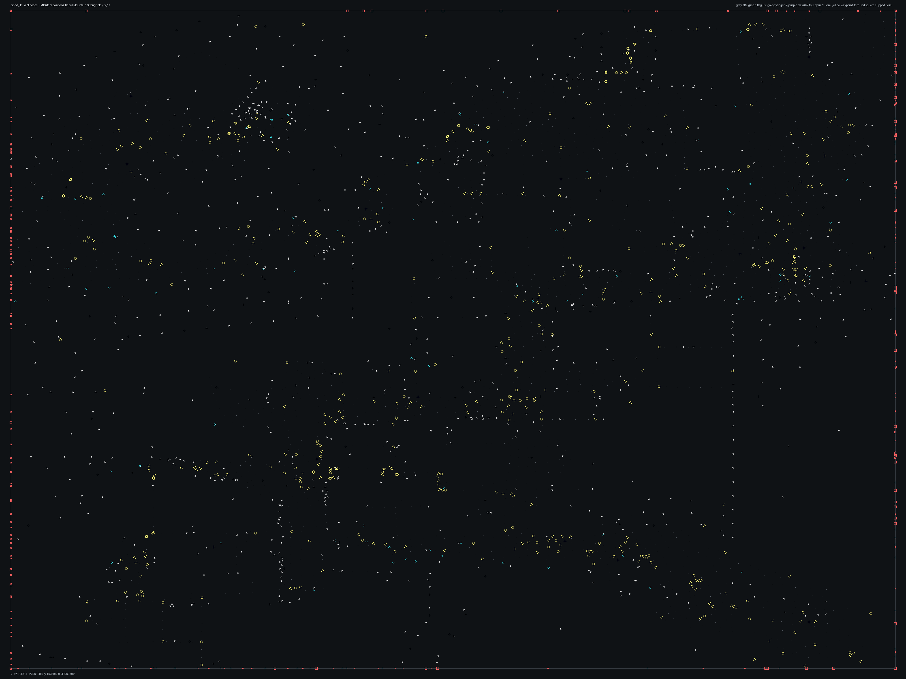

# tsbhd_11.bms - Rebel Mountain Stronghold

Back to [AIN Mission Index](../AIN%20Mission%20Index.md)

[Open full-size overlay image](overlays/tsbhd_11_xy.png)

## Overlay Legend

| Marker | Meaning |
| --- | --- |
| Gray dots | Normal AIN navigation nodes. |
| Green dots | AIN nodes with `NodeFlags & 0x1C`. |
| Gold dots | AIN `NodeClass 6`. |
| Cyan-blue dots | AIN `NodeClass 7`. |
| Pink dots | AIN `NodeClass 8`. |
| Purple dots | AIN `NodeClass 9`. |
| Cyan circles | MIS items with `ai_textfile`. |
| Yellow circles | MIS items with `waypoint_id`. |
| White circles | Other MIS items with positions. |
| Red squares on frame | MIS items outside the AIN graph bounds. |

## Mission File Info

- Terrain: `ts_11`
- AIN nodes: `2328`
- AIN areas: `256`
- MIS items/events/waypoint defs: `1976` / `86` / `123`
- MIS AI-positioned items: `120`
- MIS items with `waypoint_id`: `600`
- AINODEPATH events: `1`

## AIN Plot Maps

| Field | Description | XY | XZ | YZ |
| --- | --- | --- | --- | --- |
| Area ID | Node area/sector grouping. | [XY](plots/tsbhd_11_area_id_xy.png) | [XZ](plots/tsbhd_11_area_id_xz.png) | [YZ](plots/tsbhd_11_area_id_yz.png) |
| Node Class | `NodeClass` values, including special classes `6`-`9`. | [XY](plots/tsbhd_11_node_class_xy.png) | [XZ](plots/tsbhd_11_node_class_xz.png) | [YZ](plots/tsbhd_11_node_class_yz.png) |
| Node Flags | `NodeFlags` byte values and flag clusters. | [XY](plots/tsbhd_11_node_flags_xy.png) | [XZ](plots/tsbhd_11_node_flags_xz.png) | [YZ](plots/tsbhd_11_node_flags_yz.png) |
| Radius | Node `Radius` byte values. | [XY](plots/tsbhd_11_radius_xy.png) | [XZ](plots/tsbhd_11_radius_xz.png) | [YZ](plots/tsbhd_11_radius_yz.png) |
| Edge Flags | Combined outgoing `EdgeFlags`. | [XY](plots/tsbhd_11_edge_flags_xy.png) | [XZ](plots/tsbhd_11_edge_flags_xz.png) | [YZ](plots/tsbhd_11_edge_flags_yz.png) |

## AINODEPATH Events

### Event 0 - AINODEPATH_ON

- Event block line: `1265`
- AINODEPATH action line(s): `1269`

**Trigger Items**

_None found._

**Referenced Items**

| Ref | Candidates |
| ---: | --- |
| `2` | item `2` / id `263` / type `1272` Blackhawk, miniguns, both doors open (`101272`) / ai `H_BHawk` / team `1` / group `12`; node `1225`, area `0`, dist `767.0` item `1635` / id `2` / type `6261` Iranian Rebel Suicide Troop 1 (`106261`) / team `2` / group `21`; node `2113`, area `0`, dist `1.6` |
| `4` | item `4` / id `267` / type `1287` Blackhawk, weak AI miniguns, both doors open (`101287`) / ai `h_bhawkn` / group `16`; node `2107`, area `0`, dist `558.4` item `1637` / id `4` / type `6261` Iranian Rebel Suicide Troop 1 (`106261`) / team `2` / group `21`; node `2133`, area `0`, dist `1.8` |
| `5` | item `5` / id `268` / type `1287` Blackhawk, weak AI miniguns, both doors open (`101287`) / ai `h_bhawkn` / group `15`; node `2108`, area `0`, dist `525.2` item `1638` / id `5` / type `6261` Iranian Rebel Suicide Troop 1 (`106261`) / team `2` / group `21`; node `2176`, area `0`, dist `3.4` |

**Trigger Waypoints**

_None found._

## Spatial Notes

| Check | Result |
| --- | --- |
| AI item coverage | `92 / 120` AI-positioned items are inside the AIN XY bounds. |
| Positioned item coverage | `1647 / 1976` positioned MIS items are inside the AIN XY bounds. |
| AI nearest-node distance | min `0.7`, median `4.7`, max `767.8`. |
| Area coverage | `1` `AreaId` values used; dominant areas: `[(0, 2328)]`. |
| Special node classes | `{}`. |
| Nonzero edge flags | `{'0x00': 12025}`. |

### Outside AIN Bounds

| Item |
| --- |
| item `0` / id `2018` / type `1245` Technical enemy vehicle #3 (`101245`) / ai `G_Jeep` / wp `122` / group `31` |
| item `1` / id `264` / type `1272` Blackhawk, miniguns, both doors open (`101272`) / ai `H_BHawk` / team `1` / group `13` |
| item `2` / id `263` / type `1272` Blackhawk, miniguns, both doors open (`101272`) / ai `H_BHawk` / team `1` / group `12` |
| item `4` / id `267` / type `1287` Blackhawk, weak AI miniguns, both doors open (`101287`) / ai `h_bhawkn` / group `16` |
| item `5` / id `268` / type `1287` Blackhawk, weak AI miniguns, both doors open (`101287`) / ai `h_bhawkn` / group `15` |
| item `6` / id `269` / type `1287` Blackhawk, weak AI miniguns, both doors open (`101287`) / ai `h_bhawkn` / group `14` |
| item `7` / id `266` / type `1287` Blackhawk, weak AI miniguns, both doors open (`101287`) / ai `h_bhawkn` / group `30` |
| item `8` / id `90` / type `1289` Blackhawk fast roping NO Die (`101289`) / ai `H_BHawk` / group `27` |

### Farthest AI Items From AIN Nodes

| Item | Nearest Node | Area | Distance |
| --- | ---: | ---: | ---: |
| item `1623` / id `100` / type `1772` 10th Mountain Teammate 3 (`101772`) / ai `null` / team `1` / group `24` | `1225` | `0` | `767.8` |
| item `2` / id `263` / type `1272` Blackhawk, miniguns, both doors open (`101272`) / ai `H_BHawk` / team `1` / group `12` | `1225` | `0` | `767.0` |
| item `1626` / id `102` / type `4514` 10th Mountain Teammate 1 (`104514`) / ai `null` / team `1` / group `23` | `1225` | `0` | `766.9` |
| item `1621` / id `98` / type `1752` 10th Mountain Teammate 2 (`101752`) / ai `null` / team `1` / group `25` | `1225` | `0` | `766.1` |
| item `1` / id `264` / type `1272` Blackhawk, miniguns, both doors open (`101272`) / ai `H_BHawk` / team `1` / group `13` | `1225` | `0` | `727.5` |

### Special Class Nodes

| Node | Class | Area | Flags | Nearest MIS Item | Distance |
| ---: | ---: | ---: | --- | --- | ---: |
| | | | | | |

### Nonzero Edge Flags

| Flag | Source | Target | Areas | Classes | Reverse | Distance |
| --- | ---: | ---: | --- | --- | --- | ---: |
| | | | | | | |
